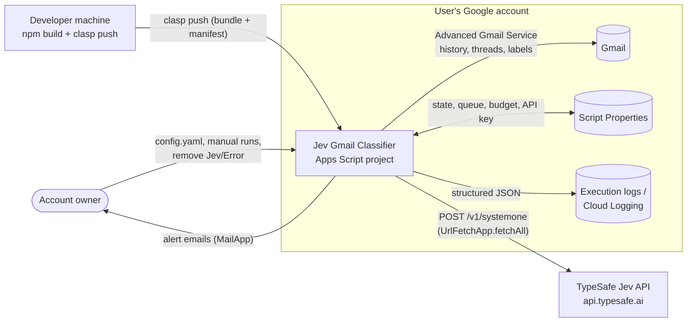
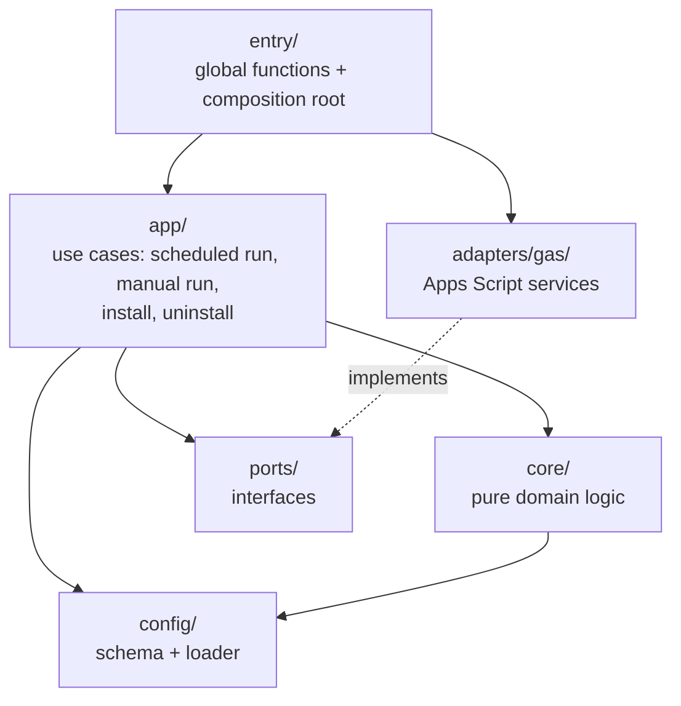
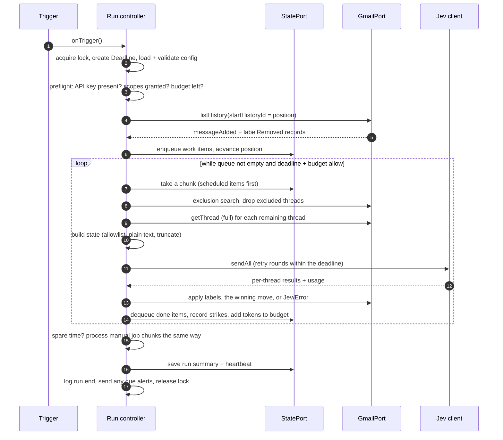
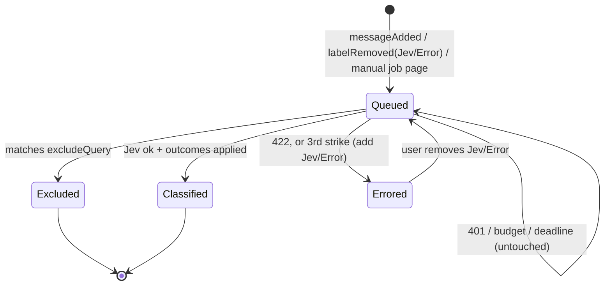
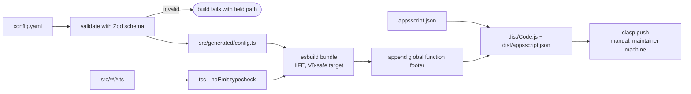

# Jev Gmail Classifier: Solution Design

> **Status:** Accepted for v1. Decided on 2026-09-25.
>
> **Where this fits:** the [Product Vision](product-vision.md) says *why*, the [Product Design Document](product-design-document.md) (PDD) says *what*, and this document says *how*: the architecture, technology, and patterns every epic, story, and task builds on. The [Engineering Standards](engineering-standards.md) hold the coding, testing, and workflow conventions, and the [Architecture Decision Records](adr/README.md) (ADRs) hold the reasoning behind each significant decision. The [README](../README.md) is the user-facing description and must agree with this document.
>
> **Precedence:** Vision > PDD > Solution Design (this document, its ADRs, and the Engineering Standards) > README. If you find a conflict, the higher document wins; raise it rather than silently choosing.
>
> **Level of detail:** high-level on purpose. Numbers marked *starting value* and items in [§13](#13-epic-guidance) are settled by the epic that owns them. When an epic settles one, it updates this document or adds an ADR.

## Contents

1. [Architectural Drivers](#1-architectural-drivers)
2. [System Context](#2-system-context)
3. [Platform Constraints](#3-platform-constraints)
4. [Architecture Overview](#4-architecture-overview)
5. [Components and Ports](#5-components-and-ports)
6. [Runtime Flows](#6-runtime-flows)
7. [Data Design](#7-data-design)
8. [Jev Integration](#8-jev-integration)
9. [Gmail Integration](#9-gmail-integration)
10. [Cross-Cutting Concerns](#10-cross-cutting-concerns)
11. [Build and Deployment](#11-build-and-deployment)
12. [Testing Architecture](#12-testing-architecture)
13. [Epic Guidance](#13-epic-guidance)
14. [Technical Risks and Items to Verify](#14-technical-risks-and-items-to-verify)
15. [Glossary](#15-glossary)

## 1. Architectural Drivers

The product principles translate into these architectural drivers. When two designs are otherwise equal, pick the one that serves the higher driver.

| # | Driver | Comes from | What it means for the design |
|---|--------|-----------|------------------------------|
| D1 | **Precision over recall** | Vision principle 1 | When unsure, do nothing: don't apply, don't move, don't guess. Moves need stronger evidence (first classification, high threshold). |
| D2 | **Privacy by construction** | Vision principle 4 | Only the header allowlist and plain text leave the account. Exclusion works per *thread*. Bodies and the API key never reach logs. The OAuth scope makes permanent deletion impossible. |
| D3 | **Bounded by design** | Vision principle 6 | Every execution has a deadline, a chunk size, and a token budget check. Nothing loops unbounded. |
| D4 | **Loud when broken** | Vision principle 2 | Every failure path ends in a log event, and the actionable ones in an alert or the `Jev/Error` label. No silent skips. |
| D5 | **Cheap** | Vision principle 3 | One request per thread, all rules together, trimmed content, no reclassification without new mail, daily token cap. |
| D6 | **Testable core** | PDD §6 | All decision logic runs in Node against fakes, with no Apps Script globals. |
| D7 | **Configuration over code** | Vision principle 5 | Behavior changes through `config.yaml`, validated at build and at runtime. |

## 2. System Context



- **One installation serves one Google account.** There is no server, database, or shared tenant.
- **The only external system is the Jev API.** No other outbound calls are allowed.
- The developer machine is used only to build and push. It is not part of the runtime.

## 3. Platform Constraints

These shape every design choice. Figures come from the [README](../README.md#limits-and-cost) and the research recorded in the ADRs; epics re-check them when they rely on them.

| Constraint | Consequence |
|-----------|-------------|
| 6-minute execution limit. | Every entry point runs against a `Deadline` ([§10.3](#103-time-budget)). |
| 90 min/day of trigger runtime on consumer accounts (about 37 s per run at 10-minute intervals). | Scheduled runs have a short soft limit. Backfill uses spare time only ([ADR-0009](adr/0009-manual-runs-use-spare-time.md)). |
| No mail-arrival trigger; time-driven triggers only at 1, 5, 10, 15, or 30 minutes. | The product polls. |
| V8 runtime **without** ES modules, `#private` fields, static class fields, `setTimeout`, `fetch`, `atob`, `TextDecoder`, or `crypto`. | TypeScript is bundled and down-levelled. Waits use `Utilities.sleep`, base64 uses `Utilities`, HTTP uses `UrlFetchApp` ([ADR-0012](adr/0012-toolchain.md)). |
| Triggers and the editor call only top-level `function` declarations. | The bundle ends with a generated footer of global functions ([§11](#11-build-and-deployment)). |
| Script Properties: 9 KB per value, 500 KB per store. | State is namespaced, small, and sharded ([§7.3](#73-script-properties-state)). |
| 20 triggers per user per script. | Only one recurring trigger. There are no chained one-off triggers. |
| Jev accepts one `state` per request; 32k tokens for `state` plus the longest question; 64k for `state` plus all questions; no token-count endpoint. | One request per thread, and truncation uses a character estimate with a safety margin ([§8.4](#84-truncation)). |
| Jev's official SDK needs `fetch`. | A hand-written client runs on `UrlFetchApp` ([ADR-0010](adr/0010-jev-request-shape-and-retries.md)). |

## 4. Architecture Overview

### 4.1 Style: ports and adapters

The code is layered as **ports and adapters** (hexagonal), with a pure core ([ADR-0002](adr/0002-ports-and-adapters.md)).



**Dependency rule.** An arrow means "may import". Everything else is forbidden and enforced by lint:

- `core/` is pure: no Apps Script globals, no I/O, no clock, no randomness. Anything impure is passed in as a value or as a port.
- `app/` orchestrates through ports only. It never touches a global.
- `adapters/gas/` is the **only** place Apps Script globals appear (`Gmail`, `UrlFetchApp`, `PropertiesService`, `LockService`, `MailApp`, `ScriptApp`, `Utilities`, `Session`, `console`).
- `entry/` is the composition root. It builds real adapters, wires them into `app/`, and exposes the global functions.
- All ports are **synchronous**, because Apps Script services are synchronous. The core and app do not use `async`/`await`.

### 4.2 Repository layout

The target layout. E2 creates it and may refine names, but not the layer boundaries.

```text
.
├── appsscript.json            # manifest template (scopes, advanced services, timeZone)
├── config.example.yaml        # committed example; CI builds against it
├── config.yaml                # user's real config (git-ignored)
├── .clasp.json.example        # committed; .clasp.json is git-ignored
├── src/
│   ├── core/                  # pure domain: rules, outcomes, state builder, truncation,
│   │   │                      # body converters, retry policy, budget, work queue, queries
│   │   └── body/              # BodyConverter implementations (basic; advanced later)
│   ├── app/                   # use cases and run controller
│   ├── ports/                 # port interfaces
│   ├── adapters/gas/          # Apps Script implementations of the ports
│   ├── config/                # Zod schema (shared by build and runtime) + loader
│   ├── entry/                 # main.ts: composition root + global functions
│   └── generated/             # build output from config.yaml (git-ignored)
├── scripts/                   # build.ts, probe.ts (local Jev probe)
├── spikes/                    # E1 and later experiments, run by hand against a real account
├── test/                      # unit tests, fakes/, fixtures/
├── docs/                      # smoke-test checklist; docs/archive/ (historical)
└── output/                    # vision, PDD, solution design, standards, ADRs
```

## 5. Components and Ports

### 5.1 Components

The PDD's components ([PDD §6.1](product-design-document.md#61-main-components)) map to code as follows.

| Component | Layer | Responsibility |
|-----------|-------|----------------|
| **Config** | `config/` | One Zod schema, used at build time to validate `config.yaml` and at runtime to validate the embedded config on load. Exposes a typed, frozen `Config`. |
| **History sync** (PDD: Work finder) | `app/` + `core/` | Reads Gmail history from the saved position, turns records into work items, and advances the position. Also runs the fallback search when history has expired. |
| **Work queue** | `core/` + `StatePort` | A persisted, de-duplicated queue of threads to classify, with strike counts and the first-classification flag. Scheduled work always comes before manual work. |
| **Exclusion filter** | `core/` + `GmailPort` | Removes every thread in which *any* message matches `excludeQuery`, before anything is read for Jev. |
| **State builder** | `core/` | Turns a thread into Jev `state`: header allowlist, plain text via a `BodyConverter`, newest first, truncated to fit. |
| **Jev client** | `core/` (pure request and response logic) + `HttpPort` | Builds requests, sends batches with `fetchAll`, retries in rounds, classifies responses, and reports token usage. |
| **Outcome applier** | `core/` (decide) + `GmailPort` (apply) | Decides the labels and the one winning move, then applies them. Handles `Jev/Error` and missing scopes. |
| **Run controller** | `app/` | Lock, deadline, token budget, scheduled-before-manual ordering, and the per-run summary. |
| **Notifier** | `app/` + `LogPort` + `MailPort` | Structured logging, and rate-limited alert emails. |
| **Lifecycle** | `app/` | `install`, `uninstall`, and the scope preflight check. |

### 5.2 Ports

Each port is a narrow TypeScript interface in `ports/`, with one Apps Script adapter and one in-memory fake (`test/fakes/`). Names are working names.

| Port | Wraps | Main operations |
|------|-------|-----------------|
| `GmailPort` | Advanced Gmail Service (`Gmail.Users.*`) | `getProfile`, `listHistory`, `searchThreadIds`, `getThread`, `listLabels`, `createLabel`, `modifyThread`, `trashThread` |
| `HttpPort` | `UrlFetchApp.fetchAll` | `sendAll(requests) → responses` (status, headers, body text) |
| `StatePort` | `PropertiesService.getScriptProperties()` | typed `get`/`set`/`delete` on namespaced keys, plus sharded values |
| `SecretsPort` | Script Properties (`JEV_API_KEY`) | `getJevApiKey()` |
| `LockPort` | `LockService.getScriptLock()` | `tryAcquire() → boolean`, `release()` |
| `ClockPort` | `Date`, `Utilities.sleep`, `Session.getScriptTimeZone()` | `now()`, `sleep(ms)`, `timeZone()` |
| `RandomPort` | `Math.random` | `next()`, used for jitter |
| `LogPort` | `console.*` | `info/warn/error(event, fields)` |
| `MailPort` | `MailApp.sendEmail` | `send(to, subject, body)` |
| `TriggerPort` | `ScriptApp` | `replaceRecurringTrigger(fn, minutes)`, `deleteTriggers(fn)` |
| `AuthPort` | `ScriptApp.getAuthorizationInfo` / granted-scope APIs | `missingScopes() → string[]` |

## 6. Runtime Flows

### 6.1 Entry points

These are the only global functions. Each one runs inside the script lock and a `Deadline`.

| Function | Started by | Purpose |
|----------|-----------|---------|
| `onTrigger` | The recurring time-driven trigger. | A scheduled run: history sync, the queue, then spare time on any manual job. |
| `install` | The user, in the editor. | Authorizes, checks scopes, saves the starting position (kept if one already exists), and creates or replaces the trigger. |
| `uninstall` | The user, in the editor. | Removes the trigger and all `state.*` keys. Leaves labels and `JEV_API_KEY`. |
| `startManualRun` | The user, in the editor, after setting `MANUAL_*` Script Properties. | Validates and echoes back the job, saves it, and processes as much as time allows. |
| `continueManualRun` | The user, in the editor (optional). | Processes the current manual job for up to the manual deadline. |
| `cancelManualRun` | The user, in the editor. | Deletes the current manual job. |

The lock is **one script-wide lock** taken with `tryLock(0)`. If it is busy, the function logs `run.skipped` with reason `busy` and returns ([ADR-0008](adr/0008-single-lock-and-deadline.md)).

### 6.2 Scheduled run



**Two phases.** *Ingest* reads history and adds to the queue. *Process* takes from the queue and classifies. Keeping them separate makes retries, the budget, and the deadline uniform: any item not finished simply stays in the queue ([ADR-0004](adr/0004-history-api-position.md)).

### 6.3 Ingest: Gmail history to work queue

- **Position.** `state.position` holds the last Gmail `historyId` ingested, plus the time it was saved.
- **Read.** Call `users.history.list` with `startHistoryId` and `historyTypes = [messageAdded, labelRemoved]`, paging until done or until the queue's safety cap is reached. Ignore a record that has neither `messagesAdded` nor `labelsRemoved`: Gmail also returns records with only `messages` (seen with several types, and with `labelRemoved` alone).
- **Filter `messageAdded` records.** Ignore drafts (`DRAFT`), and messages in `SPAM` or `TRASH`. Received and sent messages both count: a reply you send can change what a thread is about.
  - A record's `labelIds` are the labels **when the message was added**, not now. So this filter drops only mail that arrived as a draft or in Spam.
  - Mail moved to Spam or Trash before processing is caught when the thread is read for processing, using current labels. Messages now in `DRAFT`, `SPAM`, or `TRASH` are left out of `state`, and an item with no message left is skipped.
  - Each draft save adds a new message ID labelled `DRAFT`. Sending a draft adds a new ID with `SENT`. Mail sent to yourself is one message with both `SENT` and `INBOX`. `CATEGORY_*` labels don't matter.
  - Confirmed by E1 (`spikes/19-message-added.md`).
- **Filter `labelRemoved` records.** Keep only those where `Jev/Error` was removed. These re-queue the thread with its strike count reset. That is how the user retries an errored thread.
  - **What a removal looks like.** Each removal, from the Gmail UI or the API, gives one record with one `labelsRemoved[]` entry per message that had the label: `{labelIds: [removed IDs], message: {id, threadId, labelIds}}`. `message.labelIds` are the labels right after that change. Deleting the label itself gives the same records.
  - **Filtering.** Filter on the client, in the same call as `messageAdded`, without `history.list`'s `labelId` option. The option works, but it would need a second call and a second position. Keep entries whose `labelIds` include the `Jev/Error` ID **saved in state**: after a user deletes the label, its name no longer resolves, and the recreated label has a new ID.
  - **Trash and Spam.** Skip entries whose `message.labelIds` include `TRASH` or `SPAM`: processing ignores those threads.
  - **De-duplicate** by `message.threadId`. Other changes on the same thread (for example, opening it in the UI removes `UNREAD`) come as separate records, and are ignored.
  - Confirmed by E1 (`spikes/20-label-removed.md`).
- **Threads marked `Jev/Error`.** A new message on such a thread does **not** queue it. It stays flagged until the user removes the label.
  - A message that arrives after `threads.modify` added the label does **not** inherit it. So E3 checks whether any message in the thread still carries `Jev/Error` (a minimal `threads.get`), not the new message's `labelIds`.
  - Confirmed by E1 (`spikes/20-label-removed.md`).
- **Enqueue.** Each distinct thread becomes one work item, de-duplicated against items already queued. A thread is marked **first classification** when every one of its messages arrived after the classifier's position, meaning it's a brand-new conversation. That flag is fixed when the item is queued, and survives retries.
  - **How "arrived after" is computed.** The item stores the position's `savedAt` at queue time. When the thread is first read, it is a first classification if every non-draft message's `internalDate` is at or after that `savedAt`, with no skew margin. The result is then fixed on the item.
  - A message's `historyId` can't be used, because it moves whenever the message changes (for example, when it's marked read).
  - For imported mail, `internalDate` is the `Date` header, so an import with an old date counts as old: labels only, which is the safe direction.
  - Confirmed by E1 (`spikes/19-message-added.md`).
- **Advance.** Once the items are safely saved, set the position to the `historyId` returned by the call's **last page** (it changes between pages while mail arrives, and later pages include the newer records). If the queue is at its cap, stop ingesting and don't advance. This back-pressure means nothing is lost; the same history is read again next run.
- **Expired position.** A 404 from `history.list` means Gmail has discarded the history. This is typically after a week or more, and sometimes after hours. Fall back to searching `after:<epoch of last successful ingest − 1 h>`, reset the position from `getProfile`, and alert once.

### 6.4 Process: classify a chunk

1. **Take a chunk** from the queue. Scheduled items come first, then manual-job items. The chunk size is a starting value owned by E7.
2. **Exclusion filter.** This is the only exclusion check, and it applies to every chunk item, scheduled and manual alike ([ADR-0017](adr/0017-exclusion-search-per-chunk-for-all-work.md), superseding [ADR-0005](adr/0005-positive-thread-level-exclusion.md) when accepted).
   - Get the chunk's threads in metadata form (`metadataHeaders: ['Date']`), which gives each message's `internalDate` and `Date` header without bodies.
   - Run **one** `threads.list` search for the whole chunk: `q = (<excludeQuery>) after:<lo> before:<hi>`, with `includeSpamTrash: true`, paged until there is no `nextPageToken`. Here:
     - The user's query always goes in parentheses.
     - `lo` is the earliest `internalDate` **or** parsed `Date` header of **any** message in **any** chunk thread, in epoch seconds, minus 86400. It must span the oldest message, not just the newest: a thread whose only match is its oldest message is otherwise missed.
     - `hi` is the latest of now and every chunk message's `internalDate` or `Date` header, plus 86400. Search can compare against a date other than the `internalDate` the API reports: an upload's receive time, which is never later than now. So an upper bound taken from message dates alone can miss. Including the message dates also covers a `Date` header set in the future.
     - Epoch bounds are exact to the second and both inclusive.
     - `includeSpamTrash: true` is required. Without it, a thread whose only matching message is in Spam or Trash isn't returned, yet `threads.get` still returns that message.
   - Drop every chunk thread the search returns. Dropped threads are logged as `thread.excluded` and are finished: they are never sent, and never marked.
   - The search matches **per message**. A thread is returned when one message satisfies the whole query.
   - Confirmed by E1 ([`spikes/23-exclusion-query.md`](../spikes/23-exclusion-query.md)). A new message was searchable within a second of `history.list` reporting it (self-sends and uploads), so no indexing-lag delay is needed.
3. **Build `state`** for each remaining thread ([§8.3](#83-state-layout)).
4. **Budget check.** If the daily token budget is already spent, stop. Items stay queued, and the budget alert is sent. A run may overshoot by at most the batch in flight.
5. **Send** all the chunk's requests with `fetchAll`, retrying in rounds ([§8.5](#85-retries-in-rounds)).
6. **Per-thread outcome.** This is the per-thread error boundary ([§10.1](#101-error-model)).
   - **Success:** decide and apply outcomes ([§6.5](#65-applying-outcomes)), log `thread.classified`, and dequeue.
   - **Retryable failure, retries exhausted:** add a strike and leave the item queued for the next run. On the third strike, add `Jev/Error`, dequeue, and queue an alert.
   - **Invalid (422):** add `Jev/Error` immediately, dequeue, and queue an alert.
   - **Auth (401) or missing key:** stop the whole run. Nothing is marked, items stay queued, and an alert is sent.
7. **Record** token usage into today's budget.

### 6.5 Applying outcomes

- **Decide** (pure, in `core/`):
  - A rule fires when `p ≥ (rule.threshold ?? defaultThreshold)`.
  - Every firing label rule contributes its label.
  - Moves are considered only if the item is a first classification, or a manual job with `applyMoves`. When they are, the **first** firing move rule in config order wins.
- **Apply** (`GmailPort`). Adding labels and removing `INBOX` go into as few `threads.modify` calls as possible:
  - `archive` removes `INBOX`.
  - `spam` adds `SPAM` and removes `INBOX`.
  - `label:<name>` adds the label and removes `INBOX`.
  - `trash` calls `threads.trash`.
- **Labels.** Label IDs are looked up once per run from `labels.list`. Missing labels, including nested names like `Finance/Bill`, are created.
- **Never removed.** The classifier never removes a classification label, and it never removes `Jev/Error`.
- **Missing scope.** If an action fails because a scope isn't granted, the per-action result is `scope`. Labels that could be applied are applied, the move is skipped, and `moveSkipped: "scope"` is logged. The thread counts as handled, so it isn't re-sent to Jev every run, and a `scope_missing` alert is queued. After the user fixes the scope, a manual run with `applyMoves` redoes the moves ([ADR-0003](adr/0003-advanced-gmail-service-and-scopes.md)).

### 6.6 Manual runs

- **Input.** A manual run takes Script Properties, because editor functions can't take arguments:

  | Property | Meaning |
  |----------|---------|
  | `MANUAL_QUERY` | A Gmail search, for example `label:Receipts`. |
  | `MANUAL_TIMESPAN` | For example `2h` or `7d`. Converted to `after:<epoch seconds>`, because Gmail's `newer_than:` has no hours. |
  | `MANUAL_APPLY_MOVES` | `true` or `false`. |
  | `MANUAL_REPLACE` | Must be `true` to replace an unfinished job. |

  At least one of the query or the timespan is required. `startManualRun` validates the input, logs the exact final query, and refuses to start if a job is unfinished and `MANUAL_REPLACE` isn't set.
- **Job search.** The job's search is `MANUAL_QUERY` and/or the timespan only; it never includes `excludeQuery`. Its threads are queued as manual items, and they reach the chunk exclusion filter in [§6.4](#64-process-classify-a-chunk) like scheduled items. The job search is never the exclusion check. E1 showed that `(<query>) (<excludeQuery>)` misses a thread when the two queries match different messages, and so does `(<query>) -(<excludeQuery>)` ([ADR-0017](adr/0017-exclusion-search-per-chunk-for-all-work.md)).
- **Job.** `state.manual` holds the query, the flags, a search cursor, and counts. Threads with `Jev/Error` are skipped. Every matching thread is reclassified, because there's no processed label to bypass. Moves apply only with `applyMoves`.
- **Continuation.** A manual job never gets its own trigger. It runs in scheduled runs' spare time, after scheduled work, and in `startManualRun` and `continueManualRun` executions from the editor, which use the longer manual deadline ([ADR-0009](adr/0009-manual-runs-use-spare-time.md)). The cursor design, whether a page token or a descending `before:` bound, is E8's; it must survive across executions.
- **Reporting.** Progress is logged each execution. On completion, the job logs `manual.completed` with counts per label and per move destination.

### 6.7 Install and uninstall

- **`install`:**
  - Triggers authorization.
  - Runs the scope preflight.
  - Validates the config and the API key's presence.
  - Saves `state.installedAt`.
  - Sets `state.position` from `getProfile().historyId` **only if no position exists**, or if `RESET_POSITION` is `true` (then deletes that property).
  - Replaces the `onTrigger` trigger at `triggerIntervalMinutes`.
  - Logs a summary.

  Re-running `install`, for example to change the interval, never skips or duplicates mail.
- **`uninstall`:** deletes triggers for `onTrigger` and every `state.*` key. It leaves labels, `JEV_API_KEY`, and any `MANUAL_*` inputs. Mail that arrives while the classifier is uninstalled is classified only through a manual run.

## 7. Data Design

### 7.1 Gmail labels

| Label | Written by | Meaning |
|-------|-----------|---------|
| Classification labels (from `rules[]`) | Classifier | Added when a rule fires. Never removed by the classifier. |
| `Jev/Error` | Classifier | The thread needs attention: a 422, or 3 strikes. Only the user removes it, and removing it retries the thread. |

There is **no** `Jev/Processed` label. Progress is tracked in state ([ADR-0004](adr/0004-history-api-position.md)).

### 7.2 Configuration

- **Source.** `config.yaml` at the repo root. It is git-ignored because it describes the user's mail. `config.example.yaml` is committed, and CI builds with it.
- **Schema.** One Zod schema in `src/config/schema.ts` is the single source of truth. It emits `config.schema.json` for editor validation.
- **Validated twice** ([ADR-0013](adr/0013-config-validation-and-per-user-files.md)):
  - **At build:** `config.yaml` is parsed and validated. Any error fails the build with a message that gives the field path.
  - **At runtime load:** the embedded config is validated again by the same schema. A failure is invalid state, so it throws, alerts, and stops the run.
- **Fields** (final names in E2):

  | Field | Notes |
  |-------|-------|
  | `defaultThreshold` | Required, from 0 to 1. |
  | `triggerIntervalMinutes` | One of 1, 5, 10, 15, or 30. Default `10`. |
  | `jevModel` | Default `jev-latest`. |
  | `dailyTokenBudget` | Default `20000000`. |
  | `excludeQuery` | A **positive** Gmail query of mail that must never be sent, for example `from:mybank.com OR label:Private`. |
  | `plainTextMethod` | `basic` (default). `advanced` is reserved and rejected in v1. |
  | `rules[].id` | Required. Unique. A short slug used as the Jev question key and in logs. |
  | `rules[].question` | Required. |
  | `rules[].action` | `label` (default) or `move`. |
  | `rules[].label` / `rules[].destination` | `destination` is `archive`, `spam`, `trash`, or `label:<name>`. |
  | `rules[].threshold` | Optional, from 0 to 1. |

- **Time zone.** Not in `config.yaml`. It is `timeZone` in `appsscript.json`, which ships as `Etc/UTC`, and the user edits it. It defines "a day" for the budget and alert limits.

### 7.3 Script Properties state

All persistent state goes through `StatePort` ([ADR-0007](adr/0007-script-properties-state.md)):

- Keys are namespaced.
- Values are JSON with a `v` schema-version field, so a later upgrade can migrate them.
- Anything that can grow is sharded across numbered keys, with a hard cap.

| Key (working name) | Holds | Growth control |
|--------------------|-------|----------------|
| `JEV_API_KEY` | The secret, set by the user. | — |
| `MANUAL_*`, `RESET_POSITION` | User inputs. | — |
| `state.installedAt` | The install time. | — |
| `state.position` | `{historyId, savedAt}` | — |
| `state.queue.<n>` | Work items: `{threadId, source, firstClassification, applyMoves, strikes, enqueuedAt}` | Capped. Ingest stops at the cap (back-pressure). |
| `state.manual` | The manual job: query, flags, cursor, counts. | One job. |
| `state.budget` | `{day, inputTokens}` | Reset when the day changes. |
| `state.gmailCalls` | `{day, count}`: Gmail API calls made today, in the script's time zone. Read once at run start and written once at run end (in a `finally`), inside the script lock, which keeps it exact ([§9](#9-gmail-integration)). | Reset when the day changes. |
| `state.alerts` | `{condition: lastSentDay}` | Fixed set of conditions. |
| `state.runs` | `{lastStart, lastEnd, consecutiveFailures, lastSummary}` | Fixed size. |

### 7.4 Work item lifecycle



## 8. Jev Integration

### 8.1 Client structure

The client is hand-written, because the official SDK needs `fetch`. It has two halves ([ADR-0010](adr/0010-jev-request-shape-and-retries.md)):

- **Pure functions in `core/`:**
  - `buildRequest(config, state)`
  - `interpretResponse(status, headers, body) → JevResult`
  - `retryDelay(attempt, retryAfter, random)`
- **A transport:** the `HttpPort` and its `fetchAll` adapter.

The local probe ([§12](#12-testing-architecture)) reuses the pure half with Node's `fetch`.

### 8.2 Request and response

```jsonc
// POST https://api.typesafe.ai/v1/systemone   Authorization: Bearer <JEV_API_KEY>
{
  "model": "<config.jevModel>",
  "state": [ /* §8.3 */ ],
  "questions": {
    "<rule.id>": { "type": "noul", "instructions": "<rule.question>" }
    // …one entry per rule, all rules in every request
  }
}
// 200 →
{ "model": "jev-1.13.0",
  "answers": { "<rule.id>": { "type": "noul", "noul": 0.93 } },
  "usage": { "input_tokens": 2140, "output_tokens": 20 } }
```

- Answers are matched by `rule.id`. A missing or malformed answer is an unexpected response ([§10.1](#101-error-model)).
- The actual `model` returned and the `x-typesafe-request-id` response header are logged with every classification.
- `usage.input_tokens` feeds the daily budget.
- The error body format is undocumented, so it is parsed defensively. It is logged only after truncation, and it never contains email content that we sent back.

### 8.3 `state` layout

`state` is a JSON **array of message objects, newest first**, with **descriptive keys** ([ADR-0010](adr/0010-jev-request-shape-and-retries.md)):

```json
[
  { "from": "…", "sender": "…", "replyTo": "…", "to": "…", "cc": "…",
    "subject": "…", "date": "…", "listId": "…", "listUnsubscribe": "…",
    "precedence": "…", "autoSubmitted": "…", "body": "…" }
]
```

- **Headers.** Only the allowlist: `From`, `Sender`, `Reply-To`, `To`, `Cc`, `Subject`, `Date`, `List-Id`, `List-Unsubscribe`, `Precedence`, `Auto-Submitted`. A header a message doesn't have is omitted, not sent as empty. The key names are defined in one place in `core/`. The Gmail API returns header values already decoded (RFC 2047 encoded-words, folded lines), so E4 doesn't decode them. Confirmed by E1 ([`spikes/29-part-encoding.md`](../spikes/29-part-encoding.md)).
- **Body.** Plain text from a `BodyConverter` chosen by `plainTextMethod` ([ADR-0011](adr/0011-plain-text-extraction.md)).
  - **`basic`** walks the MIME tree and uses the `text/plain` part if there is one. Otherwise it converts the `text/html` part with the in-house converter: drop `<head>`, `<style>`, and `<script>`; turn block tags and `<br>` into line breaks; strip the remaining tags; decode common entities; collapse whitespace.
  - **Part data** from the Advanced Gmail Service is a **byte array** (signed bytes), with the transfer encoding already undone. Gmail has already **transcoded every text part to UTF-8**, whatever charset its `Content-Type` declares (`body.size` still counts the original bytes). So the adapter decodes with `Utilities.newBlob(data).getDataAsString('UTF-8')` and ignores the declared charset: decoding with it garbles non-UTF-8 mail, and an unknown charset name makes `getDataAsString` throw. The REST API returns the same bytes as a padded base64url string, which the Advanced Service never does. (The local probe reads raw `.eml` MIME, where the declared charset does apply, with a UTF-8 fallback for an unknown name.) Confirmed by E1 ([`spikes/29-part-encoding.md`](../spikes/29-part-encoding.md)).
  - Gmail gives a calendar invite's `text/calendar` part a `filename` and an `attachmentId`, so it's excluded like any attachment and `basic` uses the invite's `text/plain` or `text/html` part. Attachments of any size come without inline data. A large text body (tested to 1 MB) stays inline, with no `attachmentId`, so the attachment rule below doesn't drop it.
  - A forwarded **`message/rfc822`** part is expanded into nested `parts`, whether it's an attachment or inline. The inner message's text parts carry inline data with **no** `filename` or `attachmentId`, even when the `message/rfc822` container has both. So the walker **doesn't descend into a part it excludes**, or `basic` would pick up the forwarded message's text. Whether an inline forwarded message (no `filename`) counts as body text is E4's decision (E1, API-built stand-in).
  - **`advanced`** is reserved for a future `html-to-text`-based converter, which would need an `atob` shim.
- **Never included:** attachments (any part with a `filename` or an `attachmentId`), and any header outside the allowlist.

### 8.4 Truncation

Truncation fits `state` plus the longest question within Jev's 32k-token limit, using `chars / 4`-style estimation with a safety margin (the ratio and margin are E4's). It works on the **structure**, never on serialized JSON, in this order:

1. Drop the bodies of the oldest messages, keeping their headers.
2. Drop the oldest messages entirely.
3. Cut the newest message's body from the end.

Every truncation is logged as `truncated: {messagesDropped, bodiesDropped, charsDropped}`.

### 8.5 Retries in rounds

Apps Script has no timers, and `fetchAll` blocks until every request returns, so retries happen in **rounds**:

```text
pending = all requests
repeat:
  responses = fetchAll(pending)
  classify each: done | retryable | final
  pending = retryable
  if pending empty or attempts exhausted or deadline too close: stop
  sleep(max backoff among pending, honouring Retry-After, capped by time left)
```

- **Starting policy** (tuned in E5), copied from TypeSafe's SDK: exponential backoff from 500 ms, doubling to 5 s, with jitter, and about 3 attempts. `Retry-After` / `retry-after-ms` is honoured, capped by the time left in the run.
- **What counts as retryable, a normal failure, or exceptional is decided by the implementer for each case** ([§10.1](#101-error-model)). The guideline:
  - Retryable: 429, 529, other overload or unavailable statuses, and network or timeout errors.
  - Normal failures: 422 and 401.
  - Exceptional: a generic 500 and anything unexpected.

## 9. Gmail Integration

- **The Advanced Gmail Service only.** `GmailApp` is banned by lint ([ADR-0003](adr/0003-advanced-gmail-service-and-scopes.md)).
  - `GmailApp` requires the full `https://mail.google.com/` scope, which allows permanent deletion.
  - The Advanced Service runs on `gmail.modify`, which covers everything v1 does, including Trash, and cannot delete permanently.
- **Manifest** (`appsscript.json`):
  - `runtimeVersion: "V8"`
  - `timeZone: "Etc/UTC"`
  - The Gmail advanced service (v1) enabled.
  - Explicit `oauthScopes`:

  | Scope | Needed for | Without it |
  |-------|-----------|-----------|
  | `https://www.googleapis.com/auth/gmail.modify` | Reading history and threads, searching, creating and applying labels, archive, spam, trash, reading the profile (owner address and `historyId`). | Nothing works. |
  | `https://www.googleapis.com/auth/script.external_request` | Calling Jev. | Nothing is classified. |
  | `https://www.googleapis.com/auth/script.scriptapp` | Creating and deleting the trigger, and checking the authorization state. | `install` and `uninstall` fail. |
  | `https://www.googleapis.com/auth/script.send_mail` | Alert emails. | Alerts are only logged. |

  `https://mail.google.com/` (permanent deletion) is **never** requested.
- **Scope preflight.** At `install` and at the start of every run, `AuthPort.missingScopes()` compares the granted scopes with the declared ones. This matters because Google's granular consent lets a user leave some unticked. Each missing scope is logged as `scope_missing` with the features it disables, and alerted once a day where mail can still be sent. The run continues with what still works.
- **Per-action fallback.** A `403` "insufficient authentication scopes" from any Gmail call is caught in the adapter and returned as a `scope` result. It never crashes the run.
- **The owner's address** for alerts comes from `Gmail.Users.getProfile('me').emailAddress`, which avoids the `userinfo.email` scope.
- **Gmail API quota** (checked by E1, [`spikes/30-gmail-quota.md`](../spikes/30-gmail-quota.md)).
  - **Unit costs** ([Gmail API usage limits](https://developers.google.com/workspace/gmail/api/reference/quota)): `getProfile` and `labels.list` 1, `history.list` 2, `threads.list` and `threads.modify` 10, `threads.trash` 20, and `threads.get` **40 in any format**. A thread costs about 50 units (get plus modify).
  - **Per-user rate limit: 6,000 units per minute**, shared by everything that uses the account's Gmail through the same Cloud project. It binds in practice: back-to-back calls tripped it after about 2,900 units in 18 s, with "Quota exceeded for quota metric 'Total Query Cost' and limit 'Units per minute per user'" (HTTP 403, `rateLimitExceeded`; a few minutes' backoff cleared it). Calls take about 90–300 ms, so an unpaced run exceeds 100 units/s. The run controller sizes each run's Gmail work by quota units as well as time, and treats that error as "stop Gmail work for this run", not as a thread failure or the daily stop (E7).
  - **Daily quota.** Whether Advanced Service calls also count toward Apps Script's "Email read/write" daily quota (20,000/day for consumer accounts) is undocumented, and deliberately not tested by exhausting it. The product tracks its own daily Gmail calls in `state.gmailCalls` ([§7.3](#73-script-properties-state)) and logs `gmailCalls` and `gmailCallsToday` in `run.end`, so usage can be compared with the documented figure. There is no daily cap.

## 10. Cross-Cutting Concerns

### 10.1 Error model

Exceptions are for **invalid input or invalid state**. An expected failure is a **result**, not an exception ([ADR-0006](adr/0006-results-and-error-boundaries.md)).

- **Results.** Operations that can fail in expected ways return a discriminated union, for example:
  - `JevResult = {ok: true, answers, usage, requestId} | {ok: false, kind: 'retryable' | 'invalid' | 'auth' | 'scope', …}`

  An `ok:false` from Jev is a successful call that failed. The code handling it also "fails successfully": it records a strike or a `Jev/Error`, and does not throw.
- **Exceptions.** Throw on invalid input or state: a bad config at load, a malformed 200 response, a missing answer, a bug. Typed exceptions (`ConfigError`, `UnexpectedResponseError`, `ThreadProcessingError`, `RunAbortError`) may be thrown **on purpose** to bubble up to a shared handler. For example, a `NotOk`-style exception can carry a failed result to the same per-thread handler that deals with an unexpected 500.
- **Three boundaries:**

  | Boundary | Catches | Then |
  |----------|---------|------|
  | Per request (Jev client) | Transport errors | Returns a result. Retries within rounds. |
  | Per thread | Any result or exception for one thread, except `RunAbortError` | Strike, `Jev/Error`, or skip, and log. **One thread never stops the run.** |
  | Per run (entry point) | Everything else, including `RunAbortError` (auth, invalid config) | Logs `run.failed`, records the failure in `state.runs`, queues the alert, then **rethrows** so the Apps Script execution shows as Failed. |

- **What is retryable, normal, or exceptional** is decided by the implementer for each use case, documented where it's decided, and tested.

### 10.2 Token budget

- `state.budget` accumulates `usage.input_tokens` for the current day, in the script's time zone.
- The budget is checked before each batch. Once it is reached, nothing more is sent until the day changes. Queued items wait, and a `budget_reached` alert is sent.
- Overshoot is bounded by the batch already in flight.
- The budget covers both scheduled and manual work.

### 10.3 Time budget

- Every entry point creates one `Deadline` from `ClockPort`, with a **soft limit** (stop starting new work) and a **reserve** (time kept for applying outcomes and saving state for anything already sent). Paying for a classification and then losing it is the worst case.
- Retries, ingest paging, and chunk loops all ask `deadline.remaining()`.
- Starting values (E7): scheduled soft limit 30 s, manual soft limit 4.5 min, reserve 10 s.

### 10.4 Concurrency

There is one script lock, taken without waiting, and one execution at a time ([ADR-0008](adr/0008-single-lock-and-deadline.md)). This matters because the queue, the budget, strike counts, and the position are all read, changed, and written back. Gmail label additions are idempotent, so a crash after applying labels but before saving state only costs a repeat classification.

### 10.5 Logging and alerts

Logs are **structured JSON only**, one object per event, through `LogPort`. `console` is banned outside the log adapter ([ADR-0014](adr/0014-structured-logging.md)).

- **Every event** carries `event`, `runId`, `entry` (which entry point), and `ts`.
- **Main events:**
  - `run.start`, `run.skipped`, `run.end` (summary), `run.failed`
  - `ingest.done`, `history.expired`
  - `thread.classified`, `thread.excluded`, `thread.failed`, `thread.errored`
  - `scope_missing`, `budget.reached`, `alert.sent`
  - `manual.started`, `manual.progress`, `manual.completed`, `config.invalid`
- **`thread.classified`** carries `threadId`, `subject`, `from`, `probabilities {ruleId: p}`, `fired [ruleId]`, `actions`, `moveSkipped?`, `truncated?`, `requestId`, `model`, and `inputTokens`.
- **`run.end`** is the evidence for the Coverage measure. It carries counts of items ingested, classified, excluded, retried, errored, and left queued; labels applied per label; moves per destination; tokens used and remaining; and duration.
- **Never logged:** message bodies, the API key, or the `Authorization` header. One `redact` helper in the log adapter scrubs known secret fields as a last line of defence.
- **Alerts** use `MailPort`, go to the owner, and are limited to one per condition per day via `state.alerts`. The conditions:
  - `auth`: 401, or the key is missing.
  - `errored`: new `Jev/Error` threads, listed with Gmail links.
  - `run_failures`: repeated failed or timed-out runs, detected from the `state.runs` heartbeat.
  - `budget_reached`
  - `scope_missing`
  - `history_expired`
  - `config_invalid`

### 10.6 Security and privacy

- **Secrets.** `JEV_API_KEY` is read from Script Properties per run, and never logged. Locally, `.env` (git-ignored) is used only by the probe and by spikes. For spikes it also holds the spike runner's credentials for the throwaway test account (`GMAIL_EMAIL`, `GOOGLE_OAUTH_CLIENT_ID`, `GOOGLE_OAUTH_CLIENT_SECRET`, `SPIKE_REFRESH_TOKEN`, `SPIKE_SCRIPT_ID`; see `.env.example`), which are also secrets in the `spike-account` GitHub environment ([ADR-0016](adr/0016-run-spikes-from-agents-and-a-manual-workflow.md), proposed).
- **Data minimization.** Only the header allowlist and plain text are sent. Attachments are never sent. Exclusion is evaluated **per thread**: if any message matches, the whole thread is never read for Jev and never sent ([ADR-0005](adr/0005-positive-thread-level-exclusion.md)).
- **Least privilege.** The explicit scopes are in [§9](#9-gmail-integration).
- **Per-user files are git-ignored:** `config.yaml` and `.clasp.json`.
- **Outbound calls.** The only network destination is `https://api.typesafe.ai`. The Jev base URL is a constant, not user config.

## 11. Build and Deployment



- **Toolchain:** Node 24 LTS, npm, TypeScript (strict), esbuild, Zod, and `yaml` for the build ([ADR-0012](adr/0012-toolchain.md)).
- **Bundle.** esbuild writes one IIFE with a V8-safe target: class fields and `#private` are lowered or banned. A generated footer declares a real top-level `function` for each entry point (`function onTrigger() { return JevGmailClassifier.onTrigger(); }`, and so on), because triggers and the editor only see declarations.
- **`clasp`** (3.x) pushes `dist/` (the `rootDir` in `.clasp.json`). Deployment is manual in v1: `npm run build && npx clasp push`.
- **CI** (GitHub Actions, on every PR and on `main`): install, lint, typecheck, test, and build against `config.example.yaml`, on a Node 24 and Node 26 matrix. No deploy.
- **Releases.** release-please turns Conventional Commits into a changelog and SemVer tags ([ADR-0015](adr/0015-git-workflow-and-releases.md)).
- **Upgrades.** Pull, build, push. State values carry a `v` field, so a new version can migrate old state on load. A migration that can't run must throw `ConfigError`/`StateError` and alert. Silently resetting state is not allowed.

## 12. Testing Architecture

The principle is **test what is testable in the ways it can be tested, and don't test what is not testable in the ways it cannot be tested.** Details are in the [Engineering Standards](engineering-standards.md#8-testing).

| What | How |
|------|-----|
| `core/` logic: rules, outcomes, truncation, converters, retry policy, budget, queue, queries | Vitest unit tests, table-driven where they fit. Coverage guide: 90% lines. |
| `app/` orchestration: run controller, ingest, manual jobs, install | Vitest against **in-memory fakes** of every port, with a controllable clock. |
| Jev response handling | **Recorded fixtures** in `test/fixtures/jev/`: real response shapes with probabilities, headers, and error bodies, never email content. |
| Gmail message structure: state builder, MIME walker, decoder | **Synthetic fixtures** in `test/fixtures/gmail/`: scrubbed `threads.get` (`format: 'full'`) responses exactly as the Advanced Service returns them (byte-array `data`), each with its expected decoded text ([E1](../spikes/29-part-encoding.md)). |
| Apps Script adapters | Not unit-tested. Covered by `spikes/` scripts and the manual **smoke-test checklist** (`docs/smoke-test.md`), run in a real account. |
| Question wording and `basic` conversion quality | The **local probe** (`npm run probe -- <file.eml>`) reuses the core state builder and the pure Jev client half, with Node `fetch` and `.env`. It's a developer tool, not a user feature. |
| Build and config validation | Unit tests on the schema, plus CI building the example config. |

No live Gmail or Jev calls run in CI. The only exception is the manually dispatched spike workflow (`.github/workflows/spikes.yml`), which pushes and runs `spikes/` functions against the throwaway test account through the Apps Script API. It never runs on pull requests or pushes, and never against a real mailbox ([ADR-0016](adr/0016-run-spikes-from-agents-and-a-manual-workflow.md), proposed).

## 13. Epic Guidance

This updates the PDD's [epic list](product-design-document.md#14-epics) with the architecture decisions. Each epic owns the listed details and records its decisions in this document or an ADR.

| Epic | Architectural scope | Details it settles |
|------|---------------------|--------------------|
| **E1 Gmail behavior spike** | Scripts in `spikes/`. | History API behavior: `messageAdded` for sent mail, drafts, and category labels; `labelRemoved` for `Jev/Error`; expiry. Gmail's handling of grouped and `OR` exclusion queries with `after:`/`before:` epochs. What adding `SPAM` via `threads.modify` does (whether it's reported to Google). Nested label creation. Whether Advanced Service calls count toward Apps Script's daily Gmail quota. How body data is encoded. The exact error text for a missing scope. |
| **E2 Project foundation** | Layout, tooling, lint boundaries, config schema and generation, bundle and footer, manifest, fakes harness, CI, `.gitignore` entries, example files. | Final config field names and messages. The esbuild target. The lint rules that enforce the layering. |
| **E3 History sync** (was *Thread discovery*) | Ingest, position, work queue, first-classification flag, exclusion filter, expiry fallback. | Queue cap and sharding. How exclusion is batched. The fallback window. |
| **E4 Thread → `state`** | State builder, header keys, `BodyConverter` `basic`, truncation. | The chars-per-token ratio and safety margin. The entity list. A `basic` quality check on real HTML-only mail using the probe. |
| **E5 Jev client** | Pure request and response logic, the `fetchAll` transport, retry rounds, token accounting, daily budget. | Retry counts and delays. The per-status classification. Batch size per `fetchAll`. |
| **E6 Outcomes** | Decide and apply, label ID cache and creation, `Jev/Error` and the 3-strike rule, the `scope` result. | How `threads.modify` calls are combined. |
| **E7 Scheduling and lifecycle** | Run controller, lock, `Deadline`, trigger, `install`/`uninstall`, scope preflight. | Chunk size, soft limits, reserve. The exact scope-introspection API. |
| **E8 Manual runs** | `MANUAL_*` inputs, the job in state, spare-time continuation, `continueManualRun`/`cancelManualRun`, per-destination counts. | The search cursor design. The timespan grammar. |
| **E9 Observability** | Log events and fields, `redact`, alert conditions and rate limits, heartbeat. | Alert email format. |
| **E10 v1 release** | README setup and Permissions sections, smoke checklist, changelog, tag, 2-week pilot. | — |

## 14. Technical Risks and Items to Verify

| Item | Why it matters | Where it's handled |
|------|----------------|--------------------|
| The History API may miss or duplicate events, or expire sooner than expected. | Threads missed or re-sent. | E1 spike, expiry fallback, and back-pressure ([§6.3](#63-ingest-gmail-history-to-work-queue)). `labelRemoved` (E1 #20): no duplicates. Each removal gave one record, with one entry per message, so E3 de-duplicates by thread. `messageAdded` (E1 #19): no duplicates. Each message had exactly one record, and paging returned each record once. Records with no change array and page-by-page `historyId`s are handled in §6.3. |
| The exclusion search could miss a matching message outside its date window. | Privacy. | Confirmed and corrected by E1 ([`spikes/23-exclusion-query.md`](../spikes/23-exclusion-query.md)). Grouping, nested parentheses, `OR`, and `{}` work, and bounds are exact and inclusive. The window starts a day before the earliest `internalDate` or `Date` header of any chunk message. It ends at least a day after **now**, because search can use an upload's receive time rather than the reported `internalDate`. The search also sets `includeSpamTrash: true` and pages to the end ([§6.4](#64-process-classify-a-chunk)). |
| Search can compare `after:`/`before:` against a date the API doesn't report. | Privacy, if a window is built from message dates alone. | E1 saw it only for uploads (`insert`/`import` with `receivedTime`), not for self-sends, and couldn't test mail from outside. An upper bound of at least now + 1 d covers it. E3 tests the window builder with a message whose indexed date is later than its `internalDate`. |
| A combined search for manual runs, `(<query>) (<excludeQuery>)`, misses threads whose matches are split across messages. | Privacy. | Confirmed by E1 (it leaks). The manual job search never includes `excludeQuery`; manual items go through the §6.4 chunk filter ([ADR-0017](adr/0017-exclusion-search-per-chunk-for-all-work.md)). |
| `threads.get` returns Spam and Trash messages of a thread. | Mail the user trashed or that Gmail marked as spam could be sent to Jev. | Found by E1; E4 decides whether the state builder skips `SPAM`/`TRASH` messages ([§8.3](#83-state-layout)). |
| The Gmail per-user, per-minute quota ("Total Query Cost", "Units per minute per user", 6,000 units/minute per user per Cloud project) is shared by everything using the account through that project, and is easy to hit: E1 hit it at about 2,900 units in 18 s of back-to-back calls ([`spikes/30-gmail-quota.md`](../spikes/30-gmail-quota.md)), and again while several spikes ran at once. | Runs fail mid-chunk with a quota exception (HTTP 403, `rateLimitExceeded`). | E7 sizes runs by quota units as well as time, and treats the error as retryable in a later run: it stops Gmail work for the run, not a per-thread failure and not the daily stop ([§9](#9-gmail-integration)). |
| Adding `SPAM` via the API may or may not report the thread to Google. | A surprising side effect. | E1. Documented in the README. |
| How well `basic` HTML conversion works for classification. | Precision on HTML-only mail. | E4 probe check. `advanced` converter reserved. |
| Character-based token estimate. | A 422 from Jev because the request is too large. | E4 margin. A 422 goes to `Jev/Error`, so it is visible and never silent. |
| Consumer trigger runtime of about 37 s per run. | Backlog. | Bounded chunks, concurrent `fetchAll`, configurable interval, back-pressure. |
| Whether the Advanced Gmail Service counts toward the 20,000/day "Email read/write" quota is undocumented, and not tested by exhausting it ([E1](../spikes/30-gmail-quota.md)). | Unexpected daily quota errors. | Daily Gmail calls are tracked in `state.gmailCalls` and logged in `run.end` (`gmailCalls`, `gmailCallsToday`). E7 keeps the tally; E9 logs it. |
## 15. Glossary

| Term | Meaning |
|------|---------|
| **Thread** | A Gmail conversation, and the unit of classification. |
| **Rule** | One `id`, one yes/no question, and one outcome (label or move). |
| **Fires** | A rule's probability is at or above its threshold. |
| **First classification** | A work item for a brand-new conversation (every message newer than the saved position). Only these, and manual jobs with `applyMoves`, may move a thread. |
| **Position** | The saved Gmail `historyId` up to which history has been ingested. |
| **Work item / queue** | A thread waiting to be classified, persisted in Script Properties. |
| **Strike** | One run in which a thread's classification failed after retries. Three strikes add `Jev/Error`. |
| **Ingest / Process** | The two phases of a run: history into the queue, then the queue into Jev and outcomes. |
| **Soft limit / reserve** | The time after which no new work starts, and the time kept for finishing work already in flight. |
| **Port / adapter** | An interface the core depends on, and its Apps Script (or fake) implementation. |
