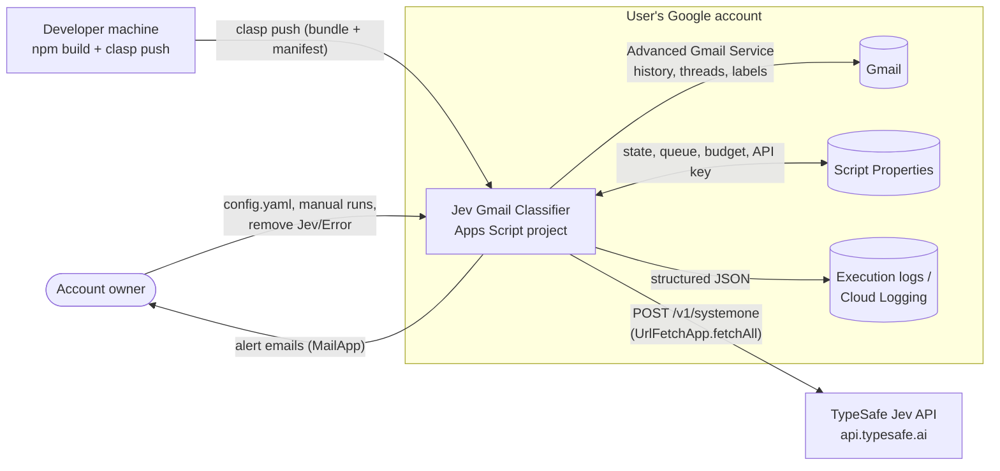
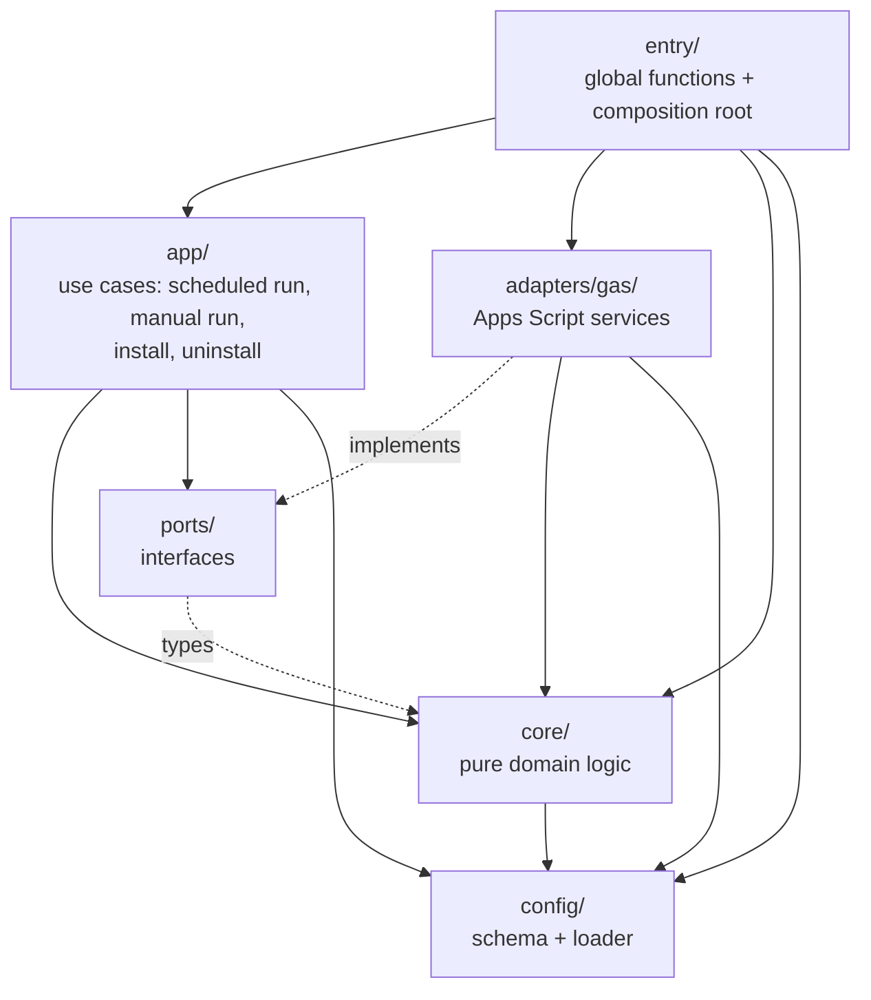
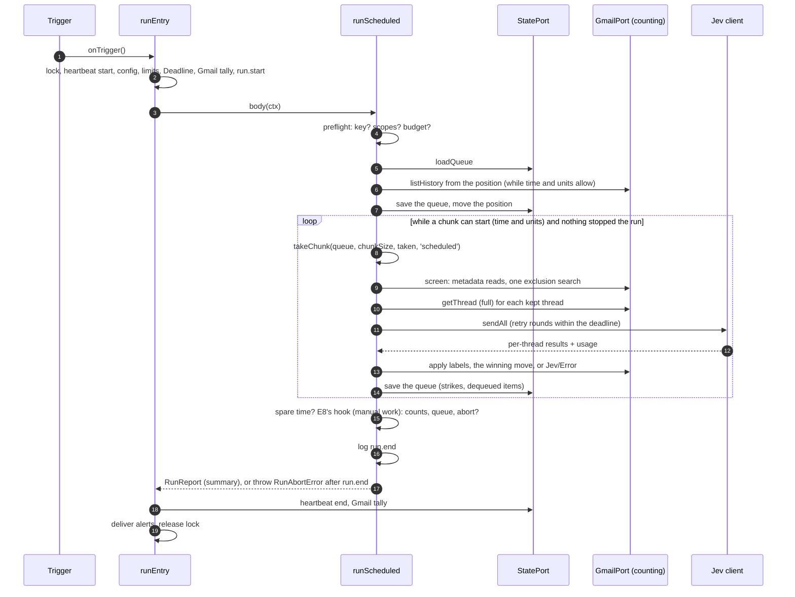
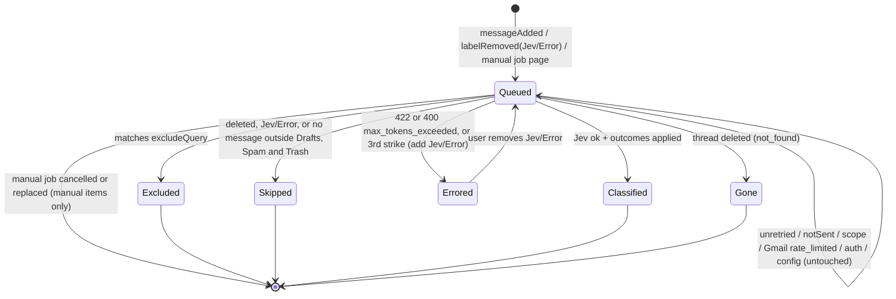

# Jev Gmail Classifier: Solution Design

> **Status:** Accepted for v1. Decided on 2026-09-25.
>
> **Where this fits:** the [Product Vision](product-vision.md) says *why*, the [Product Design Document](product-design-document.md) (PDD) says *what*, and this document says *how*: the architecture, technology, and patterns every epic, story, and task builds on. The [Engineering Standards](engineering-standards.md) hold the coding, testing, and workflow conventions, and the [Architecture Decision Records](adr/README.md) (ADRs) hold the reasoning behind each significant decision. The [README](../README.md) is the user-facing description and must agree with this document.
>
> **Precedence:** Vision > PDD > Solution Design (this document, its ADRs, and the Engineering Standards) > README. If you find a conflict, the higher document wins; raise it rather than silently choosing.
>
> **Level of detail:** high-level on purpose. Numbers marked *starting value* and items in [§13](#13-epic-guidance) are settled by the epic that owns them. When an epic settles one, it updates this document or adds an ADR.

## Contents

1. [Architectural Drivers](#1-architectural-drivers)
2. [System Context](#2-system-context)
3. [Platform Constraints](#3-platform-constraints)
4. [Architecture Overview](#4-architecture-overview)
5. [Components and Ports](#5-components-and-ports)
6. [Runtime Flows](#6-runtime-flows)
7. [Data Design](#7-data-design)
8. [Jev Integration](#8-jev-integration)
9. [Gmail Integration](#9-gmail-integration)
10. [Cross-Cutting Concerns](#10-cross-cutting-concerns)
11. [Build and Deployment](#11-build-and-deployment)
12. [Testing Architecture](#12-testing-architecture)
13. [Epic Guidance](#13-epic-guidance)
14. [Technical Risks and Items to Verify](#14-technical-risks-and-items-to-verify)
15. [Glossary](#15-glossary)

## 1. Architectural Drivers

The product principles translate into these architectural drivers. When two designs are otherwise equal, pick the one that serves the higher driver.

| # | Driver | Comes from | What it means for the design |
|---|--------|-----------|------------------------------|
| D1 | **Precision over recall** | Vision principle 1 | When unsure, do nothing: don't apply, don't move, don't guess. Moves need stronger evidence (first classification, high threshold). |
| D2 | **Privacy by construction** | Vision principle 4 | Only the header allowlist and plain text leave the account. Exclusion works per *thread*. Bodies and the API key never reach logs. The OAuth scope makes permanent deletion impossible. |
| D3 | **Bounded by design** | Vision principle 6 | Every execution has a deadline, a chunk size, and a token budget check. Nothing loops unbounded. |
| D4 | **Loud when broken** | Vision principle 2 | Every failure path ends in a log event, and the actionable ones in an alert or the `Jev/Error` label. No silent skips. |
| D5 | **Cheap** | Vision principle 3 | One request per thread, all rules together, trimmed content, no reclassification without new mail, daily token cap. |
| D6 | **Testable core** | PDD §6 | All decision logic runs in Node against fakes, with no Apps Script globals. |
| D7 | **Configuration over code** | Vision principle 5 | Behavior changes through `config.yaml`, validated at build and at runtime. |

## 2. System Context


```mermaid
flowchart LR
  user([Account owner])
  subgraph google[User's Google account]
    gmail[(Gmail)]
    script[Jev Gmail Classifier<br/>Apps Script project]
    props[(Script Properties)]
    logs[(Execution logs /<br/>Cloud Logging)]
  end
  jev[TypeSafe Jev API<br/>api.typesafe.ai]
  dev[Developer machine<br/>npm build + clasp push]

  dev -- "clasp push (bundle + manifest)" --> script
  script -- "Advanced Gmail Service<br/>history, threads, labels" --> gmail
  script -- "POST /v1/systemone<br/>(UrlFetchApp.fetchAll)" --> jev
  script <-->|"state, queue, budget, API key"| props
  script -- "structured JSON" --> logs
  script -- "alert emails (MailApp)" --> user
  user -- "config.yaml, manual runs,<br/>remove Jev/Error" --> script
```

- **One installation serves one Google account.** There is no server, database, or shared tenant.
- **The only external system is the Jev API.** No other outbound calls are allowed.
- The developer machine is used only to build and push. It is not part of the runtime.

## 3. Platform Constraints

These shape every design choice. Figures come from the [README](../README.md#limits-and-cost) and the research recorded in the ADRs; epics re-check them when they rely on them.

| Constraint | Consequence |
|-----------|-------------|
| 6-minute execution limit. | Every entry point runs against a `Deadline` ([§10.3](#103-time-budget)). |
| 90 min/day of trigger runtime on consumer accounts (about 37 s per run at 10-minute intervals). | Scheduled runs have a short soft limit. Backfill uses spare time only ([ADR-0009](adr/0009-manual-runs-use-spare-time.md)). |
| No mail-arrival trigger; time-driven triggers only at 1, 5, 10, 15, or 30 minutes. | The product polls. |
| V8 runtime **without** ES modules, `#private` fields, static class fields, `setTimeout`, `fetch`, `atob`, `TextDecoder`, or `crypto`. | TypeScript is bundled and down-levelled. Waits use `Utilities.sleep`, base64 uses `Utilities`, HTTP uses `UrlFetchApp` ([ADR-0012](adr/0012-toolchain.md)). |
| Triggers and the editor call only top-level `function` declarations. | The bundle ends with a generated footer of global functions ([§11](#11-build-and-deployment)). |
| Script Properties: 9 KB per value, 500 KB per store. | State is namespaced, small, and sharded ([§7.3](#73-script-properties-state)). |
| 20 triggers per user per script. | Only one recurring trigger. There are no chained one-off triggers. |
| Jev accepts one `state` per request; 32k tokens for `state` plus the longest question; 64k for `state` plus all questions; no token-count endpoint. | One request per thread, and truncation uses a character estimate with a safety margin ([§8.4](#84-truncation)). |
| Jev's official SDK needs `fetch`. | A hand-written client runs on `UrlFetchApp` ([ADR-0010](adr/0010-jev-request-shape-and-retries.md)). |

## 4. Architecture Overview

### 4.1 Style: ports and adapters

The code is layered as **ports and adapters** (hexagonal), with a pure core ([ADR-0002](adr/0002-ports-and-adapters.md)).


```mermaid
flowchart TB
  entry["entry/<br/>global functions + composition root"]
  app["app/<br/>use cases: scheduled run, manual run,<br/>install, uninstall"]
  core["core/<br/>pure domain logic"]
  ports["ports/<br/>interfaces"]
  adapters["adapters/gas/<br/>Apps Script services"]
  config["config/<br/>schema + loader"]

  entry --> app
  entry --> adapters
  app --> core
  app --> ports
  app --> config
  adapters -. implements .-> ports
  adapters --> core
  adapters --> config
  entry --> core
  entry --> config
  ports -. types .-> core
  core --> config
```

**Dependency rule.** An arrow means "may import". The arrows show the main dependencies; the import matrix under [Lint rules](#lint-rules) is the complete rule. Everything it doesn't allow is forbidden and enforced by lint:

- `core/` is pure: no Apps Script globals, no I/O, no clock, no randomness. Anything impure is passed in as a value or as a port.
- `app/` orchestrates through ports only. It never touches a global.
- `adapters/gas/` is the **only** place Apps Script globals appear (`Gmail`, `UrlFetchApp`, `PropertiesService`, `LockService`, `MailApp`, `ScriptApp`, `Utilities`, `Session`, `console`). Within it, only the log adapter uses `console`.
- `entry/` is the composition root. It builds real adapters, wires them into `app/`, and exposes the global functions.
- All ports are **synchronous**, because Apps Script services are synchronous. The core and app do not use `async`/`await`.

#### Lint rules

ESLint enforces the dependency rule with its built-in restriction rules (`@typescript-eslint/no-restricted-imports`, `no-restricted-globals`, `no-restricted-properties`, and `no-restricted-syntax`), with no boundary plugin. The lists live in `scripts/lint/layers.ts`, and `test/lint/layer-boundaries.test.ts` proves each one. Change this section and `layers.ts` in the same PR.

**Import matrix.** A row may import a column only where the cell says so; everything else fails. "Types only" means `import type`.

| Importer ↓ \ imports → | `core/` | `config/` | `ports/` | `app/` | `adapters/gas/` | `entry/` | `virtual:generated-config` | `src/generated/` |
|---|---|---|---|---|---|---|---|---|
| `core/` | yes | yes | no | no | no | no | no | no |
| `core/result.ts`, `core/errors.ts`, `core/log-fields.ts` | yes | **no** (cycle guard) | no | no | no | no | no | no |
| `config/` | only `result.ts`, `errors.ts` | yes | no | no | no | no | no | no |
| `ports/` | types only | types only | yes | no | no | no | no | no |
| `app/` | yes | yes | yes | yes | no | no | no | no |
| `adapters/gas/` (and the log adapter) | yes | yes | yes | no | yes | no | no | no |
| `entry/` | yes | yes | yes | yes | yes | yes | yes | no |
| `scripts/` | yes | yes | yes | yes | yes | yes | no | no |
| `test/` | yes | yes | yes | yes | yes | yes | **no** | **no** |

- **Cycle guard.** `config/` imports `core/result.ts` and `core/errors.ts` (for `ConfigError`), and `errors.ts` uses `core/log-fields.ts`. These three modules may import only `core/`, so `core/` → `config/` → `core/` can't form a cycle. A new module that `result.ts` or `errors.ts` imports joins the cycle guard.
- **Packages in `src/`.** Every `src/` file may import only relative paths and `zod`; `src/entry/` may also import `virtual:generated-config`. Node built-ins (`fs`, `node:fs`) and build-time packages (`yaml`, `esbuild`) fail. `tsconfig.json` has `types: ["node"]` for every file, so this rule is the only guard. `scripts/` may import any package.
- **The embedded config.** Only `src/entry/` imports `virtual:generated-config` ([§11](#11-build-and-deployment)). Nothing imports `src/generated/`: it's a debug copy the build writes, and lint ignores it. Tests build a `Config` from fixtures.
- A `src/` file outside every layer folder gets the `core/` rules, the strictest.

**Globals per layer.**

| Layer | Apps Script globals (list A) | Other Apps Script services | `GmailApp` | Clock and randomness | `console` |
|---|---|---|---|---|---|
| `core/`, `config/`, `ports/`, `app/`, `entry/` | no | no | no | no | no |
| `adapters/gas/` (except the log adapter) | yes | no | no | yes | no |
| The log adapter, `src/adapters/gas/gas-log-adapter.ts` | yes | no | no | yes | yes |
| `scripts/`, `test/` | not restricted | not restricted | no | yes | yes |

- **List A:** `Gmail`, `UrlFetchApp`, `PropertiesService`, `LockService`, `MailApp`, `ScriptApp`, `Utilities`, `Session`.
- **Other Apps Script services**, which v1 doesn't use (most need a scope the manifest doesn't declare): `Logger`, `CacheService`, `DriveApp`, `SpreadsheetApp`, `DocumentApp`, `SlidesApp`, `FormApp`, `CalendarApp`, `ContactsApp`, `GroupsApp`, `HtmlService`, `ContentService`, `XmlService`, `CardService`, `Browser`. Using one later updates this list, and needs an ADR if it adds a scope.
- **Clock and randomness:** `Date.now()`, `new Date()` with no arguments, `Date()` called as a function (with any arguments), `performance`, and `Math.random()`. `new Date(value)` and `Date.UTC(...)` are allowed everywhere. Elsewhere, use `ClockPort` and `RandomPort`.
- **The log adapter** is the only `src/` file that may use `console`. No log adapter exists yet; the epic that writes it (E9) uses this path, or changes `layers.ts` and this section in the same PR.
- **Default exports** fail in `src/`, `scripts/`, and `test/` ([ES §3](engineering-standards.md#3-repository-layout-and-module-rules)). The root tool configs (`eslint.config.ts`, `vitest.config.ts`) keep theirs.

### 4.2 Repository layout

The target layout. E2 creates it and may refine names, but not the layer boundaries.

```text
.
├── appsscript.json            # manifest template (scopes, advanced services, timeZone)
├── config.example.yaml        # committed example; CI builds against it
├── config.schema.json         # committed JSON Schema for editors, regenerated by the build
├── config.yaml                # user's real config (git-ignored)
├── .clasp.json.example        # committed; .clasp.json is git-ignored
├── src/
│   ├── core/                  # pure domain: rules, outcomes, state builder, truncation,
│   │   │                      # body converters, retry policy, budget, work queue, queries
│   │   └── body/              # BodyConverter implementations (basic; advanced later)
│   ├── app/                   # use cases and run controller
│   ├── ports/                 # port interfaces
│   ├── adapters/gas/          # Apps Script implementations of the ports
│   ├── config/                # Zod schema (shared by build and runtime) + loader
│   ├── entry/                 # main.ts: composition root and global functions;
│   │                          # entry-points.ts: the list of global function names
│   │                          # the footer is generated from
│   └── generated/             # readable copy of the embedded config (git-ignored; §11)
├── scripts/                   # build.ts; probe.ts, probe-run.ts, eml-thread.ts, mime.ts (local Jev probe)
├── spikes/                    # E1 and later experiments, run by hand against a real account
├── test/                      # unit tests, fakes/, fixtures/
├── docs/                      # smoke-test checklist; docs/archive/ (historical)
└── output/                    # vision, PDD, solution design, standards, ADRs
```

`src/generated/` and `src/core/body/` appear later (the build and E4). Since E7 ([#121](https://github.com/kellystuard/jev-gmail-classifier/issues/121)), `src/adapters/gas/` has an adapter for every port: Gmail, HTTP, state, secrets, lock, trigger, auth, clock, random, log and mail (`gas-mail-adapter.ts` with the pure `mail-errors.ts`, E9 [#146](https://github.com/kellystuard/jev-gmail-classifier/issues/146)), plus the UTF-8 decoder. `src/entry/main.ts` builds them per call ([§6.1](#61-entry-points)).

## 5. Components and Ports

### 5.1 Components

The PDD's components ([PDD §6.1](product-design-document.md#61-main-components)) map to code as follows.

| Component | Layer | Responsibility |
|-----------|-------|----------------|
| **Config** | `config/` | One Zod schema, used at build time to validate `config.yaml` and at runtime to validate the embedded config on load. Exposes a typed, frozen `Config`. |
| **History sync** (PDD: Work finder) | `app/` + `core/` | Reads Gmail history from the saved position, turns records into work items, and advances the position. Also runs the fallback search when history has expired. |
| **Work queue** | `core/` + `StatePort` | A persisted, de-duplicated queue of threads to classify, with strike counts and the first-classification flag. Scheduled work always comes before manual work. |
| **Exclusion filter** | `core/` + `GmailPort` | Removes every thread in which *any* message matches `excludeQuery`, before anything is read for Jev. |
| **State builder** | `core/` | Turns a thread into Jev `state`: header allowlist, plain text via a `BodyConverter`, newest first, truncated to fit. |
| **Jev client** | `core/` (pure request and response logic) + `HttpPort` | Builds requests, sends batches with `fetchAll`, retries in rounds, classifies responses, and reports token usage. |
| **Outcome applier** | `core/` (decide) + `GmailPort` (apply) | Decides the labels and the one winning move, then applies them. Handles `Jev/Error` and missing scopes. |
| **Run controller** | `app/` | Lock, deadline, token budget, scheduled-before-manual ordering, and the per-run summary. |
| **Notifier** | `app/` + `LogPort` + `MailPort` | Structured logging, and rate-limited alert emails. |
| **Lifecycle** | `app/` | `install`, `uninstall`, and the scope preflight check. |

### 5.2 Ports

Each port is a narrow, synchronous TypeScript interface in `src/ports/<name>-port.ts`, with one Apps Script adapter and one in-memory fake (`test/fakes/`).

- **Expected failures are results** (`Result`/`Fail` from `src/core/result.ts`, [§10.1](#101-error-model)). Anything an adapter doesn't recognize is thrown as `UnexpectedResponseError` and reaches the per-thread or per-run boundary.
- **Shared data types that `core/` reads live in `core/`**, which can't import `ports/`: the Gmail resource types (`src/core/gmail-types.ts`, with byte-array `body.data` and optional history change arrays), the Script Properties limits (`src/core/state-limits.ts`), the state types `JsonValue` and `StateKey` (`src/core/state-types.ts`, which `src/ports/state-port.ts` re-exports), and `LogFields`.
- **Common failure kinds:**
  - `scope`: a scope isn't granted. Adapters match the [§9](#9-gmail-integration) message fragments. A 403 `rateLimitExceeded` is never `scope`.
  - `rate_limited` (Gmail): the per-user rate limit. It means "stop Gmail work for this run", not a thread failure ([§9](#9-gmail-integration)).

| Port | Wraps | Main operations |
|------|-------|-----------------|
| `GmailPort` | Advanced Gmail Service (`Gmail.Users.*`) | Every method can fail with `scope` or `rate_limited`, plus:<ul><li>`getProfile() → {emailAddress, historyId}`</li><li>`listHistory({startHistoryId, historyTypes, pageToken?})`: **one page** `{records, historyId, nextPageToken?}`. The page's `historyId` changes between pages, so the caller advances to the last page's. Can also fail with `history_expired` (404, [§6.3](#63-ingest-gmail-history-to-work-queue)).</li><li>`searchThreadIds({q, includeSpamTrash, pageToken?})`: **one page** of thread IDs. `includeSpamTrash` is required. The caller pages ([§6.4](#64-process-classify-a-chunk)). Can also fail with `invalid_page_token` (400: Gmail rejected the `pageToken`; the caller decides whether that is expected, [§6.6](#66-manual-runs)).</li><li>`getThread(threadId, {format: 'full' \| 'metadata' + metadataHeaders \| 'minimal'})`, which can also fail with `not_found`.</li><li>`listLabels()`: one response, no paging.</li><li>`createLabel(name)`, which sends `labelListVisibility: labelShow` and `messageListVisibility: show`, and can also fail with `label_exists` (409) or `invalid_label_name` (400, reserved names). No parents are created.</li><li>`modifyThread(threadId, {addLabelIds, removeLabelIds})`, which can also fail with `not_found` (404, the thread was deleted), `invalid_label` (400, a name or an unknown ID) or `failed_precondition` (400 `failedPrecondition`, "Precondition check failed.": transient, seen once by E1 on a freshly imported thread).</li></ul>There is no `trashThread`: trash is `modifyThread` adding `TRASH` ([§6.5](#65-applying-outcomes)), the same labels for 10 units instead of 20, in the one call. |
| `HttpPort` | `UrlFetchApp.fetchAll` | `sendAll(requests) → results`, one per request, in the same order, from **one** `fetchAll` call (an empty list makes none). The result is `ok` with status, lower-case headers (a repeated header's values joined with `", "`) and body text for any HTTP status (`muteHttpExceptions`). Redirects aren't followed, so the `Authorization` header never follows one: a 3xx comes back as its status. When `fetchAll` itself throws, every request in the batch gets the same failure, since it can't say which request failed ([spike #94](../spikes/94-fetch-all.md)): `scope` when the message matches a [§9](#9-gmail-integration) fragment, otherwise `transport` (a network error or timeout). The failure's `message` is the exception's own text, never a header or payload. |
| `StatePort` | `PropertiesService.getScriptProperties()` | `get(key) → unknown` (parsed JSON), `set(key, json)`, `delete(key)`, `keys(prefix)` on `state.*` keys only. A value over 9 KB or a store over 500 KB throws `StateError` and writes nothing. `getInput(name)` and `deleteInput(name)` read and clear the plain user inputs (`MANUAL_*`, `RESET_POSITION`). Sharding isn't a port method: lists are sharded by `src/app/sharded-state.ts` on `get`, `set`, `delete` and `keys` ([§7.3](#73-script-properties-state)). |
| `SecretsPort` | Script Properties (`JEV_API_KEY`) | `getJevApiKey() → string \| undefined` (trimmed; blank is unset) |
| `LockPort` | `LockService.getScriptLock()` | `tryAcquire() → boolean` (`tryLock(0)`), `release()` (safe when not held) |
| `ClockPort` | `Date`, `Utilities.sleep`, `Session.getScriptTimeZone()` | `now()` (epoch ms), `sleep(ms)`, `timeZone()`. Implemented by `GasClockAdapter` (`src/adapters/gas/gas-clock-adapter.ts`, E7). |
| `RandomPort` | `Math.random` | `next()` in `[0, 1)`, used for jitter. Implemented by `GasRandomAdapter` (`src/adapters/gas/gas-random-adapter.ts`, E7). |
| `LogPort` | `console.*` | `info/warn/error(event, fields?)`. Implemented by `GasLogAdapter` (`src/adapters/gas/gas-log-adapter.ts`, E7), built per execution with the entry point's name: one JSON line per event through `console.info`, `console.warn` or `console.error`, with `event`, `runId`, `entry` and `ts` first ([§10.5](#105-logging-and-alerts)). It is minimal until E9 ([#142](https://github.com/kellystuard/jev-gmail-classifier/issues/142)) adds `redact`. |
| `MailPort` | `MailApp.sendEmail` | `send(to, subject, body)`, which can fail with `scope` or `quota`. Implemented by `GasMailAdapter` (`src/adapters/gas/gas-mail-adapter.ts`, E9 [#146](https://github.com/kellystuard/jev-gmail-classifier/issues/146)): one `MailApp.sendEmail` call, plain text, sender name `Jev Gmail Classifier`, no HTML, attachments, cc or reply-to. The error mapping is `mailFailure` in `src/adapters/gas/mail-errors.ts`: `scope` by the [§9](#9-security-privacy-and-permissions) fragments, `quota` by `service invoked too many times for one day`, anything else `UnexpectedResponseError` (`service: 'mail'`). A failure's `message` is the exception's own text with the recipient replaced by `<recipient>`, never the subject or body. |
| `TriggerPort` | `ScriptApp` | `replaceRecurringTrigger(handler, minutes)`: deletes every project trigger whose handler is `handler` (read from `getProjectTriggers()`), then creates one `timeBased().everyMinutes(minutes)` trigger; never deletes the object `create()` returned (E1 #163). `deleteTriggers(handler) → {deleted}`: other handlers' triggers are untouched. Both fail with `scope` (a §9 fragment); anything else throws `UnexpectedResponseError` (`service: 'trigger'`). |
| `AuthPort` | `ScriptApp.getAuthorizationInfo(ScriptApp.AuthMode.FULL).getAuthorizedScopes()` ([E1](../spikes/27-missing-scope.md)) | `missingScopes() → {missing}`: `DECLARED_SCOPES` (`src/core/declared-scopes.ts`) minus the authorized scopes. It fails with `unknown` if the call throws or doesn't return an array. `requireScopes(scopes)`: `ScriptApp.requireScopes(ScriptApp.AuthMode.FULL, scopes)`, which throws (bringing the consent screen back in the editor) when one isn't granted; only `install` calls it ([§6.7](#67-install-and-uninstall)). Implemented by `GasAuthAdapter` (`src/adapters/gas/gas-auth-adapter.ts`), which doesn't log. |

E2 defined these as a first cut; the owning epic refines its port: `GmailPort` (E3, E6), `HttpPort` (E5), `LockPort`, `TriggerPort`, and `AuthPort` (E7), `LogPort` and `MailPort` (E9). The adapters aren't unit-tested (they are thin): each has a section in `docs/smoke-test.md` ([§12](#12-testing-architecture)). `GasLogAdapter`'s line format and the pure `mail-errors.ts` are the exceptions, unit-tested.

## 6. Runtime Flows

### 6.1 Entry points

These are the only global functions. Each one runs inside the script lock and a `Deadline`.

| Function | Started by | Purpose |
|----------|-----------|---------|
| `onTrigger` | The recurring time-driven trigger. | A scheduled run: history sync, the queue, then spare time on any manual job. |
| `install` | The user, in the editor. | Authorizes, checks scopes, saves the starting position (kept if one already exists), and creates or replaces the trigger. |
| `uninstall` | The user, in the editor. | Removes the trigger and all `state.*` keys. Leaves labels and `JEV_API_KEY`. |
| `startManualRun` | The user, in the editor, after setting `MANUAL_*` Script Properties. | Validates the inputs, saves the job and deletes the `MANUAL_*` properties, then processes as much as time allows. A refusal (no input, an invalid value, an unfinished job) is a normal return, not a failure. |
| `continueManualRun` | The user, in the editor (optional). | Processes the current manual job for up to the manual deadline. |
| `cancelManualRun` | The user, in the editor. | Deletes the current manual job and its queued manual work, and makes no Gmail call. |

The lock is **one script-wide lock** taken with `tryLock(0)`. If it is busy, the function logs `run.skipped` with reason `busy` and returns ([ADR-0008](adr/0008-single-lock-and-deadline.md)).

**Wiring** (`src/entry/main.ts`, the composition root; E7 [#121](https://github.com/kellystuard/jev-gmail-classifier/issues/121), E8 [#288](https://github.com/kellystuard/jev-gmail-classifier/issues/288)). Each entry point builds its adapters **per call**, never at module load: the state adapter's snapshot and the log adapter's `runId` belong to one execution, and the bundle must load where Apps Script's globals aren't usable. Each runs its use case through `runEntry` ([§10.1](#101-error-model)) with `logOnlyAlertSink` (until E9) and the embedded config's loader:

| Function | `runEntry` options | Body | Returns (the editor shows it) |
|----------|--------------------|------|-------------------------------|
| `onTrigger` | `kind: 'scheduled'`, heartbeat on, Gmail tally on | `runScheduled` ([§6.2](#62-scheduled-run)), with `createManualSpareTime` as its `spareTime` hook ([§6.6](#66-manual-runs)) | `{entry, status: 'ok', stopped, summary, alerts}` from the `RunReport` |
| `install` | `kind: 'lifecycle'`, heartbeat off, Gmail tally on | `install` ([§6.7](#67-install-and-uninstall)), with the handler `'onTrigger'` | `{entry, status: 'ok', position, historyId, triggerMinutes, missingScopes}` |
| `uninstall` | `kind: 'lifecycle'`, heartbeat off, Gmail tally **off** (it deletes `state.*`) | `uninstall` ([§6.7](#67-install-and-uninstall)), with the handler `'onTrigger'` | `{entry, status: 'ok', triggersDeleted, keysDeleted}` |
| `startManualRun` | `kind: 'manual'`, heartbeat on, Gmail tally on | `startManualJob`; if a job started, `continueManualJob` ([§6.6](#66-manual-runs)) | `{entry, status: 'ok', query, applyMoves, job, stopped, summary}`, or `{entry, status: 'rejected', reason}` for a refusal |
| `continueManualRun` | `kind: 'manual'`, heartbeat on, Gmail tally on | `continueManualJob` | `{entry, status: 'ok', job, stopped, summary}` (`job: 'none'`, `stopped: 'no_job'` with no job) |
| `cancelManualRun` | `kind: 'lifecycle'`, heartbeat off, Gmail tally **off** (it makes no Gmail call) | `cancelManualJob(…, 'cancelled')` | `{entry, status: 'ok', cancelled, removed}` |

- **Busy lock:** each returns `{entry, status: 'skipped', reason: 'busy'}`.
- **Failure:** nothing is returned. `runEntry` logs `run.failed` and rethrows, and `main.ts` doesn't catch, so the execution shows as Failed ([§10.1](#101-error-model)).
- **A refused manual start:** `startManualRun` returns `{entry, status: 'rejected', reason}` at once, with no `continueManualJob` call, even when an older job exists. Its body returns no `summary`, so `state.runs` records an `ok` run with no `lastSummary`: a refusal is not a failed run. Its last event is `manual.rejected`; a cancel's is `manual.cancelled`. Neither logs `run.end`.
- **Failure of a manual entry:** a missing key (`RunAbortError` `missing_key`), an `abort`, a `StateError` or a `ConfigError` propagates from `runEntry` and the execution shows as Failed. After a start, the saved job stays and `continueManualRun` picks it up.
- The return values are plain JSON. `main.ts` exports exactly `ENTRY_POINTS` (`src/entry/entry-points.ts`), from which the bundle footer is generated ([§11](#11-build-and-deployment)). `test/build/bundle.test.ts` runs all six entry points in the bundle against stubbed Apps Script globals.

### 6.2 Scheduled run

`onTrigger` runs the run controller's body, `runScheduled` (`src/app/run-controller.ts`, [#118](https://github.com/kellystuard/jev-gmail-classifier/issues/118)), inside `runEntry` ([§10.1](#101-error-model)). `runEntry` owns the lock, the heartbeat, the config load, the `Deadline`, the counting `GmailPort`, `run.start`, `run.failed` and the alert delivery; `runScheduled` does everything between them and logs `run.end`.


```mermaid
sequenceDiagram
  autonumber
  participant T as Trigger
  participant E as runEntry
  participant R as runScheduled
  participant S as StatePort
  participant G as GmailPort (counting)
  participant J as Jev client
  T->>E: onTrigger()
  E->>E: lock, heartbeat start, config, limits, Deadline, Gmail tally, run.start
  E->>R: body(ctx)
  R->>R: preflight: key? scopes? budget?
  R->>S: loadQueue
  R->>G: listHistory from the position (while time and units allow)
  R->>S: save the queue, move the position
  loop while a chunk can start (time and units) and nothing stopped the run
    R->>R: takeChunk(queue, chunkSize, taken, 'scheduled')
    R->>G: screen: metadata reads, one exclusion search
    R->>G: getThread (full) for each kept thread
    R->>J: sendAll (retry rounds within the deadline)
    J-->>R: per-thread results + usage
    R->>G: apply labels, the winning move, or Jev/Error
    R->>S: save the queue (strikes, dequeued items)
  end
  R->>R: spare time? E8's hook (manual work): counts, queue, abort?
  R->>R: log run.end
  R-->>E: RunReport (summary), or throw RunAbortError after run.end
  E->>S: heartbeat end, Gmail tally
  E->>E: deliver alerts, release lock
```

**Steps** (`runScheduled(ctx, deps) → RunReport`):

1. **Preflight.** `runPreflight` (`src/app/run-preflight.ts`, [#119](https://github.com/kellystuard/jev-gmail-classifier/issues/119)) checks, in this order, the key, the scopes and the budget. A missing key throws `RunAbortError('missing_key')` before any call (no auth, Gmail, HTTP or state access); the per-run boundary logs `run.failed` and alerts `auth`. The scope check (`checkScopes`, [§9](#9-gmail-integration)) logs `scope_missing`, and the preflight adds its alert with the missing scopes. A reached budget adds `budget_reached` and logs `budget.reached`. It writes nothing.
2. **No `gmail.modify`:** the run stops here (`stopped: 'gmail_scope_missing'`) and makes no Gmail call at all ([§9](#9-gmail-integration): a trigger run that uses an unauthorized service fails at once). The queue is only read, for `run.end`'s `queueSize`.
3. **Queue:** `loadQueue`.
4. **Ingest** ([§6.3](#63-ingest-gmail-history-to-work-queue)) through the run's counting `GmailPort`, with `shouldContinue` true while `deadline.remaining() > 0` and the run's Gmail units are under `maxGmailUnitsPerRun` ([§10.3](#103-time-budget)). Its alerts (`history_expired`) are collected. `stopped: 'rate_limited'` means no processing this run (`ingest_rate_limited`); `stopped: 'scope'` logs `scope_missing` with `step: 'ingest'`, adds the alert with the scope, and means no processing (`ingest_scope`). `cap` and `deadline` let processing go on. A missing position throws `StateError` `missing` (run `install`).
5. **Chunk loop**, only when `script.external_request` is granted (else `classify_scope_missing`) and the budget isn't reached (else `budget`); ingest still ran.
   - **One label cache per run** (`createLabelCache` over the counting port), created before the loop and shared by every chunk and by the spare-time hook.
   - Take the next chunk with `takeChunk(queue, chunkSize, taken, 'scheduled')`: the first `chunkSize` **scheduled** items in queue order whose thread **hasn't been taken this run**. None left → `drained`, which now means "no scheduled item left to take". Manual items stay queued, untouched, for the spare-time hook or an editor run, so scheduled work comes first by construction and a chunk never mixes sources. A manual thread that merged into a scheduled item *is* scheduled (`enqueue` made it so): the loop classifies it, and it counts in this run's `run.end`, not in the job's counts.
   - The chunk starts only if `canStartChunk` allows it ([§10.3](#103-time-budget)): time first (`deadline`), then units (`units`).
   - Every thread in the chunk goes into `taken` before `processChunk` ([§6.4](#64-process-classify-a-chunk)), so **each thread is settled at most once per run**: a struck or untouched item stays at the front of the queue but isn't taken again until the next run.
   - The chunk's alerts, errored thread IDs (`errored` details) and missing scopes (`scope_missing` details) are collected, and its counts and settlements added to the run's.
   - The loop stops after a chunk that returned `abort` (`abort`), `stopGmail` (`rate_limited`, `scope`) or `stopSending` (`budget` → `budget`, `deadline` → `send_deadline`, `scope` → `send_scope`, `outage` → `outage`). The queue is already saved.
6. **Spare time.** When the loop `drained` and `deadline.remaining() > 0`, E8's `spareTime` hook (if one is wired: `createManualSpareTime`, the manual processor of [§6.6](#66-manual-runs) "Continuation") is called with the context, the label cache, the key, the saved queue and the set of threads taken this run. It returns `{counts, queue, abort?}` (`SpareTimeResult`): `queue` is the run's final queue (it sets `run.end`'s `queueSize`), `counts` go under `run.end`'s `spare` **only when it has at least one key** (a run that worked on no manual job logs no `spare`), and `abort` is handled as in step 8. The run's own counts, `labels`, `moves` and `summary` stay scheduled-only. An exception in the hook propagates like one from a chunk: no `run.end`, `run.failed` instead.
7. **`run.end`** is logged once ([§10.5](#105-logging-and-alerts)), also when step 2, 4 or 5 stopped early, and before an abort is thrown.
8. **Abort.** If a chunk, or the spare-time hook, returned `abort` (`stopped` becomes `abort`), `runScheduled` throws `RunAbortError` (`auth` for a Jev 401, 402 or 403; `config_invalid` for the unknown-model response) after `run.end`. The other threads of that chunk were settled; the refused thread stays queued, unmarked. `runEntry` logs `run.failed`, maps the alert and rethrows. A `RunAbortError` or `StateError` thrown by a callee propagates without `run.end` (`run.failed` covers it).
9. It returns a JSON-serializable `RunReport`: `summary` (the numeric `run.end` fields, which `runEntry` stores as `state.runs.lastSummary`), `stopped`, `labels`, `moves` and `alerts`.

**Two phases.** *Ingest* reads history and adds to the queue. *Process* takes from the queue and classifies. Keeping them separate makes retries, the budget, and the deadline uniform: any item not finished simply stays in the queue ([ADR-0004](adr/0004-history-api-position.md)).

### 6.3 Ingest: Gmail history to work queue

- **Position.** `state.position` holds the last Gmail `historyId` ingested, plus the time it was saved (`src/core/position.ts`). `install` writes the first one; a missing position is invalid state (`StateError` `missing`), and ingest never creates or resets one.
- **Read.** Call `users.history.list` with `startHistoryId` and `historyTypes = [messageAdded, labelRemoved]`, paging until done or until the queue's safety cap is reached. Ignore a record that has neither `messagesAdded` nor `labelsRemoved`: Gmail also returns records with only `messages` (seen with several types, and with `labelRemoved` alone).
- **Filter `messageAdded` records.** Ignore drafts (`DRAFT`), and messages in `SPAM` or `TRASH`. Received and sent messages both count: a reply you send can change what a thread is about.
  - A record's `labelIds` are the labels **when the message was added**, not now. So this filter drops only mail that arrived as a draft or in Spam.
  - Mail moved to Spam or Trash before processing is caught when the thread is read for processing, using current labels. Messages now in `DRAFT`, `SPAM`, or `TRASH` are left out of `state`, and an item with no message left is skipped ([§6.4](#64-process-classify-a-chunk) step 2, `no_messages`).
  - Each draft save adds a new message ID labelled `DRAFT`. Sending a draft adds a new ID with `SENT`. Mail sent to yourself is one message with both `SENT` and `INBOX`. `CATEGORY_*` labels don't matter.
  - The user's filters act before the record is written, so filter-archived mail has no `INBOX`, and filter labels and categories are already there. E3 must not require `INBOX`.
  - Confirmed by E1 (`spikes/19-message-added.md`).
- **Filter `labelRemoved` records.** Keep only those where `Jev/Error` was removed. These re-queue the thread with its strike count reset. That is how the user retries an errored thread. The retry is queued as `scheduled` with `firstClassification: false` (labels only: its messages predate the position), and merges into an item already queued, which resets that item's strikes to 0 and keeps its other fields.
  - **What a removal looks like.** Each removal, from the Gmail UI or the API, gives one record with one `labelsRemoved[]` entry per message that had the label: `{labelIds: [removed IDs], message: {id, threadId, labelIds}}`. `message.labelIds` are the labels right after that change. Deleting the label itself gives the same records.
  - **Filtering.** Filter on the client, in the same call as `messageAdded`, without `history.list`'s `labelId` option. The option works, but it would need a second call and a second position. Keep entries whose removed `labelIds` include **any ID in `state.jevErrorLabel`** ([§7.3](#73-script-properties-state)): after a user deletes the label, its name no longer resolves, and the recreated label has a new ID, so a deleted label's threads still match once E6 has created a new one. With no ID in state, nothing matches. The match is on the entry's removed `labelIds`, **not** on `message.labelIds` (the labels left after the change): trashing a labelled thread writes a `labelsRemoved [INBOX]` entry whose `message.labelIds` still include the `Jev/Error` ID, and it must not match.
  - **Trash and Spam.** Skip entries whose `message.labelIds` include `TRASH` or `SPAM`: processing ignores those threads.
  - **De-duplicate** by `message.threadId`. Other changes on the same thread (for example, opening it in the UI removes `UNREAD`) come as separate records, and are ignored.
  - Confirmed by E1 (`spikes/20-label-removed.md`).
- **Threads marked `Jev/Error`.** A new message on such a thread **is** queued: ingest makes no per-thread reads, so it can't tell. `screenChunk` skips the thread at its first read ([§6.4](#64-process-classify-a-chunk) step 2, `thread.skipped` with `reason: 'jev_error'`), so it is still never classified and stays flagged until the user removes the label.
  - A message that arrives after `threads.modify` added the label does **not** inherit it. So the check is whether **any** message in the thread carries one of the `Jev/Error` IDs saved in `state.jevErrorLabel`, not the new message's `labelIds`. It uses the metadata read that the exclusion check needs anyway, so it costs no extra call.
  - Confirmed by E1 (`spikes/20-label-removed.md`).
- **Enqueue.** Each distinct thread becomes one work item, de-duplicated against items already queued. A thread is marked **first classification** when every one of its messages arrived after the classifier's position, meaning it's a brand-new conversation. The item stores the position's `savedAt` when it is queued, and the flag is decided **once, at the item's first read**. After that it never changes: retries and later merges keep it.
  - **How "arrived after" is computed.** The item stores the position's `savedAt` at queue time. When the thread is first read, it is a first classification if every non-draft message's `internalDate` is at or after that `savedAt`, with no skew margin. The result is then fixed on the item.
  - **Edge cases.** A thread with no non-draft message, or with a non-draft message whose `internalDate` is missing or isn't a valid epoch-ms number, is not a first classification (labels only). Messages now in Spam or Trash still count, so an old thread can't look new: `threads.get` returns them (§14).
  - A message's `historyId` can't be used, because it moves whenever the message changes (for example, when it's marked read).
  - For imported mail, `internalDate` is the `Date` header, so an import with an old date counts as old: labels only, which is the safe direction.
  - Confirmed by E1 (`spikes/19-message-added.md`).
- **Advance.** The position moves only after the queued items are safely saved.
  - **After the last page**, set it to the `historyId` that page returned (it changes between pages while mail arrives, and later pages include the newer records).
  - **When ingest stops early**, at the queue cap, at the deadline, or on a `rate_limited` or `scope` failure, set it to the `id` of the last history record whose threads were all queued (or that was ignored). `history.list` from a record's `id` returns exactly the records after it, and never that record ([`spikes/62-history-resume.md`](../spikes/62-history-resume.md)). If no record was handled, the position doesn't move. This back-pressure loses nothing, and the next run carries on from there instead of reading history it already queued. (Not advancing at all would queue again the threads already classified since, and a backlog bigger than the cap would never get past the same records.)
  - `savedAt` is the time of the save, taken after the last `history.list` call. So every message already ingested is older than `savedAt`, and a later reply to its thread is never a first classification. A brand-new thread that arrives during ingest may lose its move (labels only), which is the safe direction.
- **Expired position.** A 404 from `history.list` means Gmail has discarded the history. This is typically after a week or more, and sometimes after hours. A position ahead of the mailbox (a corrupt value) gets the same 404, so it takes the same path ([`spikes/62-history-resume.md`](../spikes/62-history-resume.md)). Ingest then catches up with a **resumable fallback** (story #72, option B; `src/core/history-fallback.ts` and `src/app/ingest.ts`):
  - **At the 404** (from any history page), it calls `getProfile` before any search. Its `historyId` is where history resumes afterwards, so mail that arrives during the fallback is read from history later. It saves the queue (if earlier pages changed it). A `rate_limited` or `scope` failure here, or the deadline, creates no cursor, and the next run gets the 404 again. Otherwise it writes the cursor `state.fallback` ([§7.3](#73-script-properties-state)), and logs `history.expired` (with `aheadOfMailbox` when the old position was ahead of the profile's). The `history_expired` alert is reported **only by this call**, not by the runs that continue the fallback. `state.position` stays as it is until the fallback finishes.
  - **While `state.fallback` exists,** ingest runs the fallback **instead of** `history.list`, and doesn't read the position.
  - **Windows.** It searches `after:<s> before:<s>` time windows (epoch seconds, both inclusive: spike 23, C1), oldest first, from the old `savedAt` − 1 h up to the moment of the 404, with `includeSpamTrash: false` (ingest ignores Spam and Trash) and `maxResults: 500`, paged. A window starts at 1 day. One whose new threads don't fit the queue's room is halved, down to 60 s, and the size doubles back, up to 1 day, after each window that fits. At 60 s, with `scheduled` items queued, it waits for room (`stopped: 'cap'`); with none, it queues what fits and logs `history.fallback_missed`. A full queue stops it before searching.
  - **Items** are queued as `scheduled`, with `positionSavedAt` = the **old** `savedAt` and `firstClassification` unset, so a conversation that started during the outage can still move.
  - **Saving.** After each window, the queue is saved **before** the cursor. `rate_limited`, `scope` or the deadline keeps every completed window and nothing of the unfinished one; the next run searches that window again. A page token rejected inside one window's search (`invalid_page_token`, seconds old) is thrown the same way as any unexpected response: nothing of that window is queued and the cursor stays.
  - **The finish.** When the last window is done, the position becomes `{historyId: <from getProfile>, savedAt: <when the 404 was seen>}`, and **then** `state.fallback` is deleted. A crash between the two leaves a done cursor, and the next run repeats the finish. `savedAt` is the 404's time, not the finish's: that's when the `historyId` was read, so if it expires too, the next fallback starts early enough to cover the whole gap.
  - **Accepted cost.** A thread with messages in two windows is found twice. If it's still queued, it merges; if it was already classified, it's classified again: its labels repeat, and a move repeats only if it's still a first classification against the old `savedAt`. Repeating a label or a move is harmless ([`spikes/26-moves.md`](../spikes/26-moves.md)), and it happens only during a fallback. The same goes for a thread found by the search and then again in history after the finish. A `Jev/Error` removal made while the history was lost isn't recovered (the search finds messages, not label changes): the user removes the label again.

### 6.4 Process: classify a chunk

1. **Take a chunk** from the queue: `takeChunk(queue, chunkSize, taken, source)`, the first `chunkSize` items in queue order that have the given `source` (when given) and that the run hasn't taken yet ([§6.2](#62-scheduled-run)). `runScheduled` takes scheduled chunks (`'scheduled'`); manual chunks are taken only by the manual processor, `runManualJob` ([§6.6](#66-manual-runs) "Continuation"). A chunk never mixes sources. The chunk size is settled in [§10.3](#103-time-budget).
   - **E7: `processChunk`** (`src/app/process-chunk.ts`, [#266](https://github.com/kellystuard/jev-gmail-classifier/issues/266)) runs steps 2 to 6 for one chunk of at most `MAX_REQUESTS_PER_FETCHALL` items, in this order: `screenChunk`; a full `getThread` of each kept thread, in chunk order; `threadToState` and `buildRequest`; **one** `sendJevRequests` call for every built request; `settleThread` for each entry in request order, threading the queue through; then `saveQueue` **once**, whatever happened. It takes `remainingMs` (the run's `deadline.remaining`), not a `Deadline`, and returns the saved queue, flat counts, the de-duplicated alert conditions, the errored thread IDs, one flat settlement per settled thread, the input tokens, the missing scopes met, and `stopGmail?`, `stopSending?` and `abort?`. It never throws `RunAbortError` itself: the controller throws after its loop.
     - A screening failure returns at once with the input queue: nothing saved, nothing sent.
     - A full read that hits `rate_limited` or `scope` stops reading and **sends nothing** (an answer that can't be applied isn't bought); the queue from screening is saved and the unsent items stay queued, untouched.
     - An exception while reading or building one thread (other than `RunAbortError` and `StateError`) is one strike for that thread, through `strikeForException` in `src/app/settle-thread.ts`, the same code as `settleThread`'s own boundary; that thread isn't sent.
     - After a settlement with `stopGmail`, the later entries aren't settled: they stay queued, untouched, and their answers are lost. After an `abort`, settling goes on, so answers already paid for are applied.
     - A `scope` result from screening, a full read or the sender adds `scope_missing` and logs `scope_missing` once, with the `step` ([§10.5](#105-logging-and-alerts)).
2. **Exclusion filter.** This is the only exclusion check, and it applies to every chunk item, scheduled and manual alike ([ADR-0017](adr/0017-exclusion-search-per-chunk-for-all-work.md), which supersedes [ADR-0005](adr/0005-positive-thread-level-exclusion.md)).
   - **Read.** Get each chunk thread once in metadata form (`getThread` with `format: 'metadata'` and `metadataHeaders: ['Date']`), which gives each message's `labelIds`, `internalDate` and `Date` header without bodies. This is the only read before the search, and no thread is read in full until it has passed the check.
   - **Skip** a thread that can't be classified. It is logged as `thread.skipped` with `threadId`, `source` and `reason`, removed from the queue, and never marked. The reasons are checked in this order:
     - `not_found`: `threads.get` says the thread was deleted since it was queued.
     - `jev_error`: any message carries a `Jev/Error` ID saved in `state.jevErrorLabel`. Without that key, nothing is skipped for this reason ([§6.3](#63-ingest-gmail-history-to-work-queue)).
     - `no_messages`: the thread has no message, or every message is now labelled `DRAFT`, `SPAM` or `TRASH`.
   - **First classification.** For each thread not skipped whose item has no `firstClassification` yet, decide it from the same read (`isFirstClassification` over the thread's messages and the item's `positionSavedAt`, [§6.3](#63-ingest-gmail-history-to-work-queue) "Enqueue") and fix it on the item. An item that already has the flag keeps it.
   - Run **one** `threads.list` search for the whole chunk, over the threads left after the skips only, so a skipped thread's old messages don't widen the window (`searchExcludedThreads` in `src/app/exclusion-search.ts`). Without `excludeQuery`, or with no thread left, there is no search. `q = (<excludeQuery>) after:<lo> before:<hi>`, with `includeSpamTrash: true` and `maxResults: 500`. Here:
     - The user's query always goes in parentheses.
     - `lo` is the earliest `internalDate` **or** parsed `Date` header of **any** message in **any** chunk thread, in epoch seconds, minus 86400. It must span the oldest message, not just the newest: a thread whose only match is its oldest message is otherwise missed. A message with no usable date, or one dated before 1970, removes the lower bound (no `after:` term).
     - `hi` is the latest of now and every chunk message's `internalDate` or `Date` header, plus 86400. Search can compare against a date other than the `internalDate` the API reports: an upload's receive time, which is never later than now. So an upper bound taken from message dates alone can miss. Including the message dates also covers a `Date` header set in the future.
     - Epoch bounds are exact to the second and both inclusive.
     - `includeSpamTrash: true` is required. Without it, a thread whose only matching message is in Spam or Trash isn't returned, yet `threads.get` still returns that message.
   - **Batching.** The search pages until there is no `nextPageToken`, or until every remaining chunk thread has been found (no later page can add anything). A wide window can return many threads outside the chunk, so the search is bounded:
     - It reads at most 20 pages (10,000 threads, 200 quota units). Then each chunk thread not yet found gets one search of its own, in input order, with its own window from the same builder. Each search has its own 20-page limit. A thread its own search finds is `matched`. A thread whose own search also reaches 20 pages without finding it is treated as excluded (`search_capped`), because its check didn't complete. A thread is never sent without a completed check.
     - **Fail closed.** Any failed search call (`rate_limited`, `scope`) fails the whole check: nothing is kept or dropped, no further call is made, and the chunk is retried in a later run. An unrecognized Gmail error is thrown, and so is `invalid_page_token`: a token rejected inside one search, seconds after Gmail issued it, is invalid state, so nothing is sent.
     - The worst case, every thread capped, costs 200 units per thread, so E7's chunk sizing must allow for it ([ADR-0017](adr/0017-exclusion-search-per-chunk-for-all-work.md)).
   - Drop every excluded chunk thread (`matched` or `search_capped`). Each is logged as `thread.excluded` with `threadId`, `source` and `reason` only, never its subject, sender or any header. It is removed from the queue, finished: it is never sent, and never marked. `screenChunk` (`src/app/screen-chunk.ts`) makes no label change, no other Gmail write, and no state write: the caller saves the queue it returns.
   - **Fail closed.** If any read or search call fails (`rate_limited`, `scope`), `screenChunk` returns that failure at once, with no further call and no log. It returns no queue, so the caller keeps the one it had: nothing is kept, removed or flagged, and the whole chunk is screened again in a later run. No thread goes on without a completed exclusion check. An unrecognized Gmail error is thrown.
   - The search matches **per message**. A thread is returned when one message satisfies the whole query.
   - Confirmed by E1 ([`spikes/23-exclusion-query.md`](../spikes/23-exclusion-query.md)). A new message was searchable within a second of `history.list` reporting it (self-sends and uploads), so no indexing-lag delay is needed.
3. **Build `state`** for each remaining thread ([§8.3](#83-state-layout)), from a full read (`getThread` with `format: 'full'`). A thread deleted since screening (`not_found`) is dequeued and logged as `thread.skipped` (`reason: 'not_found'`). A thread whose `state` is empty (every message moved to Drafts, Spam or Trash since screening) is dequeued and logged as `thread.skipped` with `reason: 'no_messages'`. The subject and sender for `thread.classified` come from the newest message left in `state`.
4. **Budget preflight.** The run preflight ([§6.2](#62-scheduled-run), [#119](https://github.com/kellystuard/jev-gmail-classifier/issues/119)) checks the budget once per run, with `loadBudget` and `isBudgetReached`, and skips processing when it is already spent; `processChunk` doesn't check it. The check that counts is in the sender: it runs before each batch ([§10.2](#102-token-budget)). Items held back stay queued, and the budget alert is sent.
5. **Send** all the chunk's requests with `fetchAll`, retrying in rounds ([§8.5](#85-retries-in-rounds)). The sender checks the budget before each batch and records the tokens after it.
6. **Per-thread outcome.** This is the per-thread error boundary ([§10.1](#101-error-model)): `settleThread(entry, context, deps)` in `src/app/settle-thread.ts`, called by E7 once per entry of the chunk. It takes the sender's entry and the thread's work item, and returns a `ThreadSettlement`: the new queue (never saved here; E7 saves it after the chunk), an `outcome` (`classified`, `struck`, `errored`, `untouched` or `gone`), the alert conditions, and for `classified` what was applied. It never throws for a thread, except `RunAbortError` and `StateError`. A mismatched entry, or an item that isn't queued, throws `InvalidArgumentError` before the boundary (a caller bug).
   - **Success:** decide and apply outcomes ([§6.5](#65-applying-outcomes)), log `thread.classified`, and dequeue.
   - **Strikes** (`strikeOrError` in `src/app/jev-error.ts`; epic #12 decision 6). A thread gets at most one strike per run. `settleThread` decides what earns one:
     - **A strike:** a retryable response after every attempt was used (no `unretried`); a transport error after every attempt (no `unretried`); a `failed_precondition` from `modifyThread`; and any exception inside the per-thread boundary other than `RunAbortError` and `StateError` (an exceptional Jev response, a malformed 200, an unrecognized Gmail error).
     - **No strike** (the item stays queued, unchanged): a request cut short (`unretried`: `deadline`, `retry_after` or `stopped`), a request never sent (`notSent`: time, budget or an outage), a missing `script.external_request` scope, and a Gmail `rate_limited`. None of these is the thread's fault.
     - Strikes 1 and 2 are stored on the item, which stays queued for the next run. On the **third**, add `Jev/Error`, dequeue, and return the `errored` alert.
   - **Invalid (a 422 or the 400 `max_tokens_exceeded`):** add `Jev/Error` immediately, whatever the strike count, dequeue, and return the `errored` alert.
   - **Adding `Jev/Error`** (`markJevError`): resolve the label through the run's label cache (creating `Jev`, then `Jev/Error`, when missing), remember its ID in `state.jevErrorLabel` **before** the `modifyThread`, then add only that label. A stale ID gets one refresh and one retry, as in [§6.5](#65-applying-outcomes). If adding it fails with `rate_limited`, `scope` or `failed_precondition`, or throws, the item is kept **unchanged**: the strike isn't recorded and the item isn't removed, so the thread is sent again next run and no error goes unreported. `rate_limited` also stops Gmail work for the run, and `scope` returns the `scope_missing` alert. `not_found` dequeues the item (the thread is gone).
   - **Auth (401, 402 or 403) or missing key:** stop the whole run. Nothing is marked, items stay queued, and an alert is sent. For a 401, 402 or 403, `settleThread` doesn't throw: it returns the item `untouched` with `abort: 'auth'`, and E7 settles the rest of the chunk first, so answers already paid for are applied, then throws `RunAbortError` after the loop.
   - **Config (the unknown-model response):** stop the whole run like auth, and send the `config_invalid` alert. `settleThread` returns `abort: 'config_invalid'` the same way.
   - **Gmail `rate_limited`** anywhere in the thread's settlement (applying the outcome, or adding `Jev/Error`): the item is returned `untouched` with `stopGmail: 'rate_limited'`, and E7 stops Gmail work for the run. An answer already received is lost, and the thread is sent again next run. **`not_found`** (the thread was deleted): `gone`, dequeued, and logged as `thread.skipped` with `reason: 'not_found'`.
   - **Once per run.** A struck or untouched item stays at the front of the queue, so E7 settles each thread at most once per run: `runScheduled` passes the threads it has taken to `takeChunk`, so a later chunk in the same run never takes one again ([§6.2](#62-scheduled-run)). The same holds for manual items, per execution: `runManualJob` keeps its own set of taken threads (in spare time it starts from the scheduled run's set), so a struck or untouched manual item waits for the next execution ([§6.6](#66-manual-runs) "Continuation").
   - **Outage (a round in which every request got a 5xx or a network error, [§8.5](#85-retries-in-rounds)):** stop sending. Nothing is struck and the items stay queued.
7. **Token usage** is recorded into today's budget by the sender, after each batch, not here.

### 6.5 Applying outcomes

- **Decide** (pure, in `core/`):
  - Lives in `src/core/decide.ts` (`decideOutcome`, `movesAllowed`).
  - A rule fires when `p ≥ (rule.threshold ?? defaultThreshold)`. A probability equal to the threshold fires.
  - Every firing label rule contributes its label, de-duplicated by `labelKey` (the first spelling wins).
  - Moves are considered only if the item is a first classification, or a manual job with `applyMoves`: `movesAllowed` is `firstClassification === true || applyMoves === true`, so unset counts as not first. When they are, the **first** firing move rule in config order wins.
  - When moves aren't allowed, a move rule still fires (and is logged), but nothing of it applies, including a `label:<name>` destination's label.
  - A missing or out-of-range answer is a bug (`InvalidArgumentError`): `interpretResponse` guarantees both.
- **Apply** (`applyDecision`, `src/app/apply-decision.ts`; the change itself is `buildThreadChange`, `src/core/thread-change.ts`). Every label add and the move go into **one** `threads.modify` call:

  | Move | Adds | Removes |
  |------|------|---------|
  | none | every firing label | — |
  | `archive` | every firing label | `INBOX` |
  | `label:<name>` | every firing label + the label | `INBOX` |
  | `spam` | every firing label + `SPAM` | `INBOX` |
  | `trash` | every firing label + `TRASH` | — |

  - `addLabelIds` is de-duplicated (firing labels first, then the move's). `removeLabelIds` only ever holds `INBOX`.
  - No labels and no move means no call at all.
  - Every label ID is resolved through the label cache (below) **before** the call: the decision's labels, then a `label:<name>` move's label. A failure (`scope`, `rate_limited`) is returned and nothing is modified; labels already created stay.
  - A stale ID (`invalid_label`: a label deleted or renamed since the cache loaded) gives one cache refresh, the IDs resolved again (a deleted label is created again) and one retry. A second `invalid_label` throws `UnexpectedResponseError` (`reason: 'invalid_label'`), which reaches the per-thread boundary.
  - `not_found`, `failed_precondition` and `rate_limited` are returned to the per-thread boundary (`settleThread`), which decides what they mean.
  - The result's `applied` holds the label names added and the whole `MoveDestination`, so later epics can count moves per destination.

  Confirmed by E1 ([`spikes/26-moves.md`](../spikes/26-moves.md)):
  - `archive` removes `INBOX`.
  - `spam` adds `SPAM` and removes `INBOX`. Adding `SPAM` alone also removes `INBOX`, so sending both is harmless. Gmail then shows the thread as reported by the user ([§14](#14-technical-risks-and-items-to-verify)).
  - `label:<name>` adds the label and removes `INBOX`.
  - `trash` adds `TRASH` in the same call (10 units). It gives the same labels as `threads.trash` (both remove `INBOX`), which costs 20 units and isn't used.
  - User labels are kept in Spam and Trash, and can be added after a thread is trashed.
  - The change applies to every message in the thread, including the user's own sent messages. They get `SPAM` or `TRASH` and keep `SENT`.
  - Repeating a call is safe: no error, no change, and no history record. A move creates only `labelsAdded`/`labelsRemoved` history records, one per label, never `messagesAdded`, so E3 doesn't re-queue a thread the classifier just moved.
  - A later reply lands in the Inbox whatever the move was, including Spam and Trash, and doesn't get the thread's labels. The earlier messages stay where they were. The reply is then reclassified for labels only (seen with self-sent replies).
- **Labels.** A per-run label cache (`createLabelCache`, `src/app/label-cache.ts`) maps names to IDs. E7 creates it once per run; it loads `labels.list` lazily on first use (every label in one response, no paging) and keys names by `labelKey`. A failed load leaves it unloaded, so the next use tries again. Missing labels, including nested names like `Finance/Bill`, are created. `labelAncestors` gives the ancestors, which are created top-down before the leaf: a failed ancestor is logged (`label.parent_failed`) and skipped, `scope` and `rate_limited` stop at once, and an ancestor's `label_exists` is fine. The leaf's `label_exists` gives one refresh and one more lookup, then `UnexpectedResponseError` (`label_exists_but_missing`). `invalid_label_name` is an `UnexpectedResponseError`: the schema should have stopped it. Corrected by E1 ([`spikes/25-nested-labels.md`](../spikes/25-nested-labels.md)):
  - Gmail doesn't create parents: `Finance/Bill` is created alone. The web UI nests a label only under ancestors that exist, and otherwise shows it flat with its full name. So missing ancestors are created top-down first (`Finance`, then `Finance/Bill`). A parent is cosmetic, so a failure to create one doesn't block the leaf.
  - Names are compared case-insensitively, with spaces around `/` ignored. Gmail treats `finance/bill` and `Finance / Bill` as the existing `Finance/Bill`.
  - A 409 "Label name exists or conflicts" on create means the label already exists. The cache is refreshed and the name is looked up once more.
  - Labels are applied by ID only: a name gives 400 "Invalid label", and a stale ID gives 400 "labelId not found".
  - Reserved names such as `Inbox` or `Spam` give 400 "Invalid label name". The config schema rejects them.
  - A label can be created and applied in the same run.
- **Never removed.** The classifier never removes a classification label, and it never removes `Jev/Error`.
- **Missing scope.** A `scope` failure from the label cache (`listLabels`, `createLabel`) or from `modifyThread` never fails the thread. With a move and labels, the move is dropped and the labels get one more attempt on their own (one `modifyThread` with only the label IDs, never `INBOX`, `SPAM`, `TRASH` or a move label); the result has `moveSkipped: "scope"`, and also `labelsSkipped: "scope"` if that attempt lacks the scope too. With only a move or only labels, there is no retry and the matching field is set. Other failures in the retry (`rate_limited`, `not_found`, `failed_precondition`) are handled as usual. `settleThread` logs the fields in `thread.classified`, the thread counts as handled, so it isn't re-sent to Jev every run, and it returns `scope_missing` for E9's alert. After the user fixes the scope, a manual run with `applyMoves` redoes the moves ([ADR-0003](adr/0003-advanced-gmail-service-and-scopes.md)).

### 6.6 Manual runs

- **Input.** A manual run takes Script Properties, because editor functions can't take arguments:

  | Property | Meaning |
  |----------|---------|
  | `MANUAL_QUERY` | A Gmail search, for example `label:Receipts`. |
  | `MANUAL_TIMESPAN` | For example `2h` or `7d`; the grammar is in the Timespan bullet below. Converted to `after:<epoch seconds>`, because Gmail's `newer_than:` has no hours. |
  | `MANUAL_APPLY_MOVES` | `true` or `false`. |
  | `MANUAL_REPLACE` | Must be `true` to replace an unfinished job. |

  `startManualJob` (`src/app/manual-start.ts`, #132) reads the four inputs and `parseManualInputs` (`src/core/manual-input.ts`) validates them. Each is trimmed, and a blank value counts as unset. At least one of the query or the timespan is required. The checks run in a fixed order and the first failure is the reason: the query (more than 1,000 characters, `query_too_long`; a control character, `invalid_query`), the timespan (`invalid_timespan`), `MANUAL_APPLY_MOVES` (`invalid_apply_moves`), `MANUAL_REPLACE` (`invalid_replace`), then neither a query nor a timespan (`no_input`). A control character is a code unit in U+0000-U+001F or U+007F-U+009F (a tab or line break inside the value included), U+2028, U+2029 or a lone surrogate; the query is otherwise never parsed, escaped or changed. A flag is `true` or `false` in any case and unset is `false`; any other value (`yes`, `1`, `treu`) is refused, never guessed, so a typo can't turn moves on or off. A job that is unfinished with `MANUAL_REPLACE` not `true` is refused with `job_unfinished`.
  - **A refusal is a result, not a failure.** `startManualJob` logs `manual.rejected` ([§10.5](#105-logging-and-alerts)), writes nothing, keeps the inputs so the user can fix one value and run again, and returns `{started: false, reason}`. The execution completes and `state.runs` records no failure.
  - **Start.** With `MANUAL_REPLACE=true` and a job, `cancelManualJob(…, 'replaced')` runs first (see "Cancel" below). With no job nothing is cancelled whatever `MANUAL_REPLACE` says, but stray manual items in the queue (left when `state.manual` was deleted by hand) are dropped first, so the new job can't run them with the old job's `applyMoves`. Then the new job is saved in `state.manual`, **all four inputs are deleted** (set or not, so a stale `MANUAL_REPLACE` or `MANUAL_APPLY_MOVES` can't act on a later run), and `manual.started` is logged. A corrupt `state.manual` or queue, or a failing write, throws `StateError` with the inputs kept and nothing reset.
  - **Crash safety.** The write order is cancel, save the job, delete the inputs, log. A crash after the cancel leaves no job and the inputs in place, so running again starts the job. A crash after the save leaves the new job and the inputs: the job continues in spare time, and running again is refused with `job_unfinished` or, with `MANUAL_REPLACE=true` still set, replaces the job with the same query and a fresh bound. Both are harmless.
  - It makes no Gmail, Jev, auth or secrets call and reads no config.
- **Timespan.** `MANUAL_TIMESPAN` is trimmed, then must be 1 to 5 ASCII digits with no leading zero, directly followed by one unit, `h` (hours), `d` (days) or `w` (weeks), in either case. Valid: `2h`, `36H`, `7d`, `4w`. Invalid, with no guessing or repair: an empty value, `0h`, `007d`, `1.5d`, `-2h`, `2 h`, `1d12h`, `2hours`, a bare number, six or more digits, a full-width digit. `m` and `y` are refused on purpose: `m` would mean minutes here and months in Gmail's `newer_than:`, so the user writes days (`30d`, `365d`). The bound is `after:<s>` with `s = max(0, floor((now − ms) / 1000))`, computed once when the job starts and fixed for the job's life. Gmail's epoch `after:` is inclusive and exact to the second ([spike 23](../spikes/23-exclusion-query.md) C1). Code: `src/core/timespan.ts` (`parseTimespan`, `timespanAfterSeconds`; #131).
- **Job search.** The job's search is `MANUAL_QUERY` and/or the timespan only; it never includes `excludeQuery`. The final query has exactly three forms (`buildJobQuery`): the trimmed query as typed, `after:<s>` for a timespan only, or `(<query>) after:<s>` for both. It is at most 1,019 characters, and the same string is stored in `state.manual` and logged. Nothing is added for `Jev/Error`: screening skips those threads ([§6.4](#64-process-classify-a-chunk)). Its threads are queued as manual items, and they reach the chunk exclusion filter in [§6.4](#64-process-classify-a-chunk) like scheduled items. The job search is never the exclusion check. E1 showed that `(<query>) (<excludeQuery>)` misses a thread when the two queries match different messages, and so does `(<query>) -(<excludeQuery>)` ([ADR-0017](adr/0017-exclusion-search-per-chunk-for-all-work.md)).
- **Job.** `state.manual` ([§7.3](#73-script-properties-state); `src/core/manual-job.ts`, #134) holds the exact final job query, `applyMoves`, `startedAt`, the search cursor, `searchDone`, the number of executions that worked on the job, counts (pages, queued, merged, chunks, excluded, skipped, sent, classified, struck, errored, gone, input tokens), threads labelled per label name, threads moved per destination, and two overflow counts. It has no exclusion term. Threads with `Jev/Error` are skipped. Every matching thread is reclassified, because there's no processed label to bypass. Moves apply only with `applyMoves`.
- **Cursor.** A page token, with a count of IDs already read as the fallback: `cursor = {seen, pageToken?}`. `seen` is the number of thread IDs read and queued so far, and `pageToken` is the next page's token. Gmail may return fewer IDs than `maxResults`, so `seen` isn't always a multiple of the page size. The four states: no token and `seen === 0` is the first page; a token is the next page; no token with `seen > 0` and the search not done needs a walk (the refill reads from the first page, queuing nothing, until it has passed `seen` IDs); `searchDone` means no more pages. A token Gmail rejects in a later execution is the result `invalid_page_token`; the refill then drops it (keeping `seen`) and walks.
  - **Rejected: a descending `before:` bound.** `threads.list` returns no dates, so a bound would cost a 40-unit read per page, and search matches per message, so a thread with a newer reply would come back on every later page.
  - **What a job covers.** The result set isn't a snapshot. Mail that changes while the job runs can be classified twice (harmless: labels and moves are idempotent), and after a cursor reset a thread can be missed when earlier matches left the result set meanwhile. Gmail also answers some bad tokens with a page and no error ([spike 287](../spikes/287-page-token.md)), so a token that went stale that way isn't noticed and no reset happens: the job goes on from wherever Gmail put it, and threads can be missed or queued again. Accepted.
- **Refill.** `refillManualQueue(job, queue, {gmail, state, clock, log}, canContinue)` (`src/app/manual-refill.ts`, #135) reads pages of the job search and queues each thread ID as a manual work item. `runManualJob` calls it before each manual chunk. It makes no thread read, no Jev call and no label change, and it takes no config.
  - **The request** is always `searchThreadIds({q: job.query, includeSpamTrash: false, maxResults: 100, pageToken?})`: the same `q` and page size on every call, the token only when the cursor has one. Nothing is added to `job.query`. The job search is never the exclusion check, and exclusion isn't applied at enqueue: manual items reach the chunk filter in [§6.4](#64-process-classify-a-chunk) like scheduled ones ([ADR-0017](adr/0017-exclusion-search-per-chunk-for-all-work.md)).
  - **A page is read only while all four hold:** the search isn't done; the queue holds at most 100 manual items (`QUEUE_MAX_MANUAL_ITEMS − MANUAL_PAGE_SIZE`); it holds at most 900 items in all (`QUEUE_MAX_ITEMS − MANUAL_PAGE_SIZE`); and `canContinue()` is true. So a whole page always fits, and a manual job never blocks scheduled ingest. `canContinue` is the caller's check of time and Gmail units (10 per page, [§9](#9-gmail-integration)); it is asked before every search call, the walk's too.
  - **A manual item** carries `source: 'manual'`, `enqueuedAt` (one clock reading per page), and `applyMoves: true` only when the job has it. It carries no `firstClassification` and no `positionSavedAt`: screening then decides `false` for a new manual item, and a merge can't overwrite a scheduled item's undecided flag (passing `false` would take a brand-new thread's move away). An ID that is already queued merges ([§7.3](#73-script-properties-state)): a scheduled item stays scheduled and keeps its fields.
  - **Write order, per page:** the queue, then the job with the cursor advanced and `pages`, `queued` and `merged` added. A crash between the two repeats the page in the next execution, and the repeats merge. A page with no next token sets `searchDone`, also when it is empty.
  - **Failures.** `rate_limited` and `scope` end the call with `stopGmail`, and nothing is saved for that page; the caller logs and alerts a missing scope. A `StateError` from a save propagates.
  - **Cursor reset.** `invalid_page_token` for a token kept from an earlier execution: the job is saved with the token dropped, `manual.cursor_reset` is logged (`reason: 'rejected'`), and the walk follows. At most one reset happens per call.
  - **The walk** finds the cursor again by counting. It reads from the first page, queues nothing and saves nothing until it ends, then saves the restored cursor. It ends when it has passed exactly `seen` IDs (the cursor is the token for the next page); or, when the next page would pass `seen` (the result set changed, or the pages are cut differently), at the last page boundary before it, so the normal loop reads that page again and some threads are queued a second time (they merge, or are classified again); or at the end of the results, which sets `searchDone`. If `canContinue()` turns false or Gmail fails first, the walk is unfinished: the stored job keeps `seen` and has no token, and the next execution logs `manual.cursor_reset` with `reason: 'pending'` and walks again from the first page. An editor run has room for about 1,300 pages.
  - **Unexpected responses** throw `UnexpectedResponseError` (`service: 'gmail'`) before anything is saved for that page, with fixed text that never holds the query or a token: `invalid_page_token` for a request that sent no token, or for a token Gmail gave in this same call (a page just read, or the end of a walk); a next token that can't be stored (`isStorablePageToken`); a next token equal to the one just sent (the search would go round in a circle); and more than 10 empty pages in a row that each carry a next token (`REFILL_MAX_EMPTY_PAGES`, counted over one call, walk pages included). Up to that bound an empty page with a next token is followed like any other page: `seen` stays and the cursor takes the new token. The bound keeps a job from spending every run's Gmail units on pages that hold nothing (spike 287: Gmail answers the token `0` with such a page). The pages saved before the throw stay saved, so the next execution goes on from there.
- **Continuation.** A manual job never gets its own trigger. It runs in scheduled runs' spare time, after scheduled work, and in `startManualRun` and `continueManualRun` executions from the editor, which use the longer manual deadline ([ADR-0009](adr/0009-manual-runs-use-spare-time.md)). The code is `src/app/manual-run.ts` ([#136](https://github.com/kellystuard/jev-gmail-classifier/issues/136)).
  - **The manual processor.** `runManualJob(ctx, deps, {labels, apiKey, queue, taken})` is one execution's work on the job. With no job it does nothing at all: no log, no write (a stray manual item then stays queued until `cancelManualRun` or the next `startManualRun` drops it). Otherwise it counts the execution (`executions + 1`) and loops:
    1. **Refill** (above), with `canContinue` true while `deadline.remaining() > 0` and the run's Gmail units plus 10 (one search page) are within `maxGmailUnitsPerRun`. A `stopGmail` from it stops the execution (`rate_limited`, `scope`); `scope` is also logged as `scope_missing` with `step: 'manual_search'` and alerted, as ingest's is.
    2. **Take** `takeChunk(queue, chunkSize, taken, 'manual')`: manual items only, and never a thread already taken in this execution.
    3. **Nothing to take:** the job is **complete** when the search is done and no manual item is queued. If manual items are still queued, all were taken in this execution (struck or untouched), and it stops (`waiting`). Otherwise the refill was blocked: by time (`deadline`), by Gmail units (`units`), or by a queue with no room for a page (`queue_full`).
    4. **May the chunk start?** `canStartChunk` with the run's limits ([§10.3](#103-time-budget)), else `deadline` or `units`, as in the scheduled loop.
    5. The chunk's threads go into `taken`, so **each thread is settled at most once per execution**, then `processChunk` ([§6.4](#64-process-classify-a-chunk)) runs with the same deps as a scheduled chunk. It saves the queue.
    6. `addChunkToJob`, then the job is saved; the execution's own counts are kept beside it. A crash between the queue save and this save loses that chunk's counts, never a thread.
    7. The chunk's alerts, errored thread IDs and missing scopes are collected as `runScheduled` collects them, and the loop stops after a chunk with `abort` (`abort`), `stopGmail` (`rate_limited`, `scope`) or `stopSending` (`budget`, `send_deadline`, `send_scope`, `outage`).
  - **When it stops without completing,** the job is saved (this stores `executions` even when nothing else changed) and `manual.progress` is logged with the reason. It never throws `RunAbortError` itself: it returns `abort`, and its caller throws after `run.end`. A `StateError`, or an `UnexpectedResponseError` from the refill or a chunk's screening, propagates.
  - **Completion.** The job is complete when the search is done and no `source: 'manual'` item is left in the queue. Then `manual.progress` (`stopped: 'completed'`) and `manual.completed` are logged, in that order, and `state.manual` is deleted. A job that matched nothing completes in its first execution with zero counts. A struck manual item keeps the job open until it is classified or gets `Jev/Error`. A manual thread that merged into a scheduled item doesn't: it is scheduled work ([§6.2](#62-scheduled-run)), and it keeps the job's `applyMoves`.
  - **Spare time.** `createManualSpareTime(deps)` returns the hook `runScheduled` calls in step 6 of [§6.2](#62-scheduled-run): `runManualJob` with the run's context, label cache and key, and `taken` starting as the threads the run already took. It returns the execution's counts (`{}` with no job, so `run.end` has no `spare`), the saved queue and the `abort`. The scheduled run passes its own limits, so spare time does about one manual chunk of 20 per run. Scheduled mail is never starved: the hook is reached only after the scheduled loop drained, with `script.external_request` granted and budget left.
  - **Editor runs.** `continueManualJob(ctx, deps)` is the body of `continueManualRun`, and of `startManualRun` after a successful start, inside `runEntry` with `kind: 'manual'` (the manual limits of [§10.3](#103-time-budget): about seven chunks, 140 threads, per run). **It does manual work only: no ingest and no scheduled item.** New mail waits for the next trigger, and only scheduled runs move the position. Its steps:
    1. `runPreflight` ([§6.2](#62-scheduled-run)). A missing key throws `RunAbortError('missing_key')` before anything else; a saved job stays.
    2. No job: it ends with `stopped: 'no_job'` and returns normally.
    3. No `gmail.modify`: it ends with `gmail_scope_missing` and makes no Gmail call.
    4. `loadQueue`.
    5. No `script.external_request` (`classify_scope_missing`), or the budget reached (`budget`): no chunk and no refill (a refill needs neither, but it is skipped too, to keep it simple).
    6. One label cache, then `runManualJob` with nothing taken.
    7. `run.end` ([§10.5](#105-logging-and-alerts)), once, on every path from step 2 on.
    8. A chunk's `abort` throws the same `RunAbortError` as `runScheduled`, after `run.end`; the job and the queue are already saved.

    It returns `{summary, report: {job, stopped, alerts}}`; `summary` is the numeric `run.end` fields, which `runEntry` stores in `state.runs.lastSummary`.
- **Reporting.** Progress is logged each execution. On completion, the job logs `manual.completed` with counts per label and per move destination.
  - **Counting** (`src/core/manual-counts.ts`, [#138](https://github.com/kellystuard/jev-gmail-classifier/issues/138)). `addChunkToJob` adds each processed chunk to the job's totals: `chunks`, `excluded`, `skipped`, `sent`, `inputTokens`, and one per settlement `classified`, `struck` (strike events, so a thread can add twice across executions), `errored` or `gone`. `untouched` is not a total: the thread stays queued. A thread that a manual item merged into a scheduled item is counted by that scheduled run's `run.end`, not by the job.
  - **Per label and per destination.** `labels` counts threads per label name, and `moves` per destination (`archive`, `spam`, `trash` or `label:<name>`), the same keys as `run.end`. Both are flat maps of numbers, built with `Map`s so a label named `constructor` or `__proto__` is an ordinary key.
  - **The 8,000-byte rule.** A key already in a map is always counted. A new key is added only if the job, with that key, has a reserved size (`manualJobReservedBytes`: every number and the page token at their widest) of at most 8,000 UTF-8 bytes. Otherwise the count goes to `otherLabels` or `otherMoves`. This keeps the encoded job inside one Script Properties value ([§7.3](#73-script-properties-state)).
  - **Events.** `manual.progress` once per execution that had a job, and `manual.completed` when the job completes ([§10.5](#105-logging-and-alerts)). `addChunkToExecution` keeps the execution's own counts, `untouched` included, which also form the spare-time hook's `counts`.
- **Cancel.** `cancelManualJob(deps, reason)` (`src/app/manual-cancel.ts`, #139) serves `cancelManualRun` (`reason: 'cancelled'`) and `startManualJob` with `MANUAL_REPLACE` (`reason: 'replaced'`). It undoes nothing already applied: labels and moves stay. In this order:
  1. Reads the job (`loadManualJob`). A corrupt `state.manual` throws `StateError` here, before anything is written.
  2. Loads the queue, runs the pure `dropManualWork` (`src/core/work-queue.ts`) and saves the result. This removes every `source: 'manual'` item and clears `applyMoves` on the items that stay (a scheduled item that merged with a manual one stays queued as scheduled work, without the job's moves; its other fields are unchanged). `saveQueue` writes only changed shards.
  3. Deletes `state.manual`, when a job existed.
  4. Logs one `manual.cancelled` ([§10.5](#105-logging-and-alerts)) and returns `{cancelled, removed}`.

  **Why this order:** the queue is saved before the job is deleted. A crash between the two leaves a job with its cursor and no queued items, so the next execution just refills (and the cancel can be run again). The other order would leave manual items with no job, which nothing would ever take and which a later job would inherit with the old `applyMoves`.

  **No job:** it still drops stray manual items (and clears stray `applyMoves`), logs with `job: 'none'` and returns `cancelled: false`; it isn't an error. A second call is a no-op that writes nothing. **A corrupt job or queue** (`StateError`) propagates with nothing written or logged here (`runEntry` logs `run.failed`): a cancel never resets a value it can't decode ([ADR-0007](adr/0007-script-properties-state.md)). The way out is `uninstall` (it deletes `state.*` without reading) or deleting `state.manual` by hand. A failing write propagates with no `manual.cancelled`, and a second call finishes the job. It makes no Gmail, Jev, auth, secrets or clock call, raises no alert, and leaves the `MANUAL_*` inputs alone.

### 6.7 Install and uninstall

- **`install`** (`install` in `src/app/install.ts`, #128). It runs inside `runEntry` (`kind: 'lifecycle'`, heartbeat off, Gmail tally on), which owns the lock, the config load, `run.start`, `run.failed` and alert delivery. In this order:
  1. **Insist on the essential scopes:** `AuthPort.requireScopes(INSTALL_REQUIRED_SCOPES)`, which is `ScriptApp.requireScopes(ScriptApp.AuthMode.FULL, [gmail.modify, script.external_request, script.scriptapp])` (`src/core/scope-features.ts`; maintainer's choice on #128, option A). Apps Script's error propagates; run from the editor, it brings the consent screen back, so `install` doesn't finish until the three are granted. `script.send_mail` stays optional.
  2. **Scope check:** `checkScopes` ([§9](#9-gmail-integration)); its `scope_missing` alert goes to the run's collector with the missing scopes. Without `gmail.modify` or `script.scriptapp`, `install` throws `RunAbortError` `scope_missing` (a backstop behind step 1). A missing `script.send_mail` (alerts only logged) doesn't stop it: it is logged, alerted and in the report. `unknown` carries on; the per-action `scope` results below are the backstop.
  3. **Key:** no `JEV_API_KEY` → `RunAbortError` `missing_key` ("set JEV_API_KEY in Script Properties, then run install again"). Nothing has been written before this point. The key is never logged.
  4. **`state.installedAt`:** `{"v": 1, "at": <now>}`, overwritten on every install.
  5. **Position.** `RESET_POSITION` (read with `getInput`) resets only when it is `true` after trimming, in any case. Absent or blank is no reset, silently. Any other value (`yes`, `false`, `1`) is ignored, left in place, and flagged in `run.end` (`warn`, `resetPositionIgnored: true`; the value isn't logged).
     - **Kept** when a position exists and there's no reset: it is decoded (a corrupt value throws `StateError` before the trigger; the fix is `RESET_POSITION=true`), with no `getProfile` call. `state.fallback` is left alone.
     - **Set** (no position) or **reset:** `getProfile().historyId`. Then `state.fallback` is deleted, then `state.position` is written with `encodePosition` (`savedAt` = now), then, for a reset only, `RESET_POSITION` is deleted. A reset doesn't read the old position, so a corrupt one is simply replaced.
     - **Why the fallback goes first, on both paths:** a fallback cursor left next to a new position keeps running and, when it finishes, writes its own older `historyId` over the new one ([§6.3](#63-ingest-gmail-history-to-work-queue)). Deleting it first means a crash in between leaves the old position (and, for a reset, `RESET_POSITION` still set), so running `install` again redoes the step. The input is deleted right after the new position is saved and **before** the trigger: if the trigger then fails, the next `install` keeps the new position instead of resetting twice (which could skip mail between the two).
  6. **Trigger, last:** `replaceRecurringTrigger('onTrigger', triggerIntervalMinutes)`, so a trigger never exists without a position.
  7. **`run.end`** ([§10.5](#105-logging-and-alerts)); the report (`position`, `historyId`, `triggerMinutes`, `missingScopes`) goes back to the editor.

  **Failures:** `RunAbortError` `scope_missing` for a missing `gmail.modify` or `script.scriptapp` in step 2, or a `scope` result from `getProfile` or the trigger (the position stays: harmless, the next `install` keeps it); `RunAbortError` `missing_key`; Gmail's per-user rate limit from `getProfile` → `UnexpectedResponseError` (`service: 'gmail'`, `reason: 'rate_limited'`): run `install` again in a few minutes. A `StateError` from any write propagates. After any failure, running `install` again is safe.

  **The queue is kept:** `install` never reads or writes `state.queue.<n>`. Re-running `install`, for example to change the interval, never skips or duplicates mail: the position is kept, so ingest continues from where it was.
- **`uninstall`** (`src/app/uninstall.ts`):
  - Deletes the `onTrigger` triggers **first**. A missing `script.scriptapp` stops it with `RunAbortError` (`scope_missing`) before any state is touched, because a trigger with no state would fail every run.
  - Then deletes every `state.*` key found by `keys('state.')`, without reading any value, so corrupt values and every queue shard are deleted too.
  - It is idempotent: running it again after a failure finishes the job.
  - It leaves labels, `JEV_API_KEY`, any `MANUAL_*` inputs and `RESET_POSITION`.
  - It runs under the lock with no heartbeat and no Gmail tally (#120), so nothing writes `state.*` after it.
  - It logs `run.end` with `triggersDeleted` and `keysDeleted`.

  Mail that arrives while the classifier is uninstalled is classified only through a manual run.

## 7. Data Design

### 7.1 Gmail labels

| Label | Written by | Meaning |
|-------|-----------|---------|
| Classification labels (from `rules[]`) | Classifier | Added when a rule fires. Never removed by the classifier. |
| `Jev/Error` | Classifier | The thread needs attention: a 422, the 400 `max_tokens_exceeded`, or 3 strikes. Only the user removes it, and removing it retries the thread. |

There is **no** `Jev/Processed` label. Progress is tracked in state ([ADR-0004](adr/0004-history-api-position.md)).

### 7.2 Configuration

- **Source.** `config.yaml` at the repo root. It is git-ignored because it describes the user's mail. `config.example.yaml` is committed, and CI builds with it.
- **Schema.** One Zod schema in `src/config/schema.ts` is the single source of truth. It emits `config.schema.json` (JSON Schema draft 7, input side, so fields with defaults are optional) for editor validation; `config.example.yaml` points at it with a `yaml-language-server` comment. The file is **committed**, so the `$schema` line resolves on a fresh clone before any build. `npm run build` regenerates it (`scripts/config-json-schema.ts`), and a test fails if the committed copy is out of date. JSON Schema can't express the refinements (label names, unique IDs, cross-field rules): editors check the shape, and the build checks the rest.
- **Validated twice** ([ADR-0013](adr/0013-config-validation-and-per-user-files.md)):
  - **At build:** `config.yaml` (or the file given with `npm run build -- --config <path>`) is parsed and validated. Any error fails the build with a message that gives the field path ([§11](#11-build-and-deployment)).
  - **At runtime load:** the embedded config is validated again by the same schema. A failure is invalid state, so it throws, alerts, and stops the run.
- **Fields** (final, settled in E2). **Unknown keys are rejected**, at the top level and in each rule, so a typo such as `treshold` fails instead of being ignored. The exact validation messages live in the schema and its tests (`test/config/`); each is reported with its field path, such as `rules[2].destination`.

  | Field | Constraint | Default |
  |-------|-----------|---------|
  | `defaultThreshold` | A number from 0 to 1. | Required. |
  | `triggerIntervalMinutes` | One of 1, 5, 10, 15, or 30. | `10` |
  | `jevModel` | A non-empty model name with no spaces, such as `jev-1.13.0`. | `jev-latest` |
  | `dailyTokenBudget` | A whole number of tokens, at least 1. | `20000000` |
  | `excludeQuery` | A **positive** Gmail query of mail that must never be sent, for example `from:mybank.com OR label:Private`. If present, it isn't empty; a bare `excludeQuery:` line (YAML `null`) is rejected. Its Gmail syntax isn't checked. | Absent: nothing is excluded. |
  | `plainTextMethod` | Only `basic`. `advanced` is reserved and rejected in v1, with its own message. | `basic` |
  | `rules` | At least one rule. No upper limit here (request size is E4's). | Required. |
  | `rules[].id` | Matches `^[a-z][a-z0-9_-]{0,31}$`: a lowercase letter, then `a-z`, `0-9`, `-` or `_`, 1 to 32 characters. Unique across rules. Used as the Jev question key and the log key. | Required. |
  | `rules[].question` | Not empty or only spaces. | Required. |
  | `rules[].action` | `label` or `move`. | `label` |
  | `rules[].label` | Required when `action` is `label`, and not allowed when it's `move`. A valid label name (below). | — |
  | `rules[].destination` | Required when `action` is `move`, and not allowed when it's `label`. Exactly `archive`, `spam`, `trash`, or `label:<name>`, where `<name>` is everything after the colon and is a valid label name. Parsed into a `MoveDestination` (`{ kind: 'archive' }`, …, `{ kind: 'label', label }`). | — |
  | `rules[].threshold` | A number from 0 to 1. | Absent: `defaultThreshold` applies when deciding ([§6.5](#65-applying-outcomes)). The default isn't copied in. |

- **Label names** (from E1, [`spikes/25-nested-labels.md`](../spikes/25-nested-labels.md)). They apply to `rules[].label` and to `<name>` in `label:<name>`. Names are compared case-insensitively. The schema doesn't normalize names; it rejects the forms Gmail would store or show in a surprising way:
  - No empty part and no space at either end of a part: `A/`, `/A`, `A//B`, `A / B` and ` A` are rejected.
  - Not a Gmail system label: `Inbox`, `Spam`, `Trash`, `Sent`, `Drafts`, `Starred`, `Important`, `Unread` or `Chats`, in any case. `Social` is allowed.
  - The first part isn't a system label either (`Inbox/Receipts`), because Gmail would show a separate label, not one under the Inbox. Deeper parts are fine (`Work/Inbox`).
  - The first part isn't `Jev`: the `Jev/` namespace is reserved for the classifier's own `Jev/Error` ([§7.1](#71-gmail-labels)).
  - No two names across the config that differ only in case (`Finance/Bill` and `finance/bill`), because Gmail treats them as one label. The same name written identically in several rules is fine.

  `labelKey(name)` in the schema module gives the comparison key Gmail uses (lower case, spaces around `/` dropped), for E6's label cache.

- **Time zone.** Not in `config.yaml`. It is `timeZone` in `appsscript.json`, which ships as `Etc/UTC`, and the user edits it. It defines "a day" for the budget and alert limits.

### 7.3 Script Properties state

All persistent state goes through `StatePort` ([ADR-0007](adr/0007-script-properties-state.md)):

- Keys are namespaced.
- Values are JSON with a `v` schema-version field, so a later upgrade can migrate them. Each key has a codec made with `defineStateCodec` (`src/core/state-codec.ts`), which pairs the current version with a Zod schema of the value and ordered migration hooks:
  - `encode` writes `{"v": <version>, ...value}`, with `v` first.
  - `decode` migrates an older `v` on read, running the hooks `v`, `v + 1`, … in order.
  - A newer or unknown `v`, a missing hook, or a hook that throws is `StateError` `version`. A value that isn't an object with an integer `v`, or that fails the schema, is `StateError` `schema`.
  - `decode` never writes: a value that can't be decoded is never reset or rewritten ([§11](#11-build-and-deployment), "Upgrades"). Its error names the key, the version and the schema issue paths, and never the stored value.
- Anything that can grow is a **sharded list**, stored by `loadShardedList` and `saveShardedList` (`src/app/sharded-state.ts`), with the pure planning in `src/core/sharding.ts` (#210):
  - **Keys:** `<prefix><n>`, with `n` = 0, 1, 2, and so on, and a prefix that ends with `.` (`state.queue.0`, `state.queue.1`, …). The part after the prefix is `0` or a number with no leading zero. Any other key under the prefix throws `StateError` `bad_key`: it's invalid state, never skipped.
  - **Shard:** `{"v": <codec version>, "items": [...]}`, whose JSON text is at most 9 KB (`STATE_VALUE_MAX_BYTES`, in UTF-8 bytes). Items are packed in order, greedily, into as few shards as fit. An empty list stores no shards.
  - **Cap:** each list has a maximum number of shards. A list that needs more, or an item that doesn't fit in one shard on its own, throws `StateError` `too_large` and writes nothing. Callers keep their lists under their caps, so this is invalid state.
  - **Read:** every key under the prefix, sorted by `n` numerically (`keys()` sorts by code unit, so `10` comes before `2`), concatenated, with later duplicates removed by ID. A shard that fails to decode throws, and nothing is reset. After a save that stopped part-way, the stored order can differ from the list's own order, so callers re-sort.
  - **Write:** a shard whose JSON text is unchanged isn't written. The other writes follow a safe order: the lowest pending shard that can be overwritten without losing a stored item that's still in the list goes first. Writing a key that doesn't exist yet is always safe. When no write is safe (items moving in a cycle), a **temporary shard** past the end first takes the at-risk items, as they are stored now. Last, the surplus shards and any temporary shard are deleted.
  - **Crash safety:** after every single `set` or `delete`, every stored item that's still in the list is in at least one stored shard. So a save that stops part-way (a crash, or a `StateError` such as `store_full`) can leave a duplicate or bring back an item that was removed, but never loses a stored item. The peak extra space is one shard per cycle broken.

| Key (working name) | Holds | Growth control |
|--------------------|-------|----------------|
| `JEV_API_KEY` | The secret, set by the user. | — |
| `MANUAL_*`, `RESET_POSITION` | User inputs. The four `MANUAL_*` inputs are read by `startManualJob` and all deleted once a job starts; a refusal leaves them in place ([§6.6](#66-manual-runs)). `RESET_POSITION` is honoured by `install` only when it is `true` (trimmed, any case), then deleted; any other value is ignored with a warning and left in place ([§6.7](#67-install-and-uninstall)). | — |
| `state.installedAt` | `{"v": 1, "at": <epoch ms>}` (`src/core/install-record.ts`): the last `install` time, overwritten by every `install`. Nothing reads it in v1: it is a record for support. | Fixed size. |
| `state.position` | `{"v": 1, "historyId": "<digits>", "savedAt": <epoch ms>}` (`src/core/position.ts`): `historyId` is 1 to 20 decimal digits (a uint64 as Gmail sends it), `savedAt` a non-negative integer. Written first by `install`, then by ingest ([§6.3](#63-ingest-gmail-history-to-work-queue)). | Fixed size. |
| `state.jevErrorLabel` | `{"v": 1, "ids": ["Label_12", "Label_40"]}` (`src/core/jev-error-label.ts`, `src/app/jev-error-label-store.ts`, #65): every label ID the classifier has used for `Jev/Error`, newest last. Each ID is 1 to 200 characters. It keeps more than one because a user who deletes the label gets removal records with the old ID, and E6 may already have created a new `Jev/Error` with a new ID. Ingest matches removals against all of them ([§6.3](#63-ingest-gmail-history-to-work-queue)), and chunk screening uses them to skip `Jev/Error` threads. An absent key means no ID is known yet. E6 adds an ID with `rememberJevErrorLabelId` whenever it creates or looks up the label, before it first labels a thread. | At most 10 IDs; the oldest is dropped. Under 3 KB. |
| `state.fallback` | The expired-history fallback's cursor (#73): `{v, historyId, oldSavedAt, nextAfter, until, windowSeconds, startedAt, queued, merged}` (`src/core/history-fallback.ts`, #211). Present only while a fallback is running. | One cursor; deleted when the fallback finishes. |
| `state.queue.<n>` | The work queue, a sharded list (`src/core/work-queue.ts`, `src/app/queue-store.ts`). Each shard is `{"v": 1, "items": [...]}`, and an item is version 1 (#61): `threadId` (1 to 32 characters from `A-Za-z0-9_-`), `source` (`scheduled` or `manual`), `enqueuedAt` (epoch ms), `strikes` (0 to 2), and the optional `positionSavedAt` (epoch ms, from the position the item was queued against), `firstClassification` (unset until the first read decides it, then fixed) and `applyMoves` (manual items only). Timestamps are integers of at most 13 digits. Items are written in that field order with absent optional fields left out, so an unchanged item gives the same JSON text.<ul><li>**Order:** scheduled items first, then manual, each by `enqueuedAt` ascending, ties in their existing order. The order lives in memory: `loadQueue` re-sorts after reading, so the shard an item is in doesn't matter.</li><li>**Merge** (same `threadId`, [§6.3](#63-ingest-gmail-history-to-work-queue)): `source` is `scheduled` if either is; `applyMoves` is true if either is; `enqueuedAt` is the earlier; a decided `firstClassification` and an existing `positionSavedAt` are kept; `strikes` are kept, except that a `Jev/Error` removal resets them to 0.</li><li>**Removal:** `takeChunk` removes nothing. An item leaves the queue only through `dequeue` or the third `addStrike`, once it's finished, or through `dropManualWork` (a manual job cancelled or replaced, [§6.6](#66-manual-runs)).</li></ul> | Capped: `QUEUE_MAX_ITEMS` = 1,000 in total, `QUEUE_MAX_MANUAL_ITEMS` = 200 of them manual (so a manual job can never block scheduled ingest), and `QUEUE_MAX_SHARDS` = 24. A full queue of worst-case items (about 187 bytes each) needs about 21 shards, and a test proves it fits. Internal constants, not config. Ingest stops at the cap (back-pressure); a merge always succeeds. |
| `state.manual` | The manual job (`src/core/manual-job.ts`, `src/app/manual-job-store.ts`, #134): `{"v": 1, "query", "applyMoves", "startedAt", "cursor": {"seen", "pageToken"?}, "searchDone", "executions", "counts": {"pages", "queued", "merged", "chunks", "excluded", "skipped", "sent", "classified", "struck", "errored", "gone", "inputTokens"}, "labels", "moves", "otherLabels", "otherMoves"}`, in that order, with an absent `pageToken` left out. The key's presence means a job is unfinished. `query` is 1 to 1,024 characters (UTF-16 code units); `pageToken` is 1 to 2,048 printable ASCII characters other than `"` and `\` (one byte each in the JSON text); every number is a safe integer ≥ 0; `labels` (threads labelled, per label name) and `moves` (per destination: `archive`, `spam`, `trash`, `label:<name>`) are maps of such numbers, whose keys can be any non-empty string, including `constructor` or `__proto__`; `searchDone: true` never has a token; every object is strict. **Written** by `startManualJob` (creates it), the refill (moves the cursor and adds the page counts), and `runManualJob` (executions and counts); completion and cancel delete it, and `uninstall` removes it with the other `state.*` keys. A corrupt value throws `StateError` and is never reset. | One job, at most one 9 KB value. A new `labels` or `moves` key is added only while `manualJobReservedBytes` (the encoded size at its widest: every number at its largest, a 2,048-character token and `searchDone: false`) is at most 8,000 bytes; later counts go to `otherLabels` and `otherMoves`. So no later update can exceed the value limit. |
| `state.budget` | `{"v": 1, "day": "YYYY-MM-DD", "inputTokens": <int>}` (`src/core/token-budget.ts`, #99): `day` is a real calendar day in the script's time zone, `inputTokens` a non-negative safe integer (Jev's `usage.input_tokens` summed over that day). An absent key means today at 0. The store is `src/app/budget-store.ts` (`loadBudget`, `saveBudget`, #100). Read once per `sendJevRequests` call and saved after each batch that used tokens; a stored day other than today's starts from 0 ([§10.2](#102-token-budget)). | Fixed size. Reset when the day changes. |
| `state.gmailCalls` | `{"v": 1, "day": "YYYY-MM-DD", "count": <int>}`: Gmail API calls made today, in the script's time zone (`src/core/gmail-calls.ts`, `src/app/counting-gmail.ts`). Counted before each call through `countGmailCalls`, including calls that fail or throw. Read once at run start and written once at run end (in a `finally`), inside the script lock, which keeps it exact ([§9](#9-gmail-integration)). | Reset when the day changes. No cap. |
| `state.alerts` | `{"v": 1, "sent": {"<condition>": "YYYY-MM-DD", …}}` (`src/core/alert-limit.ts`, #145): the day each condition's alert email was last **sent**, in the script's time zone. Only the seven conditions (`ALERT_CONDITIONS`, `src/core/alert-condition.ts`) are valid keys, written in that order. A condition never mailed is absent, and an absent key means nothing was sent. A condition is due when its stored day isn't today: an older day, or a later one after the clock moved back. Written by the alert mailer (#302) after each sent email. A corrupt value throws `StateError` and is never reset. | Fixed: at most seven days, under 300 bytes. |
| `state.runs` | The run heartbeat: `{"v": 1, "lastStart", "lastEnd"?, "lastOutcome"?, "consecutiveFailures", "lastSummary"?}` (`src/core/run-record.ts`, #120). `lastStart` and `lastEnd` are epoch-ms integers; `lastOutcome` is `ok` or `failed`; `consecutiveFailures` is a safe integer ≥ 0 (failed or unfinished runs in a row since the last success, saturating); `lastSummary` is the latest successful run's flat counts: at most 40 finite numbers, keys matching `^[A-Za-z][A-Za-z0-9]{0,31}$`, under 2 KB of JSON. Absent optional fields are left out. **Written** by `runEntry` (`src/app/run-entry.ts`) for `onTrigger`, `startManualRun` and `continueManualRun` (`install`, `uninstall` and `cancelManualRun` don't write it): `lastStart` when the run takes the lock (the rest kept from the previous run, except that this start write adds one failure when the previous run never recorded its end: no `lastEnd`, or `lastEnd < lastStart`, because it was killed at the 6-minute limit or stopped by hand; `lastEnd` equal to `lastStart` is finished), then `lastEnd` with `ok` (failures reset to 0, `lastSummary` from the body, left out if it returned none) or `failed` (failures + 1, `lastSummary` kept). A corrupt value throws `StateError` and fails the run; it is never reset. `runEntry` raises the `run_failures` alert when the count goes up and is at least `RUN_FAILURES_ALERT_THRESHOLD` = 3 (#148; [§10.1](#101-error-model), [§10.5](#105-logging-and-alerts)). | Fixed size. |

### 7.4 Work item lifecycle


```mermaid
stateDiagram-v2
  [*] --> Queued: messageAdded / labelRemoved(Jev/Error) / manual job page
  Queued --> Excluded: matches excludeQuery
  Queued --> Skipped: deleted, Jev/Error, or no message outside Drafts, Spam and Trash
  Queued --> Classified: Jev ok + outcomes applied
  Queued --> Queued: strike 1 or 2 (retryable or transport after all attempts, failed_precondition, unexpected error)
  Queued --> Errored: 422 or 400 max_tokens_exceeded, or 3rd strike (add Jev/Error)
  Queued --> Queued: unretried / notSent / scope / Gmail rate_limited / auth / config (untouched)
  Queued --> Gone: thread deleted (not_found)
  Queued --> [*]: manual job cancelled or replaced (manual items only)
  Excluded --> [*]
  Skipped --> [*]
  Classified --> [*]
  Gone --> [*]
  Errored --> Queued: user removes Jev/Error
```

| What happened to the thread this run | Item | Strike |
|---|---|---|
| Retryable response or transport error, every attempt used | stays queued | +1; the 3rd adds `Jev/Error` and removes it |
| `failed_precondition` from `modifyThread` | stays queued | +1 |
| Unexpected error inside the per-thread boundary (not `RunAbortError` or `StateError`) | stays queued | +1 |
| 422, or the 400 `max_tokens_exceeded` | `Jev/Error`, removed | — (whatever the count) |
| Cut short (`unretried`: `deadline`, `retry_after`, `stopped`) or never sent (`notSent`: time, budget, outage) | unchanged | none |
| Missing scope, or a Gmail `rate_limited` | unchanged | none |
| Auth (401, 402, 403, missing key) or config | unchanged, the run stops | none |
| Adding `Jev/Error` fails (`rate_limited`, `scope`, `failed_precondition`, or an exception) | unchanged | not recorded |
| The thread was deleted (`not_found`) | removed | — |

A cancel or a replace removes the manual items only. An item that merged with scheduled work stays queued as scheduled work, with `applyMoves` cleared.

## 8. Jev Integration

### 8.1 Client structure

The client is hand-written, because the official SDK needs `fetch`. It has two halves ([ADR-0010](adr/0010-jev-request-shape-and-retries.md)):

- **Pure functions in `core/`:**
  - `buildRequest({model, rules}, state)`, with the `JEV_ENDPOINT` constant
  - `classifyJevResponse(response) → JevResponseClass` and `isJevOutageRound(outcomes)` (`src/core/jev-status.ts`), which classify a status ([§8.5](#85-retries-in-rounds))
  - `retryDelay(attempt, retryAfterMs, random) → ms | undefined` and `parseRetryAfter(headers, nowMs) → ms | undefined` (`src/core/retry-delay.ts`)
  - `interpretResponse(response, ruleIds) → JevResult`, with `response` a `{status, headers, body}` and `ruleIds` the config's rule ids, and `usageInputTokens(response)`, which reads the billed input tokens of a 200 and never throws (both in `src/core/jev-response.ts`)
  - The daily budget (`src/core/token-budget.ts`): `dayInTimeZone`, `budgetForDay`, `addInputTokens`, `isBudgetReached` and `remainingTokens`, with the `state.budget` codec ([§10.2](#102-token-budget))
- **The sender in `app/`:** `sendJevRequests(requests, deps)` (`src/app/jev-sender.ts`, with the budget store `loadBudget` and `saveBudget` in `src/app/budget-store.ts`) serializes each body once, adds the `Authorization` header, sends through `HttpPort` in batches and retries in rounds ([§8.5](#85-retries-in-rounds)). It returns each request's final response (or why it has none) and the billed input tokens, and never throws for a response.
- **A transport:** the `HttpPort` and its `fetchAll` adapter.

The local probe ([§12](#12-testing-architecture)) reuses the pure half with Node's `fetch`.

### 8.2 Request and response

```jsonc
// POST https://api.typesafe.ai/v1/systemone   Authorization: Bearer <JEV_API_KEY>
{
  "model": "<config.jevModel>",
  "state": [ /* §8.3 */ ],
  "questions": {
    "<rule.id>": { "type": "noul", "instructions": "<rule.question>" }
    // …one entry per rule, all rules in every request
  }
}
// 200 →
{ "model": "jev-1.13.0",
  "answers": { "<rule.id>": { "type": "noul", "noul": 0.93 } },
  "usage": { "input_tokens": 2140, "output_tokens": 20 } }
```

- The body is built by `buildRequest` in `src/core/jev-request.ts`. The API key and the headers are added by the caller (the sender and the probe).
- Answers are matched by `rule.id`, as own keys of `answers`. Each must be `{type: "noul", noul: p}` with `p` a finite number in `[0, 1]`. A missing or malformed answer is an unexpected response ([§10.1](#101-error-model)). Extra keys (ids we didn't ask, unknown envelope fields) are ignored. `test/fixtures/jev/` holds the recorded responses the tests use.
- The actual `model` returned and the `x-typesafe-request-id` response header are logged with every classification.
- `usage.input_tokens` feeds the daily budget.
- The error body format is undocumented, and a 422 body echoes the request (`state` included), so it is parsed defensively and **never logged or put in an error or a result**. Only `detail.error_type`, when it is a short identifier, is kept (as `errorType`).

### 8.3 `state` layout

`state` is a JSON **array of message objects, newest first**, with **descriptive keys** ([ADR-0010](adr/0010-jev-request-shape-and-retries.md)):

```json
[
  { "from": "…", "sender": "…", "replyTo": "…", "to": "…", "cc": "…",
    "subject": "…", "date": "…", "listId": "…", "listUnsubscribe": "…",
    "precedence": "…", "autoSubmitted": "…", "body": "…" }
]
```

- **Messages.** A message labelled `DRAFT`, `SPAM` or `TRASH` is left out: it was never sent, Gmail judged it spam, or the user trashed it. This matches ingest and `screenChunk`, which ignore the same three. `threads.get` returns such messages ([§14](#14-technical-risks-and-items-to-verify)), so the builder filters them. A thread with no message left gives an empty `state`, and E7 skips it as `no_messages`. The rest are ordered by `internalDate` (epoch ms), newest first: the sort is stable (equal dates keep thread order), and a message without a parseable `internalDate` counts as the oldest. A message with no `payload` is kept as an empty object, so the count and order stay true.
- **Headers.** Only the allowlist: `From`, `Sender`, `Reply-To`, `To`, `Cc`, `Subject`, `Date`, `List-Id`, `List-Unsubscribe`, `Precedence`, `Auto-Submitted`. The header key map (`STATE_HEADER_KEYS`) and `buildState(thread, {converter, decodeUtf8})` are in `src/core/jev-state.ts`, the one place the keys are defined. Headers are read from the message's top-level `payload.headers` only, never from a nested part (a forwarded message's `From` and `Subject` sit on a nested part). Names match case-insensitively, and values are trimmed but otherwise used as Gmail returns them. A header that appears more than once is sent once, with its non-blank values joined with `", "` in order. A header that is absent or blank is omitted, not sent as empty. Keys come out in the order above with `body` last, and a message whose body text is empty has no `body` key. The Gmail API returns header values already decoded (RFC 2047 encoded-words, folded lines), so E4 doesn't decode them. Confirmed by E1 ([`spikes/29-part-encoding.md`](../spikes/29-part-encoding.md)).
- **Body.** Plain text from the MIME walk, which uses the `text/plain` part if there is one and otherwise converts the `text/html` part with a `BodyConverter` chosen by `plainTextMethod` ([ADR-0011](adr/0011-plain-text-extraction.md)).
  - **The MIME walk** (`messageBodyText(payload, {converter, decodeUtf8})` in `src/core/body/mime-walk.ts`) is shared by every converter, and never throws for any tree. `mimeType` is compared case-insensitively (trimmed and lower-cased). A part `isExcludedPart` rejects contributes nothing, and its subtree is never visited. From the top-level `payload` down:
    - A `text/plain` leaf gives its decoded text. A `text/html` leaf gives its decoded text through the converter's `htmlToText`. Any other leaf (`text/calendar` without a `filename` included), or a leaf with no `data`, gives nothing. A `text/*` leaf's own `parts`, if any, aren't visited. A part "yields text" when its result isn't empty after trimming.
    - `multipart/alternative` gives the first child whose subtree yields `text/plain` text; if none does, the first child that yields any text (so an empty or whitespace-only plain alternative falls back to the HTML one).
    - Any other `multipart/*` (`mixed`, `related`, `signed`, unknown subtypes), and any other part with `parts`, gives the text of each child that yields text, in order, joined with a blank line.
    - A missing `payload` gives `''`.
    - **Only chosen parts are decoded:** the first pass over an alternative's children reads `text/plain` leaves only, so the HTML alternative of a message with a plain one is never decoded or converted, and a walk decodes each part at most once.
    - **Normalization** (`normalizeBodyText`), applied once to the result: `\r\n` and `\r` become `\n`, each line loses its trailing whitespace, runs of more than one blank line become one, and the whole is trimmed. It's idempotent and linear, and `basic`'s output is already in this form. A plain alternative keeps its own hard wraps.
  - **`BodyConverter`** (`src/core/body/body-converter.ts`) only turns HTML into text: `{ readonly method: PlainTextMethod; htmlToText(html: string): string }`, and `htmlToText` never throws. The MIME walk is shared by every converter and calls `htmlToText` on a decoded `text/html` part. `PlainTextMethod` (`'basic'`) is declared in `core/`, so the body modules don't depend on the config schema, and a type-level test checks that `Config['plainTextMethod']` is assignable to it. `selectBodyConverter(method)` is an exhaustive `switch`, so a new method is a type error until it's handled.
  - **`basic`** (`src/core/body/basic.ts`) is the in-house converter, with no dependencies. It is one hand-written index scan over the input, so it runs in linear time for any input (a 1 MB input, hostile or not, converts in well under a second), and never throws. Its rules:
    - **Dropped entirely:** comments (Outlook conditional comments `<!--[if mso]>…<![endif]-->` included), declarations and processing instructions (`<!DOCTYPE …>`, `<![CDATA[…]]>`, `<?xml …?>`), and the contents of `<head>`, `<style>`, `<script>`, `<noscript>` and `<template>` up to their closing tag. `<head>` also ends at a `<body` tag. An unclosed comment or dropped element, a tag with no closing `>`, or an unclosed quoted attribute value drops the rest of the input, so nothing hidden leaks into `state`.
    - **Tags** match case-insensitively. A quoted attribute value is skipped, so a `>` inside it doesn't end the tag. A `<` not followed by a letter, `/`, `!` or `?` is literal text.
    - **Line breaks:** `<br>` (and `</br>`) always gives a line break. Any other block tag, opening or closing, ends the current line if it has text, so nested `<div>`s leave no empty lines. The block tags: `address`, `article`, `aside`, `caption`, `center`, `dd`, `details`, `div`, `dt`, `fieldset`, `figcaption`, `figure`, `footer`, `form`, `header`, `li`, `main`, `nav`, `section`, `summary`, `tbody`, `tfoot`, `thead`, `tr`, and these, which leave one blank line before and after instead: `blockquote`, `dl`, `h1`–`h6`, `hr`, `ol`, `p`, `pre`, `table`, `ul`. `<pre>` gets no special treatment in v1: its whitespace collapses too.
    - **Lists and tables:** a `<li>`'s first line with text starts with `- `; an item with no text leaves nothing. `<td>` and `<th>`, opening or closing, add a space, so `a</td><td>b` gives `a b`; a row ends the line.
    - **Links and images:** `<a>` keeps only its text (no `href`). `` and its `alt` text are dropped. Every other tag is removed and its text kept.
    - **Entities** are decoded once, in text only, so `&lt;b&gt;` becomes the text `<b>` and `&amp;lt;` becomes `&lt;`. Every numeric reference with a `;` (`&#NNN;`, `&#xHH;`, `x` or `X`, hex digits in either case) is decoded; 0, a surrogate (U+D800–U+DFFF) or anything above U+10FFFF becomes U+FFFD, and 128–159 map to their windows-1252 characters as in the HTML standard (`&#150;` is `–`, `&#153;` is `™`; the five undefined ones stay as the C1 control). Named references need a `;` and match case-sensitively; an unknown name stays as written (`&foo;`, `AT&T`). The named list:
      - HTML 4's Latin-1 set, U+00A0–U+00FF: `nbsp iexcl cent pound curren yen brvbar sect uml copy ordf laquo not shy reg macr deg plusmn sup2 sup3 acute micro para middot cedil sup1 ordm raquo frac14 frac12 frac34 iquest Agrave Aacute Acirc Atilde Auml Aring AElig Ccedil Egrave Eacute Ecirc Euml Igrave Iacute Icirc Iuml ETH Ntilde Ograve Oacute Ocirc Otilde Ouml times Oslash Ugrave Uacute Ucirc Uuml Yacute THORN szlig agrave aacute acirc atilde auml aring aelig ccedil egrave eacute ecirc euml igrave iacute icirc iuml eth ntilde ograve oacute ocirc otilde ouml divide oslash ugrave uacute ucirc uuml yacute thorn yuml`.
      - Markup: `amp lt gt quot apos`.
      - Punctuation, symbols and spaces: `trade hellip mdash ndash lsquo rsquo sbquo ldquo rdquo bdquo lsaquo rsaquo bull euro dagger Dagger permil prime Prime ensp emsp thinsp zwnj zwj lrm rlm larr rarr uarr darr`.
      - The rest of windows-1252, so each of its characters has a name as well as a number: `fnof circ tilde OElig oelig Scaron scaron Yuml`.
    - **Invisible characters**, removed after entity decoding (so `&zwnj;` and `&#847;` preheader padding goes too): U+00AD, U+034F, U+180E, U+200B–U+200D, U+2060–U+2064 and U+FEFF. Non-breaking spaces (U+00A0, U+2007, U+202F) become ordinary spaces. Other Unicode spaces and the direction marks (`lrm`, `rlm`) are kept.
    - **Whitespace:** any run of spaces, tabs and source newlines becomes one space (HTML source newlines aren't line breaks). Each line is then trimmed, runs of more than one blank line become one, and the whole result is trimmed. So the output is already in the MIME walk's normal form.
  - **Part data** from the Advanced Gmail Service is a **byte array** (signed bytes), with the transfer encoding already undone. Gmail has already **transcoded every text part to UTF-8**, whatever charset its `Content-Type` declares (`body.size` still counts the original bytes). So decoding always uses UTF-8 and ignores the declared charset. It goes through an injected `Utf8Decoder` (`src/core/body/utf8.ts`), because `core/` can't decode bytes: E7 passes `gasDecodeUtf8` (`src/adapters/gas/gas-utf8.ts`, which is `Utilities.newBlob(data).getDataAsString('UTF-8')`), tests pass `nodeDecodeUtf8` (`test/fakes/node-utf8.ts`), and the probe passes its own. Only the parts the walker chooses are decoded. Decoding with the declared charset garbles non-UTF-8 mail, and an unknown charset name makes `getDataAsString` throw. The REST API returns the same bytes as a padded base64url string, which the Advanced Service never does. (The local probe reads raw `.eml` MIME and builds the same UTF-8 `data` itself, so there the declared charset does apply: it decodes with `TextDecoder(charset)`, whose WHATWG labels read `iso-8859-1`, `latin1` and `us-ascii` as windows-1252; with no charset, or a name `TextDecoder` rejects, it uses UTF-8 if the bytes are valid UTF-8, else windows-1252, which is what Gmail did in spike 29 scenarios 8b and 9b.) Confirmed by E1 ([`spikes/29-part-encoding.md`](../spikes/29-part-encoding.md)).
  - Gmail gives a calendar invite's `text/calendar` part a `filename` and an `attachmentId`, so it's excluded like any attachment and `basic` uses the invite's `text/plain` or `text/html` part. Attachments of any size come without inline data. A large text body (tested to 1 MB) stays inline, with no `attachmentId`, so the attachment rule below doesn't drop it.
  - A forwarded **`message/rfc822`** part is expanded into nested `parts`, whether it's an attachment or inline. The inner message's text parts carry inline data with **no** `filename` or `attachmentId`, even when the `message/rfc822` container has both. So the walker **doesn't descend into a part it excludes**, or `basic` would pick up the forwarded message's text. A `message/rfc822` part is excluded with its whole subtree whether it's an attachment or inline, because Gmail's own "Forward" puts the forwarded text in the body itself, so an inline `message/rfc822` is rare, is another message rather than this one's body, and would add tokens. The rule lives in `isExcludedPart` (`src/core/body/parts.ts`), which looks at one part only.
  - **`advanced`** is reserved for a future `html-to-text`-based converter, which would need an `atob` shim.
- **Never included:** attachments (any part with a non-empty `filename` or an `attachmentId`, with its whole subtree), forwarded messages (`message/rfc822` parts, attachment or inline), and any header outside the allowlist. The rule lives in `isExcludedPart` in `src/core/body/parts.ts`.

### 8.4 Truncation

Truncation fits the request within Jev's two input limits, measured by E4 against `jev-1.13.0` ([`spikes/84-token-ratio.md`](../spikes/84-token-ratio.md)):

- **The limits.** 32,768 tokens for `state` plus the longest single question, and 65,536 for `state` plus all questions combined. The first is per question: a request whose `state` plus all questions is over 32,768 is accepted while `state` plus each question is under. Jev leaves about 234 tokens of its own prompt uncounted; the budget doesn't rely on them. An over-limit request gets HTTP **400** with `{"detail":{"error_type":"max_tokens_exceeded"}}`, not a 422.
- **The estimate** (`estimateTokens`, `core/token-estimate.ts`) is the UTF-8 byte length of the text, counted from UTF-16 code units: below `0x80` counts 1, below `0x800` counts 2, each half of a surrogate pair counts 2, and any other code unit counts 3. It runs on `JSON.stringify(state)` and on each question. Jev spends at most one token per byte (0.99 for rare CJK ideographs outside its vocabulary, 0.70 for base64, 0.44 for URL-heavy text, 0.17 for English), so it never underestimates. No chars-per-token ratio can do that without overestimating English about 4× anyway, since ASCII text alone ranges over a factor of 4. English gets about 31,000 characters of `state` before truncation.
- **The fixed overhead** is 300 tokens per request (a minimal request measured 279) plus 10 per question (Jev's wrapper for a question is about 8).
- **The margin** is 1,000 tokens for the 32,768 limit and 2,000 for the 65,536 one, about 3%. The estimate already covers every measured kind of text, so the margin covers prompt and wrapper growth behind `jev-latest` and shapes of `state` not measured.
- **The budget rule.** With `s` the estimate of `JSON.stringify(state)`, `qᵢ` each question's estimate, and `n` questions, both must hold, so the tighter one wins:
  - `s + max(qᵢ) + 300 + 10 + 1000 ≤ 32768`
  - `s + Σ qᵢ + 300 + 10n + 2000 ≤ 65536`

- **The constants** are in `core/token-estimate.ts`, one place each: `JEV_LIMIT_TOKENS` (32,768), `JEV_COMBINED_LIMIT_TOKENS` (65,536), `REQUEST_OVERHEAD_TOKENS` (300), `QUESTION_OVERHEAD_TOKENS` (10), `MARGIN_TOKENS` (1,000) and `COMBINED_MARGIN_TOKENS` (2,000).
- **The reserve.** `reservedTokensForQuestions(questions)` turns both rules into one number to set beside `state`, so that `s + reserved ≤ 32768` holds exactly when both rules do: the larger of `max(qᵢ) + 10 + 300 + 1000` and `Σ qᵢ + 10n + 300 + 2000 − (65536 − 32768)`. The largest estimate counts, not the longest string (CJK costs more per character). With no questions it reserves 1,300 (overhead and margin only).

`truncateState(state, reservedTokens)` (`core/truncation.ts`) works on the **structure**, but always measures the fit on the serialized JSON: `state` fits when `estimateTokens(JSON.stringify(state)) + reservedTokens ≤ 32768`. If the input fits, it comes back as a copy with no stats. Otherwise it cuts in this order, re-checking after each change and stopping as soon as it fits:

1. Drop the `body` of the oldest message that has one, then the next oldest, keeping their headers. Never the newest message's in this step.
2. Drop the oldest message entirely, then the next oldest, until only the newest is left.
3. Cut the newest message's body from the end, to the longest prefix whose serialized JSON fits (escaping makes `"`, `\` and control characters longer). If no prefix fits, the `body` key is removed.
4. Only if the newest message's headers alone don't fit: cut its longest header value from the end, just enough to fit or down to the length of the next longest, and repeat; ties go to the first key in the §8.3 order. A value cut to empty is removed with its key, never sent blank.

The rules:

- **Never drop the newest message.** If the reserve alone exceeds the limit, the result is `[{}]`. Jev then rejects the request as over the limit (the 400 `max_tokens_exceeded`), which E5 treats like a 422: the thread gets `Jev/Error` ([§14](#14-technical-risks-and-items-to-verify)).
- **Never split a surrogate pair.** A cut that would end on a high surrogate (U+D800–U+DBFF) cuts one more code unit. No marker (such as `…`) is appended.
- **Never throw for any thread content.** Only an invalid `reservedTokens` (negative, `NaN` or infinite) throws, an `InvalidArgumentError` ([§10.1](#101-error-model)).
- **Pure.** The input isn't mutated, and the output keeps `buildState`'s key order (headers in the §8.3 order, `body` last).
- **Linear enough.** Each message's estimate is cached, since the estimate of the array is the sum of its messages' plus the brackets and commas. Steps 3 and 4 binary-search the cut. A 1,000-message thread and a 1 MB newest body each take well under a second.

**The stats** come back as `truncated: {messagesDropped, bodiesDropped, charsDropped}`, only when something was cut, measured against the input:

- `messagesDropped`: input messages minus output messages.
- `bodiesDropped`: kept messages that had a `body` in the input and have none in the output (the newest counts if step 3 removed its body).
- `charsDropped`: the total length, in UTF-16 code units, of every body and header value removed or cut, each character counted once (a body removed in step 1 whose message step 2 then drops counts once).

E7 logs them in `thread.classified` as `truncated` ([§10.5](#105-logging-and-alerts)).

**`threadToState(thread, {plainTextMethod, questions}, decodeUtf8)`** (`core/thread-state.ts`) is the one entry point E5 and E7 call. It selects the converter (`selectBodyConverter`), builds `state` (`buildState`, [§8.3](#83-state-layout)), and returns `truncateState(state, reservedTokensForQuestions(questions))`. A thread with no message left gives `{state: []}`, which E7 skips as `no_messages`. It takes plain values, not `Config`, so the probe and tests can call it: E7 passes `config.plainTextMethod`, `config.rules.map((r) => r.question)` and `gasDecodeUtf8`.

### 8.5 Retries in rounds

Apps Script has no timers, and `fetchAll` blocks until every request returns, so retries happen in **rounds**:

```text
estimate = INITIAL_ROUND_ESTIMATE_MS
for each batch of at most MAX_REQUESTS_PER_FETCHALL requests, in input order:
  roll the budget over to today; if it is reached: stop (budget); this and later batches are not sent
  if remainingMs() < estimate: stop (deadline); this and later batches are not sent
  pending = the batch; attempt = 1
  repeat:
    responses = fetchAll(pending)                  # one round
    estimate = the longest round seen in this call
    classify each: final | retryable (a retryable status, or a network error)
    if any auth, config or scope: stop (auth | config | scope) after this batch
    if outage round: stop (outage); this round's requests are not final
    retry = retryable ones with attempt < MAX_ATTEMPTS whose retryDelay isn't undefined
    if retry empty: break
    sleep = the largest retryDelay among them
    if remainingMs() < sleep + estimate: break (deadline); they are final as they are
    clock.sleep(sleep); pending = retry; attempt += 1
  add the batch's billed tokens to the budget (save if any); log jev.batch
```

- **The sender** (`sendJevRequests`, `src/app/jev-sender.ts`; E5 task #96):
  - **Batches.** Requests are split in input order into batches of at most `MAX_REQUESTS_PER_FETCHALL = 20`, and each batch runs all its rounds before the next starts. Each body is serialized once; a retry re-sends the same request.
  - **Rounds.** A round is one `fetchAll` of the batch's pending requests, all at the same attempt. `transport` (a network error) is retried like a retryable status, with no header delay. When `fetchAll` throws (a DNS error, say), the adapter reports every request of the batch as `transport`, although some may already have reached Jev ([spike 94](../spikes/94-fetch-all.md)), so a retry can send a request twice. That is accepted: a repeat costs tokens, never a wrong label. Everything else that isn't `retryable` is final after the round. There is one sleep per round, for the largest delay among the requests to retry ([ADR-0010](adr/0010-jev-request-shape-and-retries.md)).
  - **Time.** A batch starts only if `remainingMs()` (E7's `Deadline`) is at least the round estimate, and a retry round only if it is at least the sleep plus the estimate. The estimate is `INITIAL_ROUND_ESTIMATE_MS = 5000` until a round of the call has been timed, then the longest round seen in the call. 5,000 ms is the floor over the slowest round measured (625 ms from Node in `test/fixtures/jev/README.md`; `fetchAll` itself took 255 to 435 ms for 5 cheap requests in [spike 94](../spikes/94-fetch-all.md)), doubled and rounded up to 2,000 ms. The first batch is the largest, so its round is a fair estimate for the rest.
  - **Stops.** A round with an `auth`, `config` or `scope` result (in that order of precedence) ends the call after its batch: the round's retryable requests are final with their last result, and later batches aren't sent. An outage round ends it too, but its requests get no final result (`notSent: 'outage'`), so nothing is struck, and even retryable 5xx aren't retried. A batch that doesn't fit ends the call (`deadline`); a skipped retry round doesn't, and the next batch gets its own check.
  - **The result.** One entry per request, in input order: `{id, response, attempts}` (its final HTTP response, a retryable one when the attempts ran out), `{id, transport: true, attempts}`, `{id, scope: true}`, or `{id, notSent: 'deadline' | 'auth' | 'config' | 'scope' | 'outage'}`. An entry still retryable with attempts left that wasn't retried carries `unretried`: `deadline` (the retry round didn't fit), `retry_after` (the header asked for over 60 s) or `stopped` (an `auth`, `config` or `scope` in the same round), so E6 and E7 can decline to strike it. Also `stopped` (the stop reason, and `deadline` when only a retry round was skipped), `inputTokens` (`usageInputTokens` summed over every final 200, since Jev billed them all) and `alerts`.
  - It throws only for invalid input (`InvalidArgumentError`: a blank key, a repeated id) and, as `UnexpectedResponseError`, when `sendAll` returns a different number of results than requests. Whatever `sendAll` throws passes through to the per-run boundary.

- **Retry policy** (`src/core/retry-delay.ts`; starting values copied from TypeSafe's SDK, [ADR-0010](adr/0010-jev-request-shape-and-retries.md)):
  - `MAX_ATTEMPTS = 3`: the first send plus two retries. The sender decides who is retried; `retryDelay` doesn't know the limit.
  - Backoff after failed attempt `n` (1-based): `min(5000, 500 × 2^(n−1))` ms times `1 − 0.25 × random`, with `random` in [0, 1) drawn once per call. With 3 attempts the waits are 375–500 ms (after attempt 1) and 750–1,000 ms (after attempt 2). The 5 s cap matters only if `MAX_ATTEMPTS` is raised.
  - `retry-after-ms` (milliseconds) is read first, else `retry-after` (seconds, or an HTTP date, where a past date is 0). A value that is empty, negative or unparseable is ignored. Header names are lower-case (the `HttpPort` contract).
  - The wait is the larger of the backoff and the header's value, rounded up to whole ms. A header asking for more than 60,000 ms (exactly 60,000 is retried) means "don't retry in this run": `retryDelay` returns `undefined` and the request is final as retryable. The time left in the run also decides whether a retry round happens at all (the sender, above).
- **What counts as retryable, a normal failure, or exceptional is decided by the implementer for each case** ([§10.1](#101-error-model)). The guideline:
  - Retryable: 429, 529, other overload or unavailable statuses, and network or timeout errors.
  - Normal failures: 422 and 401.
  - Exceptional: a generic 500 and anything unexpected.
- **Classification.** `classifyJevResponse` (`core/jev-status.ts`) decides from the status (and, for two rows, the error body). It never throws: `interpretResponse` throws for the exceptional class, per thread. The table:

  | Status | Class | Why |
  |--------|-------|-----|
  | 200 | `success` | Interpreted by `interpretResponse`; classification never reads a 200 body. |
  | 400 with `detail.error_type` = `api_usage_error` and a `detail.message` starting `Unknown model` (recorded by E5, `test/fixtures/jev/400-unknown-model.json`) | `config` | A mistyped `jevModel` is a config mistake, not a property of the mail. The run stops, nothing is marked, and the `config_invalid` alert is sent. Checked before the status rows. |
  | 400 with `detail.error_type` = `max_tokens_exceeded` | `invalid` | Over Jev's token limit (measured by E4, [`spikes/84-token-ratio.md`](../spikes/84-token-ratio.md)). The same content fails again, so like a 422: `Jev/Error`. |
  | any other 400 | `exceptional` | An unknown bad request is a bug on our side. |
  | 401, 402, 403 | `auth` | A missing or invalid key (documented), or an account that can't be used (no credit, suspended, no access). The problem is the account, not the mail: the run stops, nothing is marked, and the `auth` alert is sent. |
  | 408, 429, 502, 503, 504, 529 | `retryable` | Timeout, rate limit (documented), bad gateway, unavailable, gateway timeout, overloaded (documented). |
  | 422 | `invalid` | The request failed validation (documented): `Jev/Error`. |
  | 500 and any other 500-599 | `exceptional` | A generic server error isn't assumed temporary (PDD §4.6). TypeSafe's SDK retries every 5xx; we deliberately don't. |
  | 404 and any other 400-499 | `exceptional` | Unexpected. |
  | anything else (1xx, other 2xx, 3xx, 600 and up, not an integer) | `exceptional` | Never expected. |
  | `transport` (from `HttpPort`, not a status) | `retryable` | A network error or timeout. The sender applies it; `classifyJevResponse` never sees it. |

  What the Jev docs say: only 401, 422, 429 and 529 are documented; the error body is "a JSON body describing what went wrong" with no schema, and no retry or request-ID headers are documented for the HTTP API. The SDK retries 408, 429 and all 5xx, and honours `Retry-After` and `retry-after-ms`. Measured (E4) and winning over the docs: the over-limit 400 and its body. The error body is parsed defensively (`jevErrorType`) and never logged.
- **Outage.** A round with at least 2 requests in which every request got a 5xx (500-599, including the retryable 502, 503, 504 and 529) or a network error is an outage (`isJevOutageRound`): sending stops for the run, nothing is struck, and the items stay queued. Otherwise a 500 strikes its own thread. One failure among successes isn't an outage.

## 9. Gmail Integration

- **The Advanced Gmail Service only.** `GmailApp` is banned by lint ([ADR-0003](adr/0003-advanced-gmail-service-and-scopes.md)).
  - `GmailApp` requires the full `https://mail.google.com/` scope, which allows permanent deletion.
  - The Advanced Service runs on `gmail.modify`, which covers everything v1 does, including Trash, and cannot delete permanently.
- **Manifest** (`appsscript.json`):
  - The template is the repo-root `appsscript.json`; `src/core/declared-scopes.ts` mirrors its `oauthScopes`, and `test/manifest.test.ts` keeps the two equal and fails if the `https://mail.google.com/` scope appears in the manifest or `src/`.
  - `runtimeVersion: "V8"`
  - `timeZone: "Etc/UTC"`
  - `exceptionLogging: "STACKDRIVER"`
  - The Gmail advanced service (v1) enabled.
  - No `executionApi`. The product is never run through the Apps Script API; only the spike manifest has it ([ADR-0016](adr/0016-run-spikes-from-agents-and-a-manual-workflow.md)).
  - Explicit `oauthScopes`:

  | Scope | Needed for | Without it |
  |-------|-----------|-----------|
  | `https://www.googleapis.com/auth/gmail.modify` | Reading history and threads, searching, creating and applying labels, archive, spam, trash, reading the profile (owner address and `historyId`). | Nothing works. |
  | `https://www.googleapis.com/auth/script.external_request` | Calling Jev. | Nothing is classified; new mail is still queued. |
  | `https://www.googleapis.com/auth/script.scriptapp` | Creating and deleting the trigger, and checking the authorization state. | `install` and `uninstall` stop; scheduled runs go on. |
  | `https://www.googleapis.com/auth/script.send_mail` | Alert emails. | Alerts are only logged. |

  `https://mail.google.com/` (permanent deletion) is **never** requested.
- **Scope preflight.** At `install` and at the start of every run, `AuthPort.missingScopes()` compares the granted scopes with the declared ones. This matters because Google's granular consent lets a user leave some unticked. Each missing scope is logged as `scope_missing` with the features it disables, and alerted once a day where mail can still be sent. The run continues with what still works.
  - **The map.** `SCOPE_FEATURES` in `src/core/scope-features.ts` maps each declared scope to a feature (a `Record<DeclaredScope, …>`, so a new scope without a row fails the typecheck), and `checkScopes` in `src/app/scope-preflight.ts` calls `AuthPort.missingScopes()` once, logs `scope_missing` for each missing scope, and returns `missing`, `can` (the features the caller may use), `unknown` (set when the call failed) and `alerts` (`['scope_missing']` when anything is missing or unknown). The caller skips a disabled feature **before** calling it and adds the condition to its alert collector. `unknown` leaves every feature on: the per-action `scope` results are the fallback.

    | Scope | Feature | What it disables |
    |-------|---------|------------------|
    | `gmail.modify` | `gmail` | Everything: reading history and threads, labels and moves. The run does nothing and `install` stops. |
    | `script.external_request` | `classify` | Classification: nothing is sent to Jev; ingest still queues new mail, and no chunk is processed. |
    | `script.scriptapp` | `trigger` | `install` and `uninstall` can't create or remove the trigger, so they stop before touching state. The run itself doesn't need it. |
    | `script.send_mail` | `alert_mail` | Alert email: alerts are only logged. |
  - **The call** is `ScriptApp.getAuthorizationInfo(ScriptApp.AuthMode.FULL).getAuthorizedScopes()`, which returns a plain array of granted scope URLs. Missing means declared minus authorized. If the call throws or doesn't return an array, the state is "unknown" (`GasAuthAdapter` doesn't log; `checkScopes` does): alert and rely on the per-action fallback. (It may need `script.scriptapp` itself; that isn't verified.)
  - **The consent screen pre-ticks nothing.** All four scopes appear as unticked checkboxes, so a partly granted install is a normal case, not an edge case.
  - **In a scheduled run the preflight is the primary defense.** Google documents that a trigger execution using a service the user didn't authorize "fails immediately with an 'Authorization is required to perform that action.' error". So the run skips each feature whose scope is missing *before* calling it, rather than relying on catching the error.
  - E1 settled the API in the all-granted state. The per-scope errors weren't observed, because the maintainer declined the partial-consent runs ([`spikes/27-missing-scope.md`](../spikes/27-missing-scope.md)). They stay unobserved: the maintainer skipped the planned live check (#268, 2026-09-30), an accepted v1 risk ([§14](#14-technical-risks-and-items-to-verify)). Two things are unknown: the real error text per scope, and what `getAuthorizationInfo` reports (including whether it needs `script.scriptapp`) in a partly granted install. The preflight is the primary defense and the fragments below are the backstop. The first real text, from E10's pilot or a user report, gets recorded here and in `scope-errors.ts`.
- **`install` and missing scopes** (settled by #128, maintainer's choice, option A). `install` runs in the editor with the user present, so it first calls `ScriptApp.requireScopes(ScriptApp.AuthMode.FULL, [gmail.modify, script.external_request, script.scriptapp])` (`AuthPort.requireScopes(INSTALL_REQUIRED_SCOPES)`), as Google recommends for trigger setup. That shows the consent screen again until those three are granted: nothing useful works without reading Gmail, calling Jev and the trigger. `script.send_mail` stays optional (alerts are then only logged), so `requireAllScopes` isn't used. Then `checkScopes` runs as a backstop: `install` stops (`RunAbortError` `scope_missing`) without `gmail.modify` or `script.scriptapp`, and carries on without the other two, listing them in its report and `run.end` ([§6.7](#67-install-and-uninstall)). The exact editor behaviour of `requireScopes` (a consent dialog or an error with a link) is documented by Google but not observed, like the per-scope errors above ([§14](#14-technical-risks-and-items-to-verify)).
- **Per-action fallback.** A missing-scope failure from any Gmail, mail, trigger, or fetch call is caught in the adapter and returned as a `scope` result. It never crashes the run, wherever the platform lets it be caught. Adapters match any of these message fragments, case-insensitively, rather than the whole text:
  - `Authorization is required to perform that action` (documented for trigger runs);
  - `insufficient authentication scopes` (the Gmail API's 403);
  - `Specified permissions are not sufficient`.

  None of them has been observed yet. A 403 `rateLimitExceeded` is a quota error, not a scope error ([§14](#14-technical-risks-and-items-to-verify)). The adapter checks for the rate limit first (`src/adapters/gas/gmail-errors.ts`): HTTP 429, a reason of `rateLimitExceeded` or `userRateLimitExceeded`, or "Units per minute per user" in the message maps to `rate_limited`. The 404 comes from `details.code`, or, with no `details`, from a message ending "Requested entity was not found."; it is `history_expired` for `listHistory` and `not_found` for `getThread` and `modifyThread`. Then come each method's own expected kinds, matched case-insensitively (from the code and reason when there is a `details` object, else from the message text), from E1's texts ([`spikes/25-nested-labels.md`](../spikes/25-nested-labels.md), [`spikes/26-moves.md`](../spikes/26-moves.md)):
  - for `createLabel`, `label_exists` is a 409, a reason of `aborted`, or "Label name exists or conflicts", and `invalid_label_name` is a 400 "Invalid label name";
  - for `modifyThread`, `invalid_label` is a 400 "Invalid label" (for example `Invalid label: Finance/Bill`) or "labelId not found", and `failed_precondition` is a reason of `failedPrecondition` or "Precondition check failed.";
  - for `searchThreadIds`, `invalid_page_token` is a 400 "Invalid pageToken" (`reason: invalidArgument`), observed by E8 ([`spikes/287-page-token.md`](../spikes/287-page-token.md)). The adapter lists it **only when the request has a `pageToken`**: with none, the same error is thrown.

  Each kind is recognized only for its own method: a 409 from `modifyThread`, or "Precondition check failed." from `createLabel`, is unexpected. Any other error, including any other 400 (a malformed history position or thread ID) or a 500, is thrown as `UnexpectedResponseError`.
- **The owner's address** for alerts comes from `Gmail.Users.getProfile('me').emailAddress`, which avoids the `userinfo.email` scope.
- **Gmail API quota** (checked by E1, [`spikes/30-gmail-quota.md`](../spikes/30-gmail-quota.md)).
  - **Unit costs** ([Gmail API usage limits](https://developers.google.com/workspace/gmail/api/reference/quota)): `getProfile` and `labels.list` 1, `history.list` 2, `threads.list` and `threads.modify` 10, `threads.trash` 20, and `threads.get` **40 in any format**. A thread costs about 50 units (get plus modify). The classifier never calls `threads.trash`: a trash is `threads.modify` adding `TRASH` ([§6.5](#65-applying-outcomes)).
  - **Per-user rate limit: 6,000 units per minute**, shared by everything that uses the account's Gmail through the same Cloud project. It binds in practice: back-to-back calls tripped it after about 2,900 units in 18 s, with "Quota exceeded for quota metric 'Total Query Cost' and limit 'Units per minute per user'" (HTTP 403, `rateLimitExceeded`; a few minutes' backoff cleared it). Calls take about 90–300 ms, so an unpaced run exceeds 100 units/s. Runs are capped by quota units per run, not paced by sleeping ([§10.3](#103-time-budget)). The run controller sizes each run's Gmail work by quota units as well as time, and treats that error as "stop Gmail work for this run", not as a thread failure or the daily stop (E7).
  - **Daily quota.** Whether Advanced Service calls also count toward Apps Script's "Email read/write" daily quota (20,000/day for consumer accounts) is undocumented, and deliberately not tested by exhausting it. The product tracks its own daily Gmail calls in `state.gmailCalls` ([§7.3](#73-script-properties-state)), counted by one wrapper around `GmailPort` (`countGmailCalls`) before each call. The same wrapper gives the run's quota units for the per-run cap ([§10.3](#103-time-budget)) and logs `gmailCalls` and `gmailCallsToday` in `run.end`, so usage can be compared with the documented figure. There is no daily cap.

## 10. Cross-Cutting Concerns

### 10.1 Error model

Exceptions are for **invalid input or invalid state**. An expected failure is a **result**, not an exception ([ADR-0006](adr/0006-results-and-error-boundaries.md)).

- **Results.** Operations that can fail in expected ways return a discriminated union, for example:
  - `JevResult` (`src/core/jev-response.ts`), built by `interpretResponse(response, ruleIds)`:
    - `ok`: `{ok: true, answers, inputTokens, outputTokens?, requestId?, model}`. `answers` maps each asked rule id, in order, to its probability. Absent optional fields are omitted.
    - `fail('invalid', {status, errorType?, requestId?})`: a 422, or the 400 `max_tokens_exceeded`.
    - `fail('auth', {status, requestId?})`: 401, 402 or 403.
    - `fail('config', {status, errorType?, requestId?})`: the unknown-model response.
    - `fail('retryable', {status, requestId?})`: still retryable when the sender's rounds ran out.
    - `fail('scope', {message})`: never returned by `interpretResponse`. The sender returns it for a request `HttpPort` refused for a missing scope.

  An `ok:false` from Jev is a successful call that failed. The code handling it also "fails successfully": it records a strike or a `Jev/Error`, and does not throw.

  Results are flat, with no `value` wrapper, and are built with the `ok()` and `fail(kind, fields)` helpers in `src/core/result.ts`.
- **Exceptions.** Throw on invalid input or state: a bad config at load, a malformed 200 response, a missing answer, a bug. The typed exceptions are in `src/core/errors.ts`. All extend `JevClassifierError`, and each carries flat, JSON-safe log fields (`toLogFields()`):
  - `ConfigError`: the config fails validation, at build time or at load.
  - `StateError`: a stored `state.*` value is invalid, a required key is missing (reason `missing`, such as `state.position` before `install`), or a write goes over the Script Properties limits (§11).
  - `UnexpectedResponseError`: a response that no rule expects.
  - `ThreadProcessingError`: carries a failed result on purpose to the per-thread handler, the same handler that deals with an unexpected 500.
  - `RunAbortError`: the run stops without marking anything (a 401, a missing key, an invalid config, or a permission `install` or `uninstall` can't work without: `scope_missing`).
  - `InvalidArgumentError`: a caller passed an argument no valid input can have, such as a negative `reservedTokens` for truncation ([§8.4](#84-truncation)). A bug, never a property of the mail.

  These exceptions may be thrown **on purpose** to bubble up to a shared handler.
- **Three boundaries:**

  | Boundary | Catches | Then |
  |----------|---------|------|
  | Per request (Jev client) | Transport errors | Returns a result. Retries within rounds. |
  | Per thread (`settleThread`, [§6.4](#64-process-classify-a-chunk) step 6; and `processChunk`'s full read and building of `state` and the request, through `strikeForException`) | Any result or exception for one thread, except `RunAbortError` and `StateError` (invalid state stops the run) | Strike, `Jev/Error`, or skip, and log. Any other exception, `Error` or not, is one strike. If adding `Jev/Error` then throws, the item is left unchanged, with no second strike. Jev's `auth` and `config` results and Gmail's `rate_limited` are returned (`abort`, `stopGmail`) for E7 to act on after the chunk. **One thread never stops the run.** |
  | Per run (`runEntry`, `src/app/run-entry.ts`) | Everything else, `Error` or not, including `RunAbortError` and `ConfigError` | Every entry point that touches state runs its body through `runEntry`, in this order: take the lock (busy: `run.skipped`, nothing else) → `state.runs` `lastStart` (when the heartbeat is on; a previous run that never recorded its end adds one failure to the count, is logged as `run.unfinished` after the write, and at 3 or more adds `run_failures` to the run's collector, so the body and `run.end` see it) → load the config → `runLimits` → the `Deadline` → load `state.gmailCalls` (when the tally is on) and wrap Gmail in the call counter → `run.start` → the body → `state.runs` `ok`. On a throw: add the mapped alert to the run's collector (`RunAbortError` `auth` or `missing_key` → `auth`; `config_invalid` or any `ConfigError` → `config_invalid`; `scope_missing` → `scope_missing`; nothing else), count the failure (in memory: failures + 1) and add `run_failures` with the count when it is 3 or more, or add it at once, without a count, when the heartbeat is on and `state.runs` couldn't be read (a corrupt value), log `run.failed`, write the failure to `state.runs`, then **rethrow the same object** so the Apps Script execution shows as Failed. A failed success heartbeat is a run failure too, counted once. A run with the heartbeat off never raises `run_failures`. In `finally`, each step in its own `try` (a failure is logged as `run.failed` with `phase: 'finally'` and never hides the run's error or result): save `state.gmailCalls`, hand the collected alerts to the `AlertSink`, release the lock. Per entry: `onTrigger` (`scheduled`) and the manual entries (`manual`) have the heartbeat and the tally on; `install` (`lifecycle`) the tally only; `uninstall` (`lifecycle`) neither, because it deletes `state.*`; `cancelManualRun` (`lifecycle`) neither, because it makes no Gmail call and a cancel isn't a run to record. |

- **What is retryable, normal, or exceptional** is decided by the implementer for each use case, documented where it's decided, and tested.

### 10.2 Token budget

- `state.budget` accumulates `usage.input_tokens` for the current day, in the script's time zone. "A day" is the calendar day from `dayInTimeZone(clock.now(), clock.timeZone())` (`src/core/token-budget.ts`), which uses `Intl.DateTimeFormat`; Apps Script's V8 gives the same days as Node and as `Utilities.formatDate` ([spike 99](../spikes/99-time-zone-day.md)). An absent key, or a stored day other than today's, starts from 0. (A later stored day only happens when the clock or the time zone moved back.)
- The budget is **reached** when `inputTokens >= dailyTokenBudget`.
- `sendJevRequests` loads the budget once per call (`loadBudget`; a corrupt value throws `StateError` before anything is sent). **Before each batch** it rolls the budget over in memory to the current day (so a call can cross midnight and start the new day from 0), then checks it. Once it is reached, that batch and all later ones get `notSent: 'budget'`, the result has `stopped: 'budget'` and `alerts: ['budget_reached']`, and `budget.reached` is logged. The check comes before the time check, so a held-back batch is reported as `budget`. Queued items wait, and E9 sends the alert.
- **After each batch** (its last retry round included) the sender adds the `usage.input_tokens` of every 200, including one `interpretResponse` later rejects (Jev billed it), and saves the budget at once if any tokens were used, so a crash loses at most one batch's count. A batch with no 200 writes nothing. A `StateError` from that save (`store_full` on an already full store) reaches the per-run boundary; the batch's answers are lost for this run and its items, still queued, are re-sent later.
- **Overshoot** is at most one batch: `MAX_REQUESTS_PER_FETCHALL` requests, each under 65,536 input tokens. The check isn't repeated inside a batch or between its retry rounds, and a budget crossed by the last batch of a call stops nothing until the next call.
- The budget covers both scheduled and manual work.

### 10.3 Time budget

- Every entry point creates one `Deadline`: `createDeadline(now, { softLimitMs, reserveMs })` in `src/core/deadline.ts`. `now` is `() => clock.now()`, because `core/` can't read the clock. It has `startedAt`, `elapsed()`, `remaining()` (to the soft limit), `remainingWithReserve()` and `pastSoftLimit()`. Both remainders are never below 0, and the methods work detached.
- **New work (ingest pages, chunks, Jev batches, retry rounds) starts only while `remaining()` > 0.** A chunk also needs `canStartChunk` (below).
- The **reserve** is a planning figure for applying outcomes and saving state for anything already sent, not a check: nothing enforces it. Paying for a classification and then losing it is the worst case.
- **Settled values** (`src/core/run-limits.ts`: `runLimits(kind, triggerIntervalMinutes)`; internal constants, never config). Evidence: [`spikes/30-gmail-quota.md`](../spikes/30-gmail-quota.md).

  | Run | Soft limit | Reserve | Chunk size | Gmail units per run | `minChunkStartMs` | Chunk-start check (`softLimit − 1 s ≥ minChunkStartMs`) | Hard limit (`softLimit + reserve ≤ 330 s`) | Daily trigger minutes (sustained backlog) |
  |-----|-----------|---------|-----------|---------------------|-------------------|------------------------------------------------------------|------------------------------------------|---------------------------------------------|
  | scheduled, 1 min | 8 s | 10 s | 5 | 1,000 | 7,000 ms | 7,000 ≥ 7,000 | 18 s | 1,440 × 13 s = 312 min |
  | scheduled, 5 min | 15 s | 10 s | 20 | 3,000 | 13,000 ms | 14,000 ≥ 13,000 | 25 s | 288 × 20 s = 96 min |
  | scheduled, 10 min | 30 s | 10 s | 20 | 3,000 | 13,000 ms | 29,000 ≥ 13,000 | 40 s | 144 × 35 s = 84 min |
  | scheduled, 15 min | 30 s | 10 s | 20 | 3,000 | 13,000 ms | 29,000 ≥ 13,000 | 40 s | 96 × 35 s = 56 min |
  | scheduled, 30 min | 30 s | 10 s | 20 | 3,000 | 13,000 ms | 29,000 ≥ 13,000 | 40 s | 48 × 35 s = 28 min |
  | manual (any interval) | 4.5 min | 10 s | 20 | 13,500 | 13,000 ms | 269,000 ≥ 13,000 | 280 s | not scheduled |

- **A chunk starts only when `canStartChunk` says so:** `remainingMs ≥ minChunkStartMs` (`chunkSize × 400 ms` for two `threads.get` per thread, plus 5,000 ms for one send round, the sender's `INITIAL_ROUND_ESTIMATE_MS`) **and** `unitsUsed + chunkLength × 90 + 10 ≤` the unit cap. 90 units is a thread's metadata read (40), full read (40) and modify (10); 10 is one exclusion-search page per chunk. `chunkLength` is the real chunk, so a short last chunk can fit where a full one would not. `GMAIL_UNIT_COST` in the same module is the canonical per-method unit table.
- **Units.** 3,000 per scheduled run keeps even two back-to-back runs under one minute's 6,000; manual 13,500 over 4.5 min is 3,000 a minute. The cap is a planning bound, not a hard stop: a chunk whose exclusion checks all hit their page cap can use up to 200 units per thread in search ([ADR-0017](adr/0017-exclusion-search-per-chunk-for-all-work.md)). The call counter still records the truth, and `rate_limited` is the backstop.
- **Daily trigger budget.** Under a sustained backlog a scheduled run lasts about `softLimit + 5 s`. Consumer accounts get 90 min/day of trigger runtime: 10, 15 and 30 minutes fit. **1 and 5 minutes are for light mail or Workspace accounts** (6 h/day): with a backlog they can exceed 90 min/day, and Apps Script then stops the triggers for the day. Idle runs take about 1–2 s, so a quiet mailbox is far below these figures.

### 10.4 Concurrency

There is one script lock, taken without waiting, and one execution at a time ([ADR-0008](adr/0008-single-lock-and-deadline.md)). `GasLockAdapter` (`src/adapters/gas/gas-lock-adapter.ts`) takes `LockService.getScriptLock()` once per execution, `tryLock(0)` never waits, `release` calls `releaseLock()` only when `hasLock()`, and Apps Script frees the lock when an execution ends, so a crash never leaves it held. `runEntry` (`src/app/run-entry.ts`, [§10.1](#101-error-model)) takes it first, before it reads or writes anything, and releases it as the **last** step of its `finally`. When another execution holds it, `runEntry` logs `run.skipped` (`reason: 'busy'`) and returns `{skipped: 'busy'}` without reading or writing state. This matters because the queue, the budget, strike counts, and the position are all read, changed, and written back. Gmail label additions are idempotent, so a crash after applying labels but before saving state only costs a repeat classification.

### 10.5 Logging and alerts

Logs are **structured JSON only**, one object per event, through `LogPort`. `console` is banned outside the log adapter ([ADR-0014](adr/0014-structured-logging.md)).

- **Every event** carries `event`, `runId`, `entry` (which entry point), and `ts`. The log adapter (`GasLogAdapter`, [§5.2](#52-ports)) adds them, so callers never pass them: `runId` is one `Utilities.getUuid()` per execution, `entry` the entry point's name, and `ts` the ISO 8601 time of the event in UTC. They come first in the line, and a field with the same name can't change them. If the fields can't be serialized, the line has only these four and `logError: 'unserializable'`.
- **Main events:**
  - `run.start`, `run.skipped`, `run.end` (summary), `run.failed`, `run.unfinished`
  - `ingest.done`, `history.expired`, `history.fallback_missed`
  - `thread.classified`, `thread.excluded`, `thread.skipped`, `thread.failed`, `thread.errored`
  - `jev.batch`, `jev.outage`
  - `scope_missing`, `budget.reached`, `alert.sent`
  - `label.created`, `label.parent_failed`
  - `manual.started`, `manual.rejected`, `manual.progress`, `manual.completed`, `manual.cancelled`, `manual.cursor_reset`, `config.invalid`
- **`run.start`** (`info`) is logged by `runEntry` once it holds the lock and has loaded the config, just before the body: `kind` (`scheduled`, `manual` or `lifecycle`), `softLimitMs`, `reserveMs`, `chunkSize` and `maxGmailUnitsPerRun` ([§10.3](#103-time-budget)).
- **`run.skipped`** (`info`) is logged by `runEntry` when the lock is busy: `kind` and `reason: 'busy'`.
- **`run.failed`** (`error`) is logged by `runEntry` once for a run whose body, config load or heartbeat threw: `kind`; `error` (the class name, or `unknown` for a thrown non-`Error`); a `JevClassifierError`'s `toLogFields()` (such as `reason`, `key`, `issues`, `errorMessage`, `cause`), or `errorMessage` for another `Error`; `elapsedMs` since the lock was taken; `alerts` (the run's conditions so far, the mapped one included, and `run_failures` when this failure raised it); and `consecutiveFailures` (the new count in `state.runs`) when the failure was counted, which shows why `run_failures` was or wasn't raised. It is left out with the heartbeat off, and when `state.runs` couldn't be read. Never a stack, a body, the key or `state`. A clean-up step that fails is logged as another `run.failed` with `phase: 'finally'`, `step` (`heartbeat`, `gmail_calls`, `alerts` or `unlock`) and the error's fields; it doesn't change the run's outcome.
- **`run.unfinished`** (`warn`) is logged by `runEntry` at the start of a run (heartbeat on) whose previous run never recorded its end, after the `state.runs` start write and before the config load and `run.start`: `lastStart` (the unfinished run's start, epoch ms) and `consecutiveFailures` (the new count, the unfinished run included). Only one execution runs at a time, so that run is over: Apps Script killed it at the 6-minute limit, or it was stopped by hand.
- **`scope_missing`** (`warn`) is logged by the scope preflight once per missing scope, at `install` and at the start of each scheduled run. It carries `scope`, `feature` and `disables` (from `SCOPE_FEATURES`); or, when the authorization check itself failed, `scope: 'unknown'` and `errorMessage`. Nothing is logged when every scope is granted. `processChunk` ([§6.4](#64-process-classify-a-chunk)) also logs it, once for each chunk in which a call met a missing scope (the preflight can be `unknown`, or a scope can be revoked mid-run), with `scope`, `feature`, `disables` and `step` (`screen`, `read` or `send`: which call met it; the preflight's event has no `step`). `runScheduled` logs it with `step: 'ingest'` when ingest stops on `scope`, and `runManualJob` with `step: 'manual_search'` when a manual job's search does ([§6.6](#66-manual-runs)). A `scope_missing` alert returned by `settleThread` (a skipped move or labels) isn't logged again: `thread.classified` carries `moveSkipped` or `labelsSkipped`.
- **`ingest.done`** is logged once per ingest call that returns (not when it throws), at `info`, or `warn` when `stopped` is `rate_limited` or `scope`, or `fallbackMissed` is above 0. It carries `pages` (`history.list` calls that succeeded), `records` (records read, bare ones included), `queued` (new work items, the fallback's included), `merged` (enqueues merged into an existing item, including a thread queued earlier in the same call), `ignored` (`messagesAdded` entries left out for `DRAFT`, `SPAM` or `TRASH`), `jevErrorRetries` (distinct threads queued or merged because the user removed `Jev/Error`; other removals aren't counted or logged), `queueSize` (items in the returned queue), `startHistoryId` and `historyId` (the position before and after; the same when it didn't move. A call that continues a fallback doesn't read the position, so it has no `startHistoryId`, and `historyId` only when it finishes the fallback), and `stopped` (`cap`, `deadline`, `rate_limited` or `scope`) only when set. When a fallback ran or started ([§6.3](#63-ingest-gmail-history-to-work-queue) "Expired position"), it also carries `fallback: true`, `fallbackStarted` (this call created the cursor), `fallbackDone` (this call finished it), `fallbackWindows` (windows completed in this call), `fallbackMissed` (new threads with no room, a lower bound), `fallbackNextAfter` and `fallbackUntil` (epoch seconds). Never a subject, sender or body: ingest reads no thread.
- **`history.expired`** (`warn`) is logged by the call that starts a fallback. It carries `historyId` and `savedAt` (the old position), `resumeHistoryId` (from `getProfile`), `aheadOfMailbox` (the old position was ahead of the mailbox: corrupt, not expired) and `until` (epoch seconds, the last second the fallback searches).
- **`history.fallback_missed`** (`warn`) is logged when a 60 s window has more new threads than an otherwise empty queue can hold. It carries `after` and `before` (the window, epoch seconds) and `missed` (a lower bound). No thread IDs, subjects or senders.
- **`jev.batch`** (`info`) is logged by the sender ([§8.5](#85-retries-in-rounds)) once per batch it started. Its fields are flat numbers: `batch` (1-based), `requests`, `rounds`, `attempts` (sends in all), `sleptMs`, `inputTokens` (this batch's), and the batch's final outcomes by class: `success`, `invalid`, `auth`, `config`, `exceptional`, `retryable` (final while still retryable), `transport`, `scope` and `outage` (not final because of an outage round). No thread IDs, bodies, headers or statuses: `thread.classified` covers each thread.
- **`budget.reached`** (`warn`) is logged by the sender once per `sendJevRequests` call that holds a batch back for the budget ([§10.2](#102-token-budget)). The run preflight ([§6.2](#62-scheduled-run)) also logs it, once per run, when today's budget is already reached, with the same fields. It carries `day`, `inputTokens` and `dailyTokenBudget`, and nothing else.
- **`manual.started`** (`info`) is logged once by `startManualJob` ([§6.6](#66-manual-runs) "Input"), after the job is saved and the inputs deleted. It carries `query` (the exact final job query; the user's own input, never `excludeQuery`), `applyMoves`, `replaced` (an old job was cancelled first) and, only with a timespan, `timespan` (the canonical text) and `after` (epoch seconds). **`manual.rejected`** (`warn`) is logged by `startManualJob` for a refusal, with `reason` (`query_too_long`, `invalid_query`, `invalid_timespan`, `invalid_apply_moves`, `invalid_replace`, `no_input` or `job_unfinished`). For `job_unfinished` it adds the running job's `query`, `startedAt` and `classified`. An input refusal never logs the rejected value. Neither event has a thread ID, subject, sender, body or `state`.
- **`manual.cancelled`** (`info`) is logged once by `cancelManualJob` ([§6.6](#66-manual-runs) "Cancel"), after the queue is saved and the job deleted. With a job it carries `reason` (`cancelled` or `replaced`), `query` (the job's own query; never `excludeQuery`), `applyMoves`, `startedAt`, `executions`, `removed` (manual items dropped from the queue), every total of the job's `counts` flat at the top level (`pages`, `queued`, `merged`, `chunks`, `excluded`, `skipped`, `sent`, `classified`, `struck`, `errored`, `gone`, `inputTokens`), `labels`, `moves`, `otherLabels` and `otherMoves`. With no job it carries `reason`, `job: 'none'` and `removed`. No thread ID, subject, sender, body or `state`. Nothing is logged when a write fails.
- **`label.created`** (`info`) is logged by the label cache ([§6.5](#65-applying-outcomes)) for each label or ancestor it creates, with `name`. **`label.parent_failed`** (`warn`) is logged when creating an ancestor fails for a reason other than `label_exists`, `scope` or `rate_limited`. It carries `name` (the ancestor), `label` (the leaf being resolved) and `kind`. Label names are config values, not mail content.
- **`jev.outage`** (`warn`) is logged once when a round is an outage ([§8.5](#85-retries-in-rounds)). It carries `batch`, `requests` (the round's), `serverErrors` (5xx responses) and `transport` (network errors).
- **`thread.skipped`** carries `threadId`, `source` and `reason` (`not_found`, `jev_error`, `no_messages`), at `info`. **`thread.excluded`** carries `threadId`, `source` and `reason` (`matched` at `info`, `search_capped` at `warn`), and never the subject or sender. Both are logged by chunk screening ([§6.4](#64-process-classify-a-chunk) step 2) once the whole chunk has been screened, never for a chunk that failed closed.
- **The `thread.*` events of `settleThread`** ([§6.4](#64-process-classify-a-chunk) step 6). Optional fields are left out when absent. Nothing is logged for an item left `untouched` with no failure (`notSent`, a missing `script.external_request` scope, `unretried`, `auth`, `config`, Gmail `rate_limited`): E7 counts them for `run.end`.
  - **`thread.classified`** (`info`) carries `threadId`, `source`, `subject?`, `from?` (from E7's full read), `probabilities {ruleId: p}`, `fired [ruleId]` (label and move rules, config order), `actions`, `moveSkipped?`, `labelsSkipped?`, `truncated?` (`{messagesDropped, bodiesDropped, charsDropped}`, present only when `state` was cut; [§8.4](#84-truncation)), `requestId?`, `model`, and `inputTokens`. `actions` is a flat string array: `label:<name>` for each label added, in order, then `move:archive`, `move:spam`, `move:trash` or `move:label:<name>` when a move was applied, for example `["label:Finance/Bill", "move:archive"]`.
  - **`thread.failed`** (`warn`) carries `threadId`, `source`, `strikes?` (the new count; absent when the strike wasn't recorded because `Jev/Error` couldn't be added), `reason` (`retryable`, `transport`, `failed_precondition`, `invalid`, or an exception's name, `unknown` for a thrown non-`Error`), `status?`, `errorType?`, `requestId?`, and `jevError?` (`rate_limited`, `scope`, `failed_precondition` or `exception`: why `Jev/Error` couldn't be added). For an exception, a `JevClassifierError`'s `toLogFields()` are added with its own `reason` renamed `errorReason`; another `Error` adds only `error` (its name) and `errorMessage`, never a stack or a cause. Never a subject, sender, header, body or `state`.
  - **`thread.errored`** (`warn`) is logged when a thread gets `Jev/Error`. It carries `threadId`, `source`, `reason` (`invalid`, or `strikes` after the third strike's `thread.failed`), `status?`, `errorType?` and `requestId?`.
  - **`thread.skipped`** (`info`) with `reason: 'not_found'` when Gmail says the thread no longer exists: `threadId`, `source` and `reason` only.
- **`thread.skipped` at the full read** (`info`) is logged by `processChunk` ([§6.4](#64-process-classify-a-chunk) step 3) with `threadId`, `source` and `reason`: `not_found` (deleted since screening) or `no_messages` (its `state` is empty: every message moved to Drafts, Spam or Trash since screening).
- **`manual.cursor_reset`** (`warn`) is logged by the refill ([§6.6](#66-manual-runs)) when it has to find a manual job's search cursor again by walking from the first page. It carries `seen` (the cursor's count of IDs already read) and `reason`: `rejected` (Gmail refused the saved page token in this execution) or `pending` (an earlier execution's walk didn't finish). Nothing else: never the query, the token, a thread ID or Gmail's error text.
- **For `install`**, `run.end` carries `position` (`kept`, `set`, `reset`), `historyId`, `triggerMinutes`, `missingScopes?` (scope URLs) and `resetPositionIgnored?`; it is `warn` when either of the last two is present, else `info` ([§6.7](#67-install-and-uninstall)).
- **`run.end`** is the evidence for the Coverage measure. For a scheduled run it is logged by `runScheduled` ([§6.2](#62-scheduled-run)) once, at `info`, also when the run stopped early and before an abort is thrown. Every value is flat (`LogFields`):
  - `ingested` (ingest's `queued`, the fallback's included) and `merged` (ingest's merges);
  - `excluded`, `skipped` (screening's and the full read's skips), `sent` (requests passed to the sender) and `chunks`, summed over the chunks;
  - `classified`, `struck`, `errored`, `untouched` and `gone`: the settlements' outcomes;
  - `inputTokens` (this run's billed tokens) and `queueSize` (the final queue);
  - `stopped`: why the run stopped: `gmail_scope_missing`, `ingest_rate_limited`, `ingest_scope`, `classify_scope_missing`, `budget`, `drained`, `deadline`, `units`, `rate_limited`, `scope`, `send_deadline`, `send_scope`, `outage` or `abort`;
  - `gmailCalls`, `gmailCallsToday` and `gmailUnits` (from the counting `GmailPort`);
  - `labels` (`{labelName: threads}`) and `moves` (`{archive|spam|trash|label:<name>: threads}`): flat records of numbers;
  - `alerts` (the run's conditions so far) and `durationMs` (`deadline.elapsed()`);
  - `spare?`: the spare-time hook's flat record of counts, present only when the hook worked on a manual job. It is that execution's 13 counts, the same as `manual.progress`'s: `pages`, `queued`, `merged`, `chunks`, `excluded`, `skipped`, `sent`, `classified`, `struck`, `errored`, `untouched`, `gone` and `inputTokens`. A hook `abort` also gives `stopped: 'abort'`.

  The run's `summary` (stored in `state.runs.lastSummary`) is the numeric fields only, without `labels`, `moves` and `spare`, whose keys are unbounded. E9 ([#143](https://github.com/kellystuard/jev-gmail-classifier/issues/143)) may refine these fields.
- **`run.end` for a manual editor run** (`startManualRun` after a start, and `continueManualRun`) is logged by `continueManualJob` ([§6.6](#66-manual-runs) "Continuation") once, at `info`, on every path after the preflight and before an abort is thrown. Every value is flat:
  - the execution's 13 counts, as in `spare` above (all 0 when no job was worked on);
  - `stopped`: `no_job`, `gmail_scope_missing`, `classify_scope_missing`, or one of `manual.progress`'s values below (`budget` is also the preflight's);
  - `job`: `none`, `active` or `completed`;
  - `queueSize` (the final queue, scheduled items included), `gmailCalls`, `gmailCallsToday`, `gmailUnits`, `alerts` and `durationMs`, as for a scheduled run.

  It has no `ingested`, `labels` or `moves`: an editor run doesn't ingest, and the per-label and per-destination counts are the job's (`manual.completed`). Its `summary` is the numeric fields (18 keys). A refused `startManualRun` and `cancelManualRun` log no `run.end`.
- **`manual.progress`** (`info`, once per execution that had a manual job; fields built by `manualProgressFields`, `src/core/manual-counts.ts`): this execution's `pages`, `queued`, `merged`, `chunks`, `excluded`, `skipped`, `sent`, `classified`, `struck`, `errored`, `untouched`, `gone` and `inputTokens`; `stopped` (why the execution stopped working on the job) and `manualQueued` (manual items still queued); and from the job `searchDone`, `seen`, `executions`, `totalClassified`, `totalErrored`, `totalExcluded` and `totalSkipped`. No query, label names or thread IDs. `stopped` is one of: `completed` (the job finished in this execution); `waiting` (every queued manual item was already taken in this execution); `queue_full` (no manual item queued and no room to queue a page); `deadline` or `units` (no time, or no Gmail units, for a page or a chunk); `rate_limited` or `scope` (Gmail stopped the refill or a chunk); `budget`, `send_deadline`, `send_scope` or `outage` (a chunk stopped sending); `abort` (a chunk met a refused key or model: the caller throws after `run.end`).
- **`manual.completed`** (`info`, when the job completes; `manualCompletedFields`): `query` (the user's own final job query, never `excludeQuery`), `applyMoves`, `startedAt`, `durationMs`, `executions`, the job's totals (`pages`, `queued`, `merged`, `chunks`, `excluded`, `skipped`, `sent`, `classified`, `struck`, `errored`, `gone`, `inputTokens`), `labels` and `moves` (flat records of numbers) and `otherLabels` and `otherMoves` ([§6.6](#66-manual-runs)).
- For `uninstall`, `run.end` carries `triggersDeleted` and `keysDeleted`.
- **Never logged:** message bodies, the API key, or the `Authorization` header. One `redact` helper in the log adapter scrubs known secret fields as a last line of defence.
- **Alerts** use `MailPort`, go to the owner, and are limited to one per condition per day via `state.alerts`. E7 **collects** them per run (`src/app/alerts.ts`): `runEntry` gives the body an `AlertCollector` (`add(condition, details?)`, `addAll`; conditions de-duplicated in first-seen order, plus `erroredThreadIds` and `missingScopes` from the details, and `consecutiveFailures`, the latest count given with `run_failures`, left out when none was given), adds a run failure's mapped condition and `run_failures` (below), and hands `collected()` to an `AlertSink` in its `finally`. E7 wires `logOnlyAlertSink`, which does nothing (the conditions are already in `run.end` or `run.failed`); E9 (#145–#147) implements the sink that sends and rate-limits. A sink must never write under `state.` when delivering for `uninstall`, which has just deleted `state.*`. The conditions:
  - `auth`: 401, or the key is missing.
  - `errored`: new `Jev/Error` threads, listed with Gmail links.
  - `run_failures`: 3 runs in a row (`RUN_FAILURES_ALERT_THRESHOLD`, the same count as the strike rule) that failed or didn't finish, counted in `state.runs` ([§7.3](#73-script-properties-state)). `runEntry` raises it, with the count, each time the count goes up and is at least 3: at the start of a run whose previous run was unfinished, in the failure path of a run that failed, or both (the collector keeps the latest count). A success resets the count to 0, but a run that succeeds after an unfinished one still delivers what it raised at its start. A failure that can't be counted (a corrupt `state.runs`) alerts at once, without a count. Only entries with the heartbeat on raise it (`onTrigger`, `startManualRun`, `continueManualRun`, which share one count). A trigger that never fires starts no run and can't be seen. It is raised again at 4, 5, …: the once-a-day limit is the sink's.
  - `budget_reached`
  - `scope_missing`
  - `history_expired`
  - `config_invalid`
- **The alert email format** (`src/core/alert-email.ts`, #147; epic #15 decision 8): `buildAlertEmail` builds one plain-text, ASCII email per condition; the sink (#302) decides when to send and to whom.
  - **Subject:** `[Jev Gmail Classifier] <headline>` (`ALERT_SUBJECT_PREFIX`, one space), with a fixed headline per condition (`ALERT_HEADLINES`), never built from input: `auth` "Jev API key missing or rejected", `errored` "Threads marked Jev/Error", `run_failures` "Runs are failing repeatedly", `budget_reached` "Daily token budget reached", `scope_missing` "A permission is missing", `history_expired` "Gmail history expired: catching up", `config_invalid` "Configuration is invalid".
  - **Body**, five parts separated by one empty line: what happened; `What the classifier did: …`; `What to do: …`; two lines, `Where to look:` (the Apps Script Executions page, `https://script.google.com/home/executions`) and `Search the log for:` (the events of that condition); and the footer. Lines are not hard-wrapped and the body has no trailing line break. The `errored` email adds one paragraph before the last two parts: threads that get `Jev/Error` later today are not mailed again.
  - **Footer**, the same for every condition: the alert is sent at most once a day for the condition (with the day and the time zone); it was sent by the user's own copy of Jev Gmail Classifier, an Apps Script project in their Google account; and the project is independent, not affiliated with TypeSafe AI or Google.
  - **`errored`:** the first line gives the count, then one Gmail link per thread, in the given order, for at most `ALERT_MAX_THREAD_LINKS` (50) IDs, then `and <n> more` on its own line when there are more, then a link to the label. A thread link is `https://mail.google.com/mail/?authuser=<encodeURIComponent(owner address)>#all/<encodeURIComponent(threadId)>`, and the label link is the same base with `#label/Jev%2FError`. The links are not verified live (§14). The email says to open each thread and, to retry one, to remove its `Jev/Error` label (a later run classifies it again, labels only; a new reply alone does not retry it).
  - **What each other email says to do:** `auth`: set `JEV_API_KEY` in Script Properties, and check the key and the TypeSafe account if it is set. `run_failures`: find the cause in the log, fixing any key, configuration or permission alert first (the count is omitted when `state.runs` couldn't be read or saved). `budget_reached`: nothing if expected, or raise `dailyTokenBudget` and push; sending resumes the next day in the script's time zone. `scope_missing`: run `install` again and grant every permission (each missing scope is listed with its `disables` text from `SCOPE_FEATURES`; an empty list says the check itself failed). `history_expired`: nothing in most cases; a `Jev/Error` removal during the gap and any `history.fallback_missed` threads need a manual run. `config_invalid`: fix `config.yaml` (for a rejected model, `jevModel`) and run `npm run push`; the text covers both a failed validation and a model Jev rejected.
  - **Never in an email:** a subject, sender or body of any mail, the API key, `excludeQuery`, a rule's question, or a label name other than `Jev/Error`. The input type has no field for them: only thread IDs, scope URLs, a count, the day and the time zone go in. The owner's address appears only inside the two kinds of link in `errored`, URL-encoded, and never in a subject. `buildAlertEmail` never throws: it runs in `runEntry`'s `finally`.

### 10.6 Security and privacy

- **Secrets.** `JEV_API_KEY` is read from Script Properties per run, and never logged. Locally, `.env` (git-ignored) is used only by the probe and by spikes. For spikes it also holds the spike runner's credentials for the throwaway test account (`GMAIL_EMAIL`, `GOOGLE_OAUTH_CLIENT_ID`, `GOOGLE_OAUTH_CLIENT_SECRET`, `SPIKE_REFRESH_TOKEN`, `SPIKE_SCRIPT_ID`; see `.env.example`), which are also secrets in the `spike-account` GitHub environment ([ADR-0016](adr/0016-run-spikes-from-agents-and-a-manual-workflow.md), proposed).
- **Data minimization.** Only the header allowlist and plain text are sent. Attachments are never sent. Exclusion is evaluated **per thread**: if any message matches, the whole thread is never read for Jev and never sent ([ADR-0017](adr/0017-exclusion-search-per-chunk-for-all-work.md)).
- **Least privilege.** The explicit scopes are in [§9](#9-gmail-integration).
- **Per-user files are git-ignored:** `config.yaml` and `.clasp.json`.
- **Outbound calls.** The only network destination is `https://api.typesafe.ai`. The Jev base URL is a constant, not user config.

## 11. Build and Deployment


```mermaid
flowchart LR
  yaml["config.yaml<br/>or --config path"] --> validate[parse YAML, validate with Zod schema]
  validate -->|invalid| fail([build fails: one path: message line per issue])
  validate --> tsc[tsc --noEmit typecheck]
  src[src/**/*.ts] --> tsc
  validate -->|raw data| virtual[virtual:generated-config<br/>served from memory]
  virtual --> bundle
  tsc --> bundle[esbuild bundle<br/>IIFE, V8-safe target]
  bundle --> footer[append global function footer]
  manifest[appsscript.json] --> dist
  footer --> dist[dist/Code.js + dist/appsscript.json]
  virtual -.->|same text, for reading| gen[src/generated/config.ts]
  dist --> clasp[clasp push<br/>manual, maintainer machine]
```

- **Toolchain:** Node 24 LTS, npm, TypeScript (strict), esbuild, Zod, and `yaml` for the build ([ADR-0012](adr/0012-toolchain.md)).
- **Config step** (first, before the typecheck, so a bad config fails in well under a second with no typecheck noise; `scripts/config-source.ts`):
  - **Which file.** `config.yaml` at the repo root, or the file given with `--config <path>`. CI runs `npm run build -- --config config.example.yaml`, so it never copies the example. An unknown argument fails the build. A missing `config.yaml` fails with a message that says to copy `config.example.yaml` (and how to build the example instead); a missing `--config` file is named.
  - **Parsing.** The `yaml` package, with duplicate keys rejected. The file must hold exactly one non-empty YAML document. A YAML error prints `<file>:<line>:<column>: <message>`.
  - **Validation.** The schema from `src/config/schema.ts`. Every issue is printed, not just the first, one per line as `<field path>: <message>` under `<file> is invalid:`.
  - **On any error** the build exits 1, and neither `dist/` nor `src/generated/` is touched.
- **The embedded config** (settles E2's decision on `src/generated/`): source code reaches the config only through the virtual module specifier `virtual:generated-config`, so `typecheck`, `lint` and `test` never need `src/generated/` or a `config.yaml`, and work on a fresh clone.
  - `generatedConfigModule()` (`scripts/generated-config.ts`) renders `export const EMBEDDED_CONFIG: unknown = {…};`. It holds the **raw** YAML data after validation, not the schema's output: the runtime parses it again with the same schema ([§7.2](#72-configuration)), so defaults and transforms apply in one place. The `unknown` type forces every reader through the loader.
  - `bundle()` takes the raw data as a required option, and an esbuild plugin serves the module from memory. `bundle()` never reads `src/generated/`.
  - Only `src/entry/` imports the specifier. The committed ambient declaration `src/entry/generated-config.d.ts` lets `tsc` and ESLint resolve it with no file on disk. In tests, `vitest.config.ts` serves the same module from `test/fixtures/config/valid.yaml`, because tests import `src/entry/main.ts`. No test imports the specifier or `src/generated/` itself.
  - The build also writes the same text to `src/generated/config.ts` (git-ignored, and excluded from `tsc`, ESLint and Prettier), so a developer can see exactly what was embedded. Both come from one function, so they can't differ.
  - **Rejected:** a `generate` step before `typecheck` and `lint` (every fresh clone, agent worktree and CI job would need a config file just to typecheck); esbuild `define` with a global (works, but hides where the value comes from); `bundle()` reading `src/generated/config.ts` from disk (the bundle test would fail on a fresh clone, because CI runs tests before the build).
- **Bundle.** esbuild writes one IIFE with a V8-safe target: class fields and `#private` are lowered or banned. A generated footer declares a real top-level `function` for each entry point (`function onTrigger() { return JevGmailClassifier.onTrigger(); }`, and so on), because triggers and the editor only see declarations. The settled details:
  - **`npm run build`** (`scripts/build.ts`) validates the config, typechecks (`tsc --noEmit`), bundles, then writes `src/generated/config.ts`, and stops at the first failing step with `Build failed: <step>: …`. `scripts/bundle.ts` does the bundling. It empties `dist/`, then writes `dist/Code.js` and a byte-for-byte copy of the repo-root `appsscript.json`.
  - **Target `es2020`.** It keeps `?.` and `??`, which Apps Script's V8 has supported since it launched, and lowers everything newer, such as class fields, `#private`, static blocks and `??=`. With `useDefineForClassFields: false`, class fields become constructor assignments. `tsconfig` `lib` is `ES2020` to match, because esbuild lowers syntax but doesn't polyfill library methods. Apps Script's V8 version isn't published, so raise the target (and `lib`, and the test's `ecmaVersion`, all tied to `ECMA_VERSION` in `scripts/bundle.ts`) only with evidence from a spike run in a real project.
  - **Platform `neutral`**, so importing a Node built-in fails the build instead of being shimmed. There's no minification (readable stack traces in the editor) and no source map. esbuild's default `legalComments` keeps dependency license notices.
  - **Global `JevGmailClassifier`.** The file starts with `"use strict";`, because the source is ES modules and so already strict, then `var JevGmailClassifier = (() => {`.
  - **The footer** is generated from `ENTRY_POINTS` in `src/entry/entry-points.ts`, which `src/entry/main.ts` must export exactly.
  - **Proof without Apps Script.** `test/build/bundle.test.ts` bundles into a temporary directory. It parses the output as an ES2020 classic script with acorn, which rules out `import`, `export`, `#private` and class fields. It evaluates the output in a Node `vm` context with no module system, and checks that each footer function exists and calls through to `JevGmailClassifier`. Running it in a real Apps Script project is a one-time maintainer step (`npm run push`).
- **`clasp`** (3.x) pushes `dist/` (the `rootDir` in `.clasp.json`). Deployment is manual in v1: `npm run push`, which runs `npm run build` (from `config.yaml`) and then `clasp push`. The build empties `dist/` first and writes no source maps, so only `Code.js` and `appsscript.json` are pushed, and no `.claspignore` is needed.
- **CI** (GitHub Actions, on every PR and on `main`): install, lint, typecheck, test, and build against `config.example.yaml`, on a Node 24 and Node 26 matrix. No deploy. The workflow is `.github/workflows/ci.yml`. Its aggregate job `ci` passes only when every Node leg passes, and it is the one required check on `main`. A `workflow_dispatch` trigger runs CI on release-please PRs, whose own events start no workflows (ES §10).
- **Releases.** release-please turns Conventional Commits into a changelog and SemVer tags ([ADR-0015](adr/0015-git-workflow-and-releases.md)). The workflow `.github/workflows/release-please.yml` runs on every push to `main` in manifest mode: `release-please-config.json` (one `node` package at the root, tags `vX.Y.Z`, first release `0.1.0`, and commits that touch only `spikes/` ignored) and `.release-please-manifest.json` (the current version). ES §10 has the versioning rules and how CI runs on a release PR.
- **Upgrades.** Pull, build, push. State values carry a `v` field, so a new version can migrate old state on load. A migration that can't run must throw `ConfigError`/`StateError` and alert. Silently resetting state is not allowed.

## 12. Testing Architecture

The principle is **test what is testable in the ways it can be tested, and don't test what is not testable in the ways it cannot be tested.** Details are in the [Engineering Standards](engineering-standards.md#8-testing).

| What | How |
|------|-----|
| `core/` logic: rules, outcomes, truncation, converters, retry policy, budget, queue, queries | Vitest unit tests, table-driven where they fit. Coverage guide: 90% lines. |
| `app/` orchestration: run controller, ingest, manual jobs, install | Vitest against **in-memory fakes** of every port, with a controllable clock. |
| Jev response handling | **Recorded fixtures** in `test/fixtures/jev/`: real response shapes with probabilities, headers, and error bodies, never email content. |
| Gmail message structure: state builder, MIME walker, decoder | **Synthetic fixtures** in `test/fixtures/gmail/`: scrubbed `threads.get` (`format: 'full'`) responses exactly as the Advanced Service returns them (byte-array `data`), each with its expected decoded text ([E1](../spikes/29-part-encoding.md)). |
| Apps Script adapters | Not unit-tested. Covered by `spikes/` scripts and the manual **smoke-test checklist** (`docs/smoke-test.md`), run in a real account. |
| Question wording and `basic` conversion quality | The **local probe**, `npm run probe -- [--config <file>] [--show-state] [--json] [--env <file>] <file.eml>...` (`scripts/probe.ts`, `scripts/probe-run.ts`). It's a developer tool, not a user feature. It turns each `.eml` into the `GmailThread` Gmail would return (`scripts/eml-thread.ts`, with a small hand-written MIME parser in `scripts/mime.ts` and no dependency), then runs the script's own code path: `threadToState`, `buildRequest`, one Node `fetch` per file with **no retries**, and `interpretResponse`. It prints, per rule, the probability, the threshold used and whether it fires, plus `model`, the request ID, input tokens and the truncation stats. A failure prints its class and status, never the response body. `--show-state` adds the `state` JSON. `--json` prints one JSON object per file on stdout (for the `basic` check, #86). The config defaults to `config.yaml`. The key comes from `JEV_API_KEY` in the environment, else the `--env` file, else `.env` at the repo root, else (in a git worktree) the main checkout's `.env`. It is never printed. |
| Build and config validation | Unit tests on the schema, plus CI building the example config. |

No live Gmail or Jev calls run in CI. The only exception is the manually dispatched spike workflow (`.github/workflows/spikes.yml`), which pushes and runs `spikes/` functions against the throwaway test account through the Apps Script API. It never runs on pull requests or pushes, and never against a real mailbox ([ADR-0016](adr/0016-run-spikes-from-agents-and-a-manual-workflow.md), proposed).

## 13. Epic Guidance

This updates the PDD's [epic list](product-design-document.md#14-epics) with the architecture decisions. Each epic owns the listed details and records its decisions in this document or an ADR.

| Epic | Architectural scope | Details it settles |
|------|---------------------|--------------------|
| **E1 Gmail behavior spike** | Scripts in `spikes/`. | History API behavior: `messageAdded` for sent mail, drafts, and category labels; `labelRemoved` for `Jev/Error`; expiry. Gmail's handling of grouped and `OR` exclusion queries with `after:`/`before:` epochs. What adding `SPAM` via `threads.modify` does (whether it's reported to Google). Nested label creation. Whether Advanced Service calls count toward Apps Script's daily Gmail quota. How body data is encoded. The exact error text for a missing scope. |
| **E2 Project foundation** | Layout, tooling, lint boundaries, config schema and generation, bundle and footer, manifest, fakes harness, CI, `.gitignore` entries, example files. | Final config field names and messages: **settled** ([§7.2](#72-configuration)). The esbuild target. The lint rules that enforce the layering: **settled** ([§4.1](#lint-rules)). |
| **E3 History sync** (was *Thread discovery*) | Ingest, position, work queue, first-classification flag, exclusion filter, expiry fallback. | Queue cap and sharding: **settled** ([§5.2](#52-ports), [§7.3](#73-script-properties-state)). How exclusion is batched: **settled** ([§6.4](#64-process-classify-a-chunk)). The fallback window: **settled** ([§6.3](#63-ingest-gmail-history-to-work-queue), [§7.3](#73-script-properties-state)). |
| **E4 Thread → `state`** | State builder, header keys, `BodyConverter` `basic`, truncation. | The `basic` rules and the entity list: **settled** ([§8.3](#83-state-layout)). The token estimate (UTF-8 bytes, not a chars-per-token ratio), the limits, the overhead and the safety margin: **settled** ([§8.4](#84-truncation)). Truncation's step 4 and stats, and `threadToState`: **settled** ([§8.4](#84-truncation)). The `basic` quality check on real HTML-only mail using the probe (moved to E5, #86): **settled** ([§14](#14-technical-risks-and-items-to-verify)). |
| **E5 Jev client** | Pure request and response logic, the `fetchAll` transport, retry rounds, token accounting, daily budget. | The per-status classification, including the 400 `max_tokens_exceeded` as `invalid`: **settled** ([§8.5](#85-retries-in-rounds)). Retry counts, delays, jitter and `Retry-After`: **settled** ([§8.5](#85-retries-in-rounds)). Batch size per `fetchAll` (20) and the round-time rule: **settled** ([§8.5](#85-retries-in-rounds)). `state.budget` and its day rollover: **settled** ([§7.3](#73-script-properties-state), [§10.2](#102-token-budget)). The `jev.batch` and `budget.reached` events: **settled** ([§10.5](#105-logging-and-alerts)). |
| **E6 Outcomes** | Decide and apply, label ID cache and creation, `Jev/Error` and the 3-strike rule, the `scope` result, the per-thread boundary. | How rules decide (ties fire, label de-duplication, no moves after the first classification): **settled** ([§6.5](#65-applying-outcomes) "Decide"). Every label add plus the move in one `threads.modify`, with `trash` as an added `TRASH` label (E1, [`spikes/26-moves.md`](../spikes/26-moves.md)), and the stale-ID retry: **settled** ([§6.5](#65-applying-outcomes) "Apply"). The label cache, `labelAncestors` and nested creation: **settled** ([§6.5](#65-applying-outcomes) "Labels"). The `GmailPort` changes (`trashThread` dropped, `failed_precondition` added) and their error mapping: **settled** ([§5.2](#52-ports), [§9](#9-gmail-integration)). What earns a strike, and `Jev/Error`: **settled** ([§6.4](#64-process-classify-a-chunk) step 6, [§7.4](#74-work-item-lifecycle)). The missing-scope fallback: **settled** ([§6.5](#65-applying-outcomes) "Missing scope"). The per-thread boundary, `settleThread`, letting `StateError` through: **settled** ([§6.4](#64-process-classify-a-chunk) step 6, [§10.1](#101-error-model)). The `thread.*` and `label.*` events: **settled** ([§10.5](#105-logging-and-alerts)). |
| **E7 Scheduling and lifecycle** | Run controller, lock, `Deadline`, trigger, `install`/`uninstall`, scope preflight. | Every detail **settled**. Chunk size, soft limits, reserve, Gmail units per run ([#122](https://github.com/kellystuard/jev-gmail-classifier/issues/122)) and the `Deadline` ([#116](https://github.com/kellystuard/jev-gmail-classifier/issues/116)): **settled** ([§10.3](#103-time-budget)). The daily Gmail call count, `state.gmailCalls` ([#267](https://github.com/kellystuard/jev-gmail-classifier/issues/267)): **settled** ([§7.3](#73-script-properties-state), [§9](#9-gmail-integration)). Scope introspection: **settled** (`getAuthorizationInfo(FULL).getAuthorizedScopes()`, `GasAuthAdapter`, [#124](https://github.com/kellystuard/jev-gmail-classifier/issues/124); [§9](#9-gmail-integration), [`spikes/27-missing-scope.md`](../spikes/27-missing-scope.md)). The scope preflight and its feature map ([#125](https://github.com/kellystuard/jev-gmail-classifier/issues/125)): **settled** ([§9](#9-gmail-integration)). The per-scope errors: **not observed**, an accepted v1 risk ([#268](https://github.com/kellystuard/jev-gmail-classifier/issues/268), the live run skipped; [§14](#14-technical-risks-and-items-to-verify)). Whether `install` insists on scopes: **settled** (`requireScopes` for `gmail.modify`, `script.external_request` and `script.scriptapp`; `script.send_mail` optional; [#128](https://github.com/kellystuard/jev-gmail-classifier/issues/128), [§6.7](#67-install-and-uninstall), [§9](#9-gmail-integration)). `install`'s order, `RESET_POSITION` and `state.installedAt` ([#128](https://github.com/kellystuard/jev-gmail-classifier/issues/128)), and `uninstall`'s ([#129](https://github.com/kellystuard/jev-gmail-classifier/issues/129)): **settled** ([§6.7](#67-install-and-uninstall), [§7.3](#73-script-properties-state)). `processChunk` ([#266](https://github.com/kellystuard/jev-gmail-classifier/issues/266)): **settled** ([§6.4](#64-process-classify-a-chunk)). The run preflight ([#119](https://github.com/kellystuard/jev-gmail-classifier/issues/119)) and the controller `runScheduled` with `run.end` ([#118](https://github.com/kellystuard/jev-gmail-classifier/issues/118)): **settled** ([§6.2](#62-scheduled-run), [§10.5](#105-logging-and-alerts)). The per-run boundary `runEntry`, `state.runs` and the alert collector ([#120](https://github.com/kellystuard/jev-gmail-classifier/issues/120)): **settled** ([§7.3](#73-script-properties-state), [§10.1](#101-error-model), [§10.5](#105-logging-and-alerts)). The lock and trigger adapters ([#115](https://github.com/kellystuard/jev-gmail-classifier/issues/115), [#127](https://github.com/kellystuard/jev-gmail-classifier/issues/127)): **settled** ([§5.2](#52-ports)). The composition root, the clock, random and log adapters ([#121](https://github.com/kellystuard/jev-gmail-classifier/issues/121)): **settled** ([§4.2](#42-repository-layout), [§5.2](#52-ports), [§6.1](#61-entry-points), [§10.5](#105-logging-and-alerts)). |
| **E8 Manual runs** | `MANUAL_*` inputs, the job in state, spare-time continuation, `continueManualRun`/`cancelManualRun`, per-destination counts. | Every detail **settled**. The timespan grammar ([#131](https://github.com/kellystuard/jev-gmail-classifier/issues/131), [§6.6](#66-manual-runs)): **settled**. The search cursor ([#134](https://github.com/kellystuard/jev-gmail-classifier/issues/134), [#287](https://github.com/kellystuard/jev-gmail-classifier/issues/287), [#135](https://github.com/kellystuard/jev-gmail-classifier/issues/135); [§6.6](#66-manual-runs), [§7.3](#73-script-properties-state), [§14](#14-technical-risks-and-items-to-verify)): **settled**; whether a stored page token survives across executions is **observed** only for ages up to 11 minutes (longer ages untested), with the count fallback as the safety net. Who takes manual items and what an editor run does ([#289](https://github.com/kellystuard/jev-gmail-classifier/issues/289), [#136](https://github.com/kellystuard/jev-gmail-classifier/issues/136); [§6.2](#62-scheduled-run), [§6.4](#64-process-classify-a-chunk), [§6.6](#66-manual-runs)): **settled**. Inputs and refusals ([#132](https://github.com/kellystuard/jev-gmail-classifier/issues/132); [§6.6](#66-manual-runs)): **settled**. Counts and events ([#138](https://github.com/kellystuard/jev-gmail-classifier/issues/138); [§10.5](#105-logging-and-alerts)): **settled**. Cancel ([#139](https://github.com/kellystuard/jev-gmail-classifier/issues/139); [§7.4](#74-work-item-lifecycle)): **settled**. The composition root ([#288](https://github.com/kellystuard/jev-gmail-classifier/issues/288); [§6.1](#61-entry-points)): **settled**. |
| **E9 Observability** | Log events and fields, `redact`, alert conditions and rate limits, heartbeat. | Alert email format. |
| **E10 v1 release** | README setup and Permissions sections, smoke checklist, changelog, tag, 2-week pilot. | — |

## 14. Technical Risks and Items to Verify

| Item | Why it matters | Where it's handled |
|------|----------------|--------------------|
| The History API may miss or duplicate events, or expire sooner than expected. | Threads missed or re-sent. | E1 spike, expiry fallback, and back-pressure ([§6.3](#63-ingest-gmail-history-to-work-queue)). `labelRemoved` (E1 #20): no duplicates. Each removal gave one record, with one entry per message, so E3 de-duplicates by thread. `messageAdded` (E1 #19): no duplicates. Each message had exactly one record, and paging returned each record once. Records with no change array and page-by-page `historyId`s are handled in §6.3. |
| The exclusion search could miss a matching message outside its date window. | Privacy. | Confirmed and corrected by E1 ([`spikes/23-exclusion-query.md`](../spikes/23-exclusion-query.md)). Grouping, nested parentheses, `OR`, and `{}` work, and bounds are exact and inclusive. The window starts a day before the earliest `internalDate` or `Date` header of any chunk message. It ends at least a day after **now**, because search can use an upload's receive time rather than the reported `internalDate`. The search also sets `includeSpamTrash: true` and pages to the end ([§6.4](#64-process-classify-a-chunk)). |
| Search can compare `after:`/`before:` against a date the API doesn't report. | Privacy, if a window is built from message dates alone. | E1 saw it only for uploads (`insert`/`import` with `receivedTime`), not for self-sends, and couldn't test mail from outside. An upper bound of at least now + 1 d covers it. E3 tests the window builder with a message whose indexed date is later than its `internalDate`. |
| A combined search for manual runs, `(<query>) (<excludeQuery>)`, misses threads whose matches are split across messages. | Privacy. | Confirmed by E1 (it leaks). The manual job search never includes `excludeQuery`; manual items go through the §6.4 chunk filter ([ADR-0017](adr/0017-exclusion-search-per-chunk-for-all-work.md)). |
| `threads.get` returns Spam and Trash messages of a thread. | Mail the user trashed or that Gmail marked as spam could be sent to Jev. | Found by E1. Settled in E4: the state builder leaves out `DRAFT`, `SPAM` and `TRASH` messages ([§8.3](#83-state-layout)). |
| The Gmail per-user, per-minute quota ("Total Query Cost", "Units per minute per user", 6,000 units/minute per user per Cloud project) is shared by everything using the account through that project, and is easy to hit: E1 hit it at about 2,900 units in 18 s of back-to-back calls ([`spikes/30-gmail-quota.md`](../spikes/30-gmail-quota.md)), and again while several spikes ran at once. | Runs fail mid-chunk with a quota exception (HTTP 403, `rateLimitExceeded`). | Settled: capped by units per run ([§10.3](#103-time-budget)), and `rate_limited` stops Gmail work for the run ([§6.2](#62-scheduled-run)): not a per-thread failure and not the daily stop; the next run retries ([§9](#9-gmail-integration)). |
| Adding `SPAM` via the API reports the thread to Google as spam. | A surprising side effect: Google receives a copy, and the sender's later mail may be filtered. | E1 ([`spikes/26-moves.md`](../spikes/26-moves.md)): treat it as a report. A thread spammed through the API shows the same banner as one the user reported with "Report spam" ("You reported this message as spam from your inbox"). Google's Help says that when you report spam "or move an email into Spam", Google receives a copy and may analyze it. The API docs are silent, and the test had no outside sender. The README Permissions section (#151) says to use `spam` only for mail the user would report themselves. |
| How well `basic` HTML conversion works for classification. | Precision on HTML-only mail. | **Checked 2026-09-30** with the probe (#86, [`spikes/86-sample-mail.md`](../spikes/86-sample-mail.md)): 19 real HTML-only messages from the test account (4 receipts or order notices, 5 service notifications, 5 newsletters, 5 marketing), 9 generic rules, 171 (sample, rule) pairs. 158 agree (92.4%) and 13 disagree: 4 false positives and 9 false negatives, **0 conversion-caused**. `basic`'s text had no CSS, template text, tags, undecoded entities, invisible padding or blank-line runs, and the main content was present and in reading order in every sample. So no fix was needed and no follow-up was filed. All 13 disagreements come from question wording or thresholds (the table below). Image-heavy mail puts some copy in `alt` text, which `basic` drops by design: no disagreement came from it, but it's something to weigh if `advanced` is ever considered. **Verdict: `basic` is good enough for v1.** The `advanced` converter stays reserved. |
| Character-based token estimate. | A rejection from Jev because the request is too large. | Measured by E4 ([`spikes/84-token-ratio.md`](../spikes/84-token-ratio.md), [§8.4](#84-truncation)): the estimate is the UTF-8 byte count, which is above Jev's count for every kind of text measured, plus a fixed overhead and a margin under the 32,768 and 65,536 limits. An over-limit request gets a 400 `max_tokens_exceeded`, not a 422, so E5 classifies it `invalid`, like a 422 (`Jev/Error`), keeping it visible and never silent ([§8.5](#85-retries-in-rounds)). |
| The real per-scope missing-scope error text, and what `getAuthorizationInfo` reports in a partly granted install, are not observed (E1 #27 and #268 both skipped). | A scope error whose text matches no fragment is thrown as `UnexpectedResponseError` (a per-thread strike or a failed run) instead of a `scope` result. A trigger run may also fail before any of our code runs, as Google documents, and the preflight can't help that run. | **Accepted v1 risk** (maintainer, 2026-09-30). The scope preflight ([§9](#9-gmail-integration)) skips a feature whose scope is missing before calling it, so the three documented message fragments in `src/adapters/gas/scope-errors.ts` are only the backstop. The first real text seen in E10's pilot or a user report is recorded then (§9, `scope-errors.ts`, `spikes/27-missing-scope.md`). |
| A `threads.list` page token kept across executions (a manual job's cursor) may be rejected, and how long a token lasts isn't documented. | A manual job that can't resume from its cursor. | `invalid_page_token` and the count fallback ([§6.6](#66-manual-runs)). Observed by E8 #287 ([`spikes/287-page-token.md`](../spikes/287-page-token.md), 2026-10-01): a garbage token is a 400 `invalidArgument` "Invalid pageToken" without the query; a token 11 minutes old gave the same page as when fresh (longer ages untested); Gmail accepts `0`, an empty string and a token with another `q` without error, so the error doesn't catch every bad token; a token is a 20-digit decimal number, which looks like a position, not an offset. |
| Consumer trigger runtime of about 37 s per run. | Backlog. | Bounded chunks, concurrent `fetchAll`, configurable interval, back-pressure. |
| Whether the Advanced Gmail Service counts toward the 20,000/day "Email read/write" quota is undocumented, and not tested by exhausting it ([E1](../spikes/30-gmail-quota.md)). | Unexpected daily quota errors. | Daily Gmail calls are tracked in `state.gmailCalls` and logged in `run.end` (`gmailCalls`, `gmailCallsToday`, `gmailUnits`; [§10.5](#105-logging-and-alerts)). |
| The Gmail links in the `errored` alert (`https://mail.google.com/mail/?authuser=<address>#all/<threadId>` and `…#label/Jev%2FError`) are not verified live. | A link that opens the wrong account or nothing. | The email also names the label. E10's smoke test opens one (`docs/smoke-test.md` "Alerts", #154). |
| What `MailApp.sendEmail` throws without `script.send_mail` and past the daily email quota is not observed; the quota text is Google's documented wording. | An unrecognized text is thrown as `UnexpectedResponseError`, logged as `run.failed` (`phase: 'finally'`, `step: 'alerts'`), and that alert isn't sent. | The sink skips `MailApp` when the preflight reports `script.send_mail` missing (#302); `mail-errors.ts` is the backstop; `docs/smoke-test.md` "Mail adapter" records the first real text. |

The `basic` check per rule (#86, 2026-09-30). The rules are `config.example.yaml`'s four plus five generic ones, and each is judged at its own threshold or `defaultThreshold` (0.8). None of the disagreements is conversion-caused.

| Rule | Pairs | Agree | False positives | False negatives | Conversion-caused |
|------|-------|-------|-----------------|-----------------|-------------------|
| `approval` | 19 | 19 | 0 | 0 | 0 |
| `bill` (0.9) | 19 | 19 | 0 | 0 | 0 |
| `newsletter` (0.95) | 19 | 14 | 0 | 5 | 0 |
| `shipping` (0.95) | 19 | 18 | 0 | 1 | 0 |
| `receipt` | 19 | 19 | 0 | 0 | 0 |
| `promotion` | 19 | 19 | 0 | 0 | 0 |
| `security_alert` | 19 | 18 | 0 | 1 | 0 |
| `account_notice` | 19 | 14 | 3 | 2 | 0 |
| `action_required` | 19 | 18 | 1 | 0 | 0 |
| **Total** | **171** | **158** | **4** | **9** | **0** |

Question-caused: `newsletter` scored 0.41 to 0.93 on the five newsletters, under its 0.95 threshold, so as written it would move none of them. `account_notice` fired on order notices and missed a welcome and an appointment reminder, so its question is too broad. The `security_alert`, `shipping` and `action_required` misses were a single borderline sample each.

## 15. Glossary

| Term | Meaning |
|------|---------|
| **Thread** | A Gmail conversation, and the unit of classification. |
| **Rule** | One `id`, one yes/no question, and one outcome (label or move). |
| **Fires** | A rule's probability is at or above its threshold. |
| **First classification** | A work item for a brand-new conversation (every message newer than the saved position). Only these, and manual jobs with `applyMoves`, may move a thread. |
| **Position** | The saved Gmail `historyId` up to which history has been ingested. |
| **Work item / queue** | A thread waiting to be classified, persisted in Script Properties. |
| **Strike** | One run in which a thread's classification failed after retries. Three strikes add `Jev/Error`. |
| **Ingest / Process** | The two phases of a run: history into the queue, then the queue into Jev and outcomes. |
| **Soft limit / reserve** | The time after which no new work starts, and the time kept for finishing work already in flight. |
| **Port / adapter** | An interface the core depends on, and its Apps Script (or fake) implementation. |
