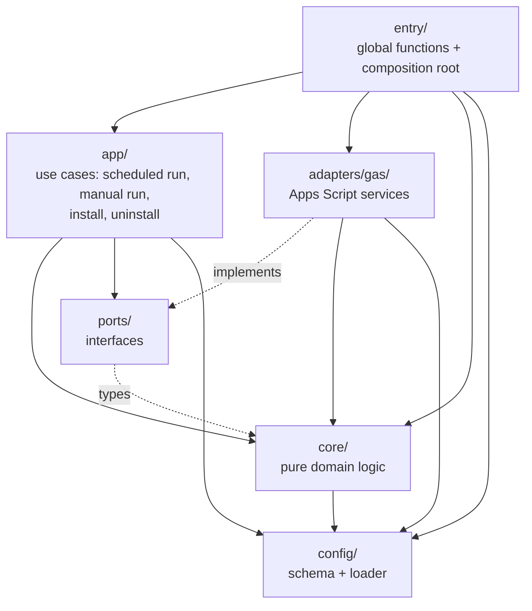
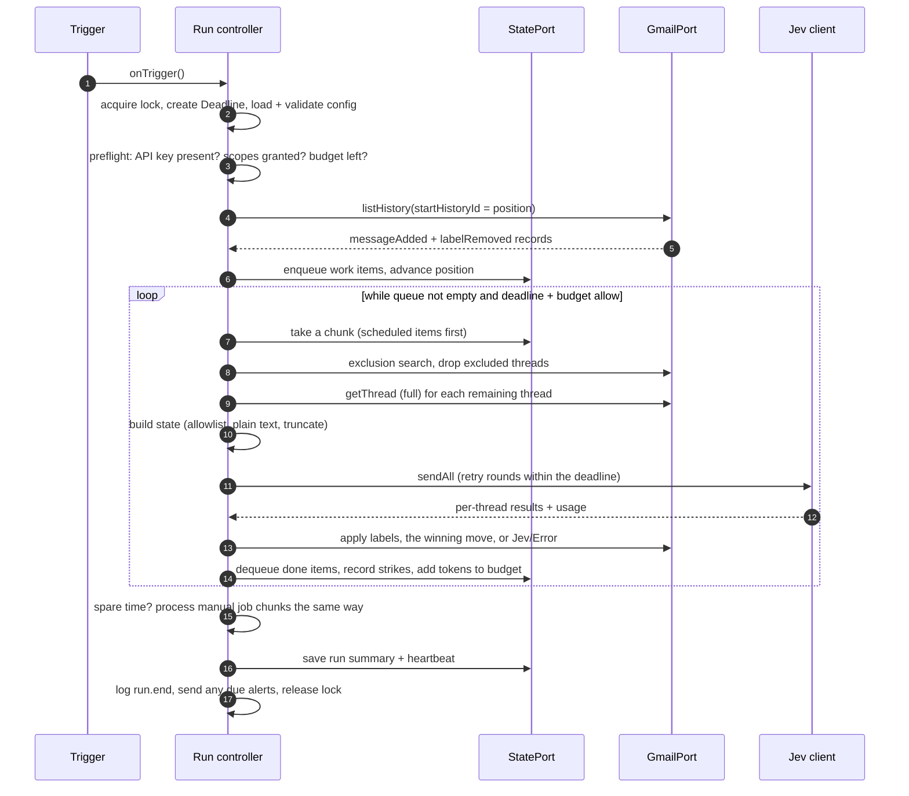
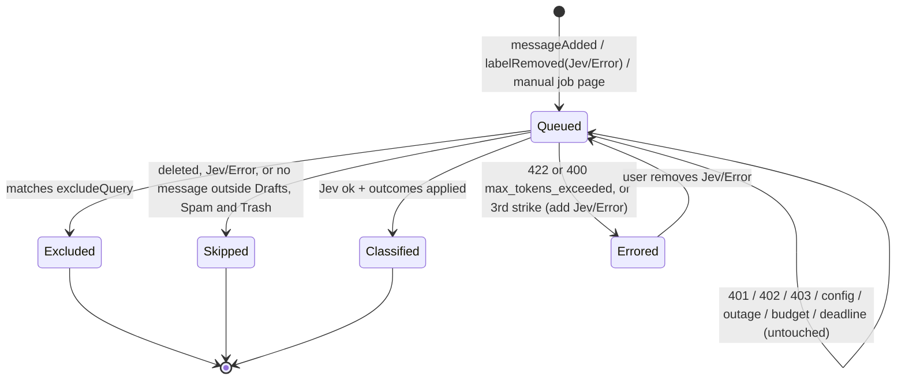
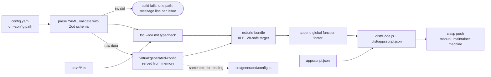

# Jev Gmail Classifier: Solution Design

> **Status:** Accepted for v1. Decided on 2026-09-25.
>
> **Where this fits:** the [Product Vision](product-vision.md) says *why*, the [Product Design Document](product-design-document.md) (PDD) says *what*, and this document says *how*: the architecture, technology, and patterns every epic, story, and task builds on. The [Engineering Standards](engineering-standards.md) hold the coding, testing, and workflow conventions, and the [Architecture Decision Records](adr/README.md) (ADRs) hold the reasoning behind each significant decision. The [README](../README.md) is the user-facing description and must agree with this document.
>
> **Precedence:** Vision > PDD > Solution Design (this document, its ADRs, and the Engineering Standards) > README. If you find a conflict, the higher document wins; raise it rather than silently choosing.
>
> **Level of detail:** high-level on purpose. Numbers marked *starting value* and items in [§13](#13-epic-guidance) are settled by the epic that owns them. When an epic settles one, it updates this document or adds an ADR.

## Contents

1. [Architectural Drivers](#1-architectural-drivers)
2. [System Context](#2-system-context)
3. [Platform Constraints](#3-platform-constraints)
4. [Architecture Overview](#4-architecture-overview)
5. [Components and Ports](#5-components-and-ports)
6. [Runtime Flows](#6-runtime-flows)
7. [Data Design](#7-data-design)
8. [Jev Integration](#8-jev-integration)
9. [Gmail Integration](#9-gmail-integration)
10. [Cross-Cutting Concerns](#10-cross-cutting-concerns)
11. [Build and Deployment](#11-build-and-deployment)
12. [Testing Architecture](#12-testing-architecture)
13. [Epic Guidance](#13-epic-guidance)
14. [Technical Risks and Items to Verify](#14-technical-risks-and-items-to-verify)
15. [Glossary](#15-glossary)

## 1. Architectural Drivers

The product principles translate into these architectural drivers. When two designs are otherwise equal, pick the one that serves the higher driver.

| # | Driver | Comes from | What it means for the design |
|---|--------|-----------|------------------------------|
| D1 | **Precision over recall** | Vision principle 1 | When unsure, do nothing: don't apply, don't move, don't guess. Moves need stronger evidence (first classification, high threshold). |
| D2 | **Privacy by construction** | Vision principle 4 | Only the header allowlist and plain text leave the account. Exclusion works per *thread*. Bodies and the API key never reach logs. The OAuth scope makes permanent deletion impossible. |
| D3 | **Bounded by design** | Vision principle 6 | Every execution has a deadline, a chunk size, and a token budget check. Nothing loops unbounded. |
| D4 | **Loud when broken** | Vision principle 2 | Every failure path ends in a log event, and the actionable ones in an alert or the `Jev/Error` label. No silent skips. |
| D5 | **Cheap** | Vision principle 3 | One request per thread, all rules together, trimmed content, no reclassification without new mail, daily token cap. |
| D6 | **Testable core** | PDD §6 | All decision logic runs in Node against fakes, with no Apps Script globals. |
| D7 | **Configuration over code** | Vision principle 5 | Behavior changes through `config.yaml`, validated at build and at runtime. |

## 2. System Context


```mermaid
flowchart LR
  user([Account owner])
  subgraph google[User's Google account]
    gmail[(Gmail)]
    script[Jev Gmail Classifier<br/>Apps Script project]
    props[(Script Properties)]
    logs[(Execution logs /<br/>Cloud Logging)]
  end
  jev[TypeSafe Jev API<br/>api.typesafe.ai]
  dev[Developer machine<br/>npm build + clasp push]

  dev -- "clasp push (bundle + manifest)" --> script
  script -- "Advanced Gmail Service<br/>history, threads, labels" --> gmail
  script -- "POST /v1/systemone<br/>(UrlFetchApp.fetchAll)" --> jev
  script <-->|"state, queue, budget, API key"| props
  script -- "structured JSON" --> logs
  script -- "alert emails (MailApp)" --> user
  user -- "config.yaml, manual runs,<br/>remove Jev/Error" --> script
```

- **One installation serves one Google account.** There is no server, database, or shared tenant.
- **The only external system is the Jev API.** No other outbound calls are allowed.
- The developer machine is used only to build and push. It is not part of the runtime.

## 3. Platform Constraints

These shape every design choice. Figures come from the [README](../README.md#limits-and-cost) and the research recorded in the ADRs; epics re-check them when they rely on them.

| Constraint | Consequence |
|-----------|-------------|
| 6-minute execution limit. | Every entry point runs against a `Deadline` ([§10.3](#103-time-budget)). |
| 90 min/day of trigger runtime on consumer accounts (about 37 s per run at 10-minute intervals). | Scheduled runs have a short soft limit. Backfill uses spare time only ([ADR-0009](adr/0009-manual-runs-use-spare-time.md)). |
| No mail-arrival trigger; time-driven triggers only at 1, 5, 10, 15, or 30 minutes. | The product polls. |
| V8 runtime **without** ES modules, `#private` fields, static class fields, `setTimeout`, `fetch`, `atob`, `TextDecoder`, or `crypto`. | TypeScript is bundled and down-levelled. Waits use `Utilities.sleep`, base64 uses `Utilities`, HTTP uses `UrlFetchApp` ([ADR-0012](adr/0012-toolchain.md)). |
| Triggers and the editor call only top-level `function` declarations. | The bundle ends with a generated footer of global functions ([§11](#11-build-and-deployment)). |
| Script Properties: 9 KB per value, 500 KB per store. | State is namespaced, small, and sharded ([§7.3](#73-script-properties-state)). |
| 20 triggers per user per script. | Only one recurring trigger. There are no chained one-off triggers. |
| Jev accepts one `state` per request; 32k tokens for `state` plus the longest question; 64k for `state` plus all questions; no token-count endpoint. | One request per thread, and truncation uses a character estimate with a safety margin ([§8.4](#84-truncation)). |
| Jev's official SDK needs `fetch`. | A hand-written client runs on `UrlFetchApp` ([ADR-0010](adr/0010-jev-request-shape-and-retries.md)). |

## 4. Architecture Overview

### 4.1 Style: ports and adapters

The code is layered as **ports and adapters** (hexagonal), with a pure core ([ADR-0002](adr/0002-ports-and-adapters.md)).


```mermaid
flowchart TB
  entry["entry/<br/>global functions + composition root"]
  app["app/<br/>use cases: scheduled run, manual run,<br/>install, uninstall"]
  core["core/<br/>pure domain logic"]
  ports["ports/<br/>interfaces"]
  adapters["adapters/gas/<br/>Apps Script services"]
  config["config/<br/>schema + loader"]

  entry --> app
  entry --> adapters
  app --> core
  app --> ports
  app --> config
  adapters -. implements .-> ports
  adapters --> core
  adapters --> config
  entry --> core
  entry --> config
  ports -. types .-> core
  core --> config
```

**Dependency rule.** An arrow means "may import". The arrows show the main dependencies; the import matrix under [Lint rules](#lint-rules) is the complete rule. Everything it doesn't allow is forbidden and enforced by lint:

- `core/` is pure: no Apps Script globals, no I/O, no clock, no randomness. Anything impure is passed in as a value or as a port.
- `app/` orchestrates through ports only. It never touches a global.
- `adapters/gas/` is the **only** place Apps Script globals appear (`Gmail`, `UrlFetchApp`, `PropertiesService`, `LockService`, `MailApp`, `ScriptApp`, `Utilities`, `Session`, `console`). Within it, only the log adapter uses `console`.
- `entry/` is the composition root. It builds real adapters, wires them into `app/`, and exposes the global functions.
- All ports are **synchronous**, because Apps Script services are synchronous. The core and app do not use `async`/`await`.

#### Lint rules

ESLint enforces the dependency rule with its built-in restriction rules (`@typescript-eslint/no-restricted-imports`, `no-restricted-globals`, `no-restricted-properties`, and `no-restricted-syntax`), with no boundary plugin. The lists live in `scripts/lint/layers.ts`, and `test/lint/layer-boundaries.test.ts` proves each one. Change this section and `layers.ts` in the same PR.

**Import matrix.** A row may import a column only where the cell says so; everything else fails. "Types only" means `import type`.

| Importer ↓ \ imports → | `core/` | `config/` | `ports/` | `app/` | `adapters/gas/` | `entry/` | `virtual:generated-config` | `src/generated/` |
|---|---|---|---|---|---|---|---|---|
| `core/` | yes | yes | no | no | no | no | no | no |
| `core/result.ts`, `core/errors.ts`, `core/log-fields.ts` | yes | **no** (cycle guard) | no | no | no | no | no | no |
| `config/` | only `result.ts`, `errors.ts` | yes | no | no | no | no | no | no |
| `ports/` | types only | types only | yes | no | no | no | no | no |
| `app/` | yes | yes | yes | yes | no | no | no | no |
| `adapters/gas/` (and the log adapter) | yes | yes | yes | no | yes | no | no | no |
| `entry/` | yes | yes | yes | yes | yes | yes | yes | no |
| `scripts/` | yes | yes | yes | yes | yes | yes | no | no |
| `test/` | yes | yes | yes | yes | yes | yes | **no** | **no** |

- **Cycle guard.** `config/` imports `core/result.ts` and `core/errors.ts` (for `ConfigError`), and `errors.ts` uses `core/log-fields.ts`. These three modules may import only `core/`, so `core/` → `config/` → `core/` can't form a cycle. A new module that `result.ts` or `errors.ts` imports joins the cycle guard.
- **Packages in `src/`.** Every `src/` file may import only relative paths and `zod`; `src/entry/` may also import `virtual:generated-config`. Node built-ins (`fs`, `node:fs`) and build-time packages (`yaml`, `esbuild`) fail. `tsconfig.json` has `types: ["node"]` for every file, so this rule is the only guard. `scripts/` may import any package.
- **The embedded config.** Only `src/entry/` imports `virtual:generated-config` ([§11](#11-build-and-deployment)). Nothing imports `src/generated/`: it's a debug copy the build writes, and lint ignores it. Tests build a `Config` from fixtures.
- A `src/` file outside every layer folder gets the `core/` rules, the strictest.

**Globals per layer.**

| Layer | Apps Script globals (list A) | Other Apps Script services | `GmailApp` | Clock and randomness | `console` |
|---|---|---|---|---|---|
| `core/`, `config/`, `ports/`, `app/`, `entry/` | no | no | no | no | no |
| `adapters/gas/` (except the log adapter) | yes | no | no | yes | no |
| The log adapter, `src/adapters/gas/gas-log-adapter.ts` | yes | no | no | yes | yes |
| `scripts/`, `test/` | not restricted | not restricted | no | yes | yes |

- **List A:** `Gmail`, `UrlFetchApp`, `PropertiesService`, `LockService`, `MailApp`, `ScriptApp`, `Utilities`, `Session`.
- **Other Apps Script services**, which v1 doesn't use (most need a scope the manifest doesn't declare): `Logger`, `CacheService`, `DriveApp`, `SpreadsheetApp`, `DocumentApp`, `SlidesApp`, `FormApp`, `CalendarApp`, `ContactsApp`, `GroupsApp`, `HtmlService`, `ContentService`, `XmlService`, `CardService`, `Browser`. Using one later updates this list, and needs an ADR if it adds a scope.
- **Clock and randomness:** `Date.now()`, `new Date()` with no arguments, `Date()` called as a function (with any arguments), `performance`, and `Math.random()`. `new Date(value)` and `Date.UTC(...)` are allowed everywhere. Elsewhere, use `ClockPort` and `RandomPort`.
- **The log adapter** is the only `src/` file that may use `console`. No log adapter exists yet; the epic that writes it (E9) uses this path, or changes `layers.ts` and this section in the same PR.
- **Default exports** fail in `src/`, `scripts/`, and `test/` ([ES §3](engineering-standards.md#3-repository-layout-and-module-rules)). The root tool configs (`eslint.config.ts`, `vitest.config.ts`) keep theirs.

### 4.2 Repository layout

The target layout. E2 creates it and may refine names, but not the layer boundaries.

```text
.
├── appsscript.json            # manifest template (scopes, advanced services, timeZone)
├── config.example.yaml        # committed example; CI builds against it
├── config.schema.json         # committed JSON Schema for editors, regenerated by the build
├── config.yaml                # user's real config (git-ignored)
├── .clasp.json.example        # committed; .clasp.json is git-ignored
├── src/
│   ├── core/                  # pure domain: rules, outcomes, state builder, truncation,
│   │   │                      # body converters, retry policy, budget, work queue, queries
│   │   └── body/              # BodyConverter implementations (basic; advanced later)
│   ├── app/                   # use cases and run controller
│   ├── ports/                 # port interfaces
│   ├── adapters/gas/          # Apps Script implementations of the ports
│   ├── config/                # Zod schema (shared by build and runtime) + loader
│   ├── entry/                 # main.ts: composition root and global functions;
│   │                          # entry-points.ts: the list of global function names
│   │                          # the footer is generated from
│   └── generated/             # readable copy of the embedded config (git-ignored; §11)
├── scripts/                   # build.ts, probe.ts (local Jev probe)
├── spikes/                    # E1 and later experiments, run by hand against a real account
├── test/                      # unit tests, fakes/, fixtures/
├── docs/                      # smoke-test checklist; docs/archive/ (historical)
└── output/                    # vision, PDD, solution design, standards, ADRs
```

`src/generated/` and `src/core/body/` appear later (the build and E4).

## 5. Components and Ports

### 5.1 Components

The PDD's components ([PDD §6.1](product-design-document.md#61-main-components)) map to code as follows.

| Component | Layer | Responsibility |
|-----------|-------|----------------|
| **Config** | `config/` | One Zod schema, used at build time to validate `config.yaml` and at runtime to validate the embedded config on load. Exposes a typed, frozen `Config`. |
| **History sync** (PDD: Work finder) | `app/` + `core/` | Reads Gmail history from the saved position, turns records into work items, and advances the position. Also runs the fallback search when history has expired. |
| **Work queue** | `core/` + `StatePort` | A persisted, de-duplicated queue of threads to classify, with strike counts and the first-classification flag. Scheduled work always comes before manual work. |
| **Exclusion filter** | `core/` + `GmailPort` | Removes every thread in which *any* message matches `excludeQuery`, before anything is read for Jev. |
| **State builder** | `core/` | Turns a thread into Jev `state`: header allowlist, plain text via a `BodyConverter`, newest first, truncated to fit. |
| **Jev client** | `core/` (pure request and response logic) + `HttpPort` | Builds requests, sends batches with `fetchAll`, retries in rounds, classifies responses, and reports token usage. |
| **Outcome applier** | `core/` (decide) + `GmailPort` (apply) | Decides the labels and the one winning move, then applies them. Handles `Jev/Error` and missing scopes. |
| **Run controller** | `app/` | Lock, deadline, token budget, scheduled-before-manual ordering, and the per-run summary. |
| **Notifier** | `app/` + `LogPort` + `MailPort` | Structured logging, and rate-limited alert emails. |
| **Lifecycle** | `app/` | `install`, `uninstall`, and the scope preflight check. |

### 5.2 Ports

Each port is a narrow, synchronous TypeScript interface in `src/ports/<name>-port.ts`, with one Apps Script adapter and one in-memory fake (`test/fakes/`).

- **Expected failures are results** (`Result`/`Fail` from `src/core/result.ts`, [§10.1](#101-error-model)). Anything an adapter doesn't recognize is thrown as `UnexpectedResponseError` and reaches the per-thread or per-run boundary.
- **Shared data types that `core/` reads live in `core/`**, which can't import `ports/`: the Gmail resource types (`src/core/gmail-types.ts`, with byte-array `body.data` and optional history change arrays), the Script Properties limits (`src/core/state-limits.ts`), the state types `JsonValue` and `StateKey` (`src/core/state-types.ts`, which `src/ports/state-port.ts` re-exports), and `LogFields`.
- **Common failure kinds:**
  - `scope`: a scope isn't granted. Adapters match the [§9](#9-gmail-integration) message fragments. A 403 `rateLimitExceeded` is never `scope`.
  - `rate_limited` (Gmail): the per-user rate limit. It means "stop Gmail work for this run", not a thread failure ([§9](#9-gmail-integration)).

| Port | Wraps | Main operations |
|------|-------|-----------------|
| `GmailPort` | Advanced Gmail Service (`Gmail.Users.*`) | Every method can fail with `scope` or `rate_limited`, plus:<ul><li>`getProfile() → {emailAddress, historyId}`</li><li>`listHistory({startHistoryId, historyTypes, pageToken?})`: **one page** `{records, historyId, nextPageToken?}`. The page's `historyId` changes between pages, so the caller advances to the last page's. Can also fail with `history_expired` (404, [§6.3](#63-ingest-gmail-history-to-work-queue)).</li><li>`searchThreadIds({q, includeSpamTrash, pageToken?})`: **one page** of thread IDs. `includeSpamTrash` is required. The caller pages ([§6.4](#64-process-classify-a-chunk)).</li><li>`getThread(threadId, {format: 'full' \| 'metadata' + metadataHeaders \| 'minimal'})`, which can also fail with `not_found`.</li><li>`listLabels()`: one response, no paging.</li><li>`createLabel(name)`, which can also fail with `label_exists` (409) or `invalid_label_name` (400, reserved names). No parents are created.</li><li>`modifyThread(threadId, {addLabelIds, removeLabelIds})`, which can also fail with `not_found` or `invalid_label` (400, a name or an unknown ID).</li><li>`trashThread(threadId)`, which can also fail with `not_found`.</li></ul> |
| `HttpPort` | `UrlFetchApp.fetchAll` | `sendAll(requests) → results`, one per request, in the same order. The result is `ok` with status, lower-case headers and body text for any HTTP status, or `transport`, or `scope`. |
| `StatePort` | `PropertiesService.getScriptProperties()` | `get(key) → unknown` (parsed JSON), `set(key, json)`, `delete(key)`, `keys(prefix)` on `state.*` keys only. A value over 9 KB or a store over 500 KB throws `StateError` and writes nothing. `getInput(name)` and `deleteInput(name)` read and clear the plain user inputs (`MANUAL_*`, `RESET_POSITION`). Sharding isn't a port method: lists are sharded by `src/app/sharded-state.ts` on `get`, `set`, `delete` and `keys` ([§7.3](#73-script-properties-state)). |
| `SecretsPort` | Script Properties (`JEV_API_KEY`) | `getJevApiKey() → string \| undefined` (trimmed; blank is unset) |
| `LockPort` | `LockService.getScriptLock()` | `tryAcquire() → boolean` (`tryLock(0)`), `release()` (safe when not held) |
| `ClockPort` | `Date`, `Utilities.sleep`, `Session.getScriptTimeZone()` | `now()` (epoch ms), `sleep(ms)`, `timeZone()` |
| `RandomPort` | `Math.random` | `next()` in `[0, 1)`, used for jitter |
| `LogPort` | `console.*` | `info/warn/error(event, fields?)` |
| `MailPort` | `MailApp.sendEmail` | `send(to, subject, body)`, which can fail with `scope` or `quota` |
| `TriggerPort` | `ScriptApp` | `replaceRecurringTrigger(handler, minutes)` (leaves exactly one), `deleteTriggers(handler) → {deleted}`; both can fail with `scope` |
| `AuthPort` | `ScriptApp.getAuthorizationInfo(ScriptApp.AuthMode.FULL).getAuthorizedScopes()` ([E1](../spikes/27-missing-scope.md)) | `missingScopes() → {missing}`: `DECLARED_SCOPES` (`src/core/declared-scopes.ts`) minus the authorized scopes. It fails with `unknown` if the call throws. |

E2 defined these as a first cut; the owning epic refines its port: `GmailPort` (E3, E6), `HttpPort` (E5), `LockPort`, `TriggerPort`, and `AuthPort` (E7), `LogPort` and `MailPort` (E9).

## 6. Runtime Flows

### 6.1 Entry points

These are the only global functions. Each one runs inside the script lock and a `Deadline`.

| Function | Started by | Purpose |
|----------|-----------|---------|
| `onTrigger` | The recurring time-driven trigger. | A scheduled run: history sync, the queue, then spare time on any manual job. |
| `install` | The user, in the editor. | Authorizes, checks scopes, saves the starting position (kept if one already exists), and creates or replaces the trigger. |
| `uninstall` | The user, in the editor. | Removes the trigger and all `state.*` keys. Leaves labels and `JEV_API_KEY`. |
| `startManualRun` | The user, in the editor, after setting `MANUAL_*` Script Properties. | Validates and echoes back the job, saves it, and processes as much as time allows. |
| `continueManualRun` | The user, in the editor (optional). | Processes the current manual job for up to the manual deadline. |
| `cancelManualRun` | The user, in the editor. | Deletes the current manual job. |

The lock is **one script-wide lock** taken with `tryLock(0)`. If it is busy, the function logs `run.skipped` with reason `busy` and returns ([ADR-0008](adr/0008-single-lock-and-deadline.md)).

### 6.2 Scheduled run


```mermaid
sequenceDiagram
  autonumber
  participant T as Trigger
  participant R as Run controller
  participant S as StatePort
  participant G as GmailPort
  participant J as Jev client
  T->>R: onTrigger()
  R->>R: acquire lock, create Deadline, load + validate config
  R->>R: preflight: API key present? scopes granted? budget left?
  R->>G: listHistory(startHistoryId = position)
  G-->>R: messageAdded + labelRemoved records
  R->>S: enqueue work items, advance position
  loop while queue not empty and deadline + budget allow
    R->>S: take a chunk (scheduled items first)
    R->>G: exclusion search, drop excluded threads
    R->>G: getThread (full) for each remaining thread
    R->>R: build state (allowlist, plain text, truncate)
    R->>J: sendAll (retry rounds within the deadline)
    J-->>R: per-thread results + usage
    R->>G: apply labels, the winning move, or Jev/Error
    R->>S: dequeue done items, record strikes, add tokens to budget
  end
  R->>R: spare time? process manual job chunks the same way
  R->>S: save run summary + heartbeat
  R->>R: log run.end, send any due alerts, release lock
```

**Two phases.** *Ingest* reads history and adds to the queue. *Process* takes from the queue and classifies. Keeping them separate makes retries, the budget, and the deadline uniform: any item not finished simply stays in the queue ([ADR-0004](adr/0004-history-api-position.md)).

### 6.3 Ingest: Gmail history to work queue

- **Position.** `state.position` holds the last Gmail `historyId` ingested, plus the time it was saved (`src/core/position.ts`). `install` writes the first one; a missing position is invalid state (`StateError` `missing`), and ingest never creates or resets one.
- **Read.** Call `users.history.list` with `startHistoryId` and `historyTypes = [messageAdded, labelRemoved]`, paging until done or until the queue's safety cap is reached. Ignore a record that has neither `messagesAdded` nor `labelsRemoved`: Gmail also returns records with only `messages` (seen with several types, and with `labelRemoved` alone).
- **Filter `messageAdded` records.** Ignore drafts (`DRAFT`), and messages in `SPAM` or `TRASH`. Received and sent messages both count: a reply you send can change what a thread is about.
  - A record's `labelIds` are the labels **when the message was added**, not now. So this filter drops only mail that arrived as a draft or in Spam.
  - Mail moved to Spam or Trash before processing is caught when the thread is read for processing, using current labels. Messages now in `DRAFT`, `SPAM`, or `TRASH` are left out of `state`, and an item with no message left is skipped ([§6.4](#64-process-classify-a-chunk) step 2, `no_messages`).
  - Each draft save adds a new message ID labelled `DRAFT`. Sending a draft adds a new ID with `SENT`. Mail sent to yourself is one message with both `SENT` and `INBOX`. `CATEGORY_*` labels don't matter.
  - The user's filters act before the record is written, so filter-archived mail has no `INBOX`, and filter labels and categories are already there. E3 must not require `INBOX`.
  - Confirmed by E1 (`spikes/19-message-added.md`).
- **Filter `labelRemoved` records.** Keep only those where `Jev/Error` was removed. These re-queue the thread with its strike count reset. That is how the user retries an errored thread. The retry is queued as `scheduled` with `firstClassification: false` (labels only: its messages predate the position), and merges into an item already queued, which resets that item's strikes to 0 and keeps its other fields.
  - **What a removal looks like.** Each removal, from the Gmail UI or the API, gives one record with one `labelsRemoved[]` entry per message that had the label: `{labelIds: [removed IDs], message: {id, threadId, labelIds}}`. `message.labelIds` are the labels right after that change. Deleting the label itself gives the same records.
  - **Filtering.** Filter on the client, in the same call as `messageAdded`, without `history.list`'s `labelId` option. The option works, but it would need a second call and a second position. Keep entries whose removed `labelIds` include **any ID in `state.jevErrorLabel`** ([§7.3](#73-script-properties-state)): after a user deletes the label, its name no longer resolves, and the recreated label has a new ID, so a deleted label's threads still match once E6 has created a new one. With no ID in state, nothing matches. The match is on the entry's removed `labelIds`, **not** on `message.labelIds` (the labels left after the change): trashing a labelled thread writes a `labelsRemoved [INBOX]` entry whose `message.labelIds` still include the `Jev/Error` ID, and it must not match.
  - **Trash and Spam.** Skip entries whose `message.labelIds` include `TRASH` or `SPAM`: processing ignores those threads.
  - **De-duplicate** by `message.threadId`. Other changes on the same thread (for example, opening it in the UI removes `UNREAD`) come as separate records, and are ignored.
  - Confirmed by E1 (`spikes/20-label-removed.md`).
- **Threads marked `Jev/Error`.** A new message on such a thread **is** queued: ingest makes no per-thread reads, so it can't tell. `screenChunk` skips the thread at its first read ([§6.4](#64-process-classify-a-chunk) step 2, `thread.skipped` with `reason: 'jev_error'`), so it is still never classified and stays flagged until the user removes the label.
  - A message that arrives after `threads.modify` added the label does **not** inherit it. So the check is whether **any** message in the thread carries one of the `Jev/Error` IDs saved in `state.jevErrorLabel`, not the new message's `labelIds`. It uses the metadata read that the exclusion check needs anyway, so it costs no extra call.
  - Confirmed by E1 (`spikes/20-label-removed.md`).
- **Enqueue.** Each distinct thread becomes one work item, de-duplicated against items already queued. A thread is marked **first classification** when every one of its messages arrived after the classifier's position, meaning it's a brand-new conversation. The item stores the position's `savedAt` when it is queued, and the flag is decided **once, at the item's first read**. After that it never changes: retries and later merges keep it.
  - **How "arrived after" is computed.** The item stores the position's `savedAt` at queue time. When the thread is first read, it is a first classification if every non-draft message's `internalDate` is at or after that `savedAt`, with no skew margin. The result is then fixed on the item.
  - **Edge cases.** A thread with no non-draft message, or with a non-draft message whose `internalDate` is missing or isn't a valid epoch-ms number, is not a first classification (labels only). Messages now in Spam or Trash still count, so an old thread can't look new: `threads.get` returns them (§14).
  - A message's `historyId` can't be used, because it moves whenever the message changes (for example, when it's marked read).
  - For imported mail, `internalDate` is the `Date` header, so an import with an old date counts as old: labels only, which is the safe direction.
  - Confirmed by E1 (`spikes/19-message-added.md`).
- **Advance.** The position moves only after the queued items are safely saved.
  - **After the last page**, set it to the `historyId` that page returned (it changes between pages while mail arrives, and later pages include the newer records).
  - **When ingest stops early**, at the queue cap, at the deadline, or on a `rate_limited` or `scope` failure, set it to the `id` of the last history record whose threads were all queued (or that was ignored). `history.list` from a record's `id` returns exactly the records after it, and never that record ([`spikes/62-history-resume.md`](../spikes/62-history-resume.md)). If no record was handled, the position doesn't move. This back-pressure loses nothing, and the next run carries on from there instead of reading history it already queued. (Not advancing at all would queue again the threads already classified since, and a backlog bigger than the cap would never get past the same records.)
  - `savedAt` is the time of the save, taken after the last `history.list` call. So every message already ingested is older than `savedAt`, and a later reply to its thread is never a first classification. A brand-new thread that arrives during ingest may lose its move (labels only), which is the safe direction.
- **Expired position.** A 404 from `history.list` means Gmail has discarded the history. This is typically after a week or more, and sometimes after hours. A position ahead of the mailbox (a corrupt value) gets the same 404, so it takes the same path ([`spikes/62-history-resume.md`](../spikes/62-history-resume.md)). Ingest then catches up with a **resumable fallback** (story #72, option B; `src/core/history-fallback.ts` and `src/app/ingest.ts`):
  - **At the 404** (from any history page), it calls `getProfile` before any search. Its `historyId` is where history resumes afterwards, so mail that arrives during the fallback is read from history later. It saves the queue (if earlier pages changed it). A `rate_limited` or `scope` failure here, or the deadline, creates no cursor, and the next run gets the 404 again. Otherwise it writes the cursor `state.fallback` ([§7.3](#73-script-properties-state)), and logs `history.expired` (with `aheadOfMailbox` when the old position was ahead of the profile's). The `history_expired` alert is reported **only by this call**, not by the runs that continue the fallback. `state.position` stays as it is until the fallback finishes.
  - **While `state.fallback` exists,** ingest runs the fallback **instead of** `history.list`, and doesn't read the position.
  - **Windows.** It searches `after:<s> before:<s>` time windows (epoch seconds, both inclusive: spike 23, C1), oldest first, from the old `savedAt` − 1 h up to the moment of the 404, with `includeSpamTrash: false` (ingest ignores Spam and Trash) and `maxResults: 500`, paged. A window starts at 1 day. One whose new threads don't fit the queue's room is halved, down to 60 s, and the size doubles back, up to 1 day, after each window that fits. At 60 s, with `scheduled` items queued, it waits for room (`stopped: 'cap'`); with none, it queues what fits and logs `history.fallback_missed`. A full queue stops it before searching.
  - **Items** are queued as `scheduled`, with `positionSavedAt` = the **old** `savedAt` and `firstClassification` unset, so a conversation that started during the outage can still move.
  - **Saving.** After each window, the queue is saved **before** the cursor. `rate_limited`, `scope` or the deadline keeps every completed window and nothing of the unfinished one; the next run searches that window again.
  - **The finish.** When the last window is done, the position becomes `{historyId: <from getProfile>, savedAt: <when the 404 was seen>}`, and **then** `state.fallback` is deleted. A crash between the two leaves a done cursor, and the next run repeats the finish. `savedAt` is the 404's time, not the finish's: that's when the `historyId` was read, so if it expires too, the next fallback starts early enough to cover the whole gap.
  - **Accepted cost.** A thread with messages in two windows is found twice. If it's still queued, it merges; if it was already classified, it's classified again: its labels repeat, and a move repeats only if it's still a first classification against the old `savedAt`. Repeating a label or a move is harmless ([`spikes/26-moves.md`](../spikes/26-moves.md)), and it happens only during a fallback. The same goes for a thread found by the search and then again in history after the finish. A `Jev/Error` removal made while the history was lost isn't recovered (the search finds messages, not label changes): the user removes the label again.

### 6.4 Process: classify a chunk

1. **Take a chunk** from the queue. Scheduled items come first, then manual-job items. The chunk size is a starting value owned by E7.
2. **Exclusion filter.** This is the only exclusion check, and it applies to every chunk item, scheduled and manual alike ([ADR-0017](adr/0017-exclusion-search-per-chunk-for-all-work.md), which supersedes [ADR-0005](adr/0005-positive-thread-level-exclusion.md)).
   - **Read.** Get each chunk thread once in metadata form (`getThread` with `format: 'metadata'` and `metadataHeaders: ['Date']`), which gives each message's `labelIds`, `internalDate` and `Date` header without bodies. This is the only read before the search, and no thread is read in full until it has passed the check.
   - **Skip** a thread that can't be classified. It is logged as `thread.skipped` with `threadId`, `source` and `reason`, removed from the queue, and never marked. The reasons are checked in this order:
     - `not_found`: `threads.get` says the thread was deleted since it was queued.
     - `jev_error`: any message carries a `Jev/Error` ID saved in `state.jevErrorLabel`. Without that key, nothing is skipped for this reason ([§6.3](#63-ingest-gmail-history-to-work-queue)).
     - `no_messages`: the thread has no message, or every message is now labelled `DRAFT`, `SPAM` or `TRASH`.
   - **First classification.** For each thread not skipped whose item has no `firstClassification` yet, decide it from the same read (`isFirstClassification` over the thread's messages and the item's `positionSavedAt`, [§6.3](#63-ingest-gmail-history-to-work-queue) "Enqueue") and fix it on the item. An item that already has the flag keeps it.
   - Run **one** `threads.list` search for the whole chunk, over the threads left after the skips only, so a skipped thread's old messages don't widen the window (`searchExcludedThreads` in `src/app/exclusion-search.ts`). Without `excludeQuery`, or with no thread left, there is no search. `q = (<excludeQuery>) after:<lo> before:<hi>`, with `includeSpamTrash: true` and `maxResults: 500`. Here:
     - The user's query always goes in parentheses.
     - `lo` is the earliest `internalDate` **or** parsed `Date` header of **any** message in **any** chunk thread, in epoch seconds, minus 86400. It must span the oldest message, not just the newest: a thread whose only match is its oldest message is otherwise missed. A message with no usable date, or one dated before 1970, removes the lower bound (no `after:` term).
     - `hi` is the latest of now and every chunk message's `internalDate` or `Date` header, plus 86400. Search can compare against a date other than the `internalDate` the API reports: an upload's receive time, which is never later than now. So an upper bound taken from message dates alone can miss. Including the message dates also covers a `Date` header set in the future.
     - Epoch bounds are exact to the second and both inclusive.
     - `includeSpamTrash: true` is required. Without it, a thread whose only matching message is in Spam or Trash isn't returned, yet `threads.get` still returns that message.
   - **Batching.** The search pages until there is no `nextPageToken`, or until every remaining chunk thread has been found (no later page can add anything). A wide window can return many threads outside the chunk, so the search is bounded:
     - It reads at most 20 pages (10,000 threads, 200 quota units). Then each chunk thread not yet found gets one search of its own, in input order, with its own window from the same builder. Each search has its own 20-page limit. A thread its own search finds is `matched`. A thread whose own search also reaches 20 pages without finding it is treated as excluded (`search_capped`), because its check didn't complete. A thread is never sent without a completed check.
     - **Fail closed.** Any failed search call (`rate_limited`, `scope`) fails the whole check: nothing is kept or dropped, no further call is made, and the chunk is retried in a later run. An unrecognized Gmail error is thrown.
     - The worst case, every thread capped, costs 200 units per thread, so E7's chunk sizing must allow for it ([ADR-0017](adr/0017-exclusion-search-per-chunk-for-all-work.md)).
   - Drop every excluded chunk thread (`matched` or `search_capped`). Each is logged as `thread.excluded` with `threadId`, `source` and `reason` only, never its subject, sender or any header. It is removed from the queue, finished: it is never sent, and never marked. `screenChunk` (`src/app/screen-chunk.ts`) makes no label change, no other Gmail write, and no state write: the caller saves the queue it returns.
   - **Fail closed.** If any read or search call fails (`rate_limited`, `scope`), `screenChunk` returns that failure at once, with no further call and no log. It returns no queue, so the caller keeps the one it had: nothing is kept, removed or flagged, and the whole chunk is screened again in a later run. No thread goes on without a completed exclusion check. An unrecognized Gmail error is thrown.
   - The search matches **per message**. A thread is returned when one message satisfies the whole query.
   - Confirmed by E1 ([`spikes/23-exclusion-query.md`](../spikes/23-exclusion-query.md)). A new message was searchable within a second of `history.list` reporting it (self-sends and uploads), so no indexing-lag delay is needed.
3. **Build `state`** for each remaining thread ([§8.3](#83-state-layout)).
4. **Budget check.** If the daily token budget is already spent, stop. Items stay queued, and the budget alert is sent. A run may overshoot by at most the batch in flight.
5. **Send** all the chunk's requests with `fetchAll`, retrying in rounds ([§8.5](#85-retries-in-rounds)).
6. **Per-thread outcome.** This is the per-thread error boundary ([§10.1](#101-error-model)).
   - **Success:** decide and apply outcomes ([§6.5](#65-applying-outcomes)), log `thread.classified`, and dequeue.
   - **Retryable failure, retries exhausted:** add a strike and leave the item queued for the next run. On the third strike, add `Jev/Error`, dequeue, and queue an alert.
   - **Invalid (a 422 or the 400 `max_tokens_exceeded`):** add `Jev/Error` immediately, dequeue, and queue an alert.
   - **Auth (401, 402 or 403) or missing key:** stop the whole run. Nothing is marked, items stay queued, and an alert is sent.
   - **Config (the unknown-model response):** stop the whole run like auth, and send the `config_invalid` alert.
   - **Outage (a round in which every request got a 5xx or a network error, [§8.5](#85-retries-in-rounds)):** stop sending. Nothing is struck and the items stay queued.
7. **Record** token usage into today's budget.

### 6.5 Applying outcomes

- **Decide** (pure, in `core/`):
  - A rule fires when `p ≥ (rule.threshold ?? defaultThreshold)`.
  - Every firing label rule contributes its label.
  - Moves are considered only if the item is a first classification, or a manual job with `applyMoves`. When they are, the **first** firing move rule in config order wins.
- **Apply** (`GmailPort`). Every label add and the move go into **one** `threads.modify` call. Confirmed by E1 ([`spikes/26-moves.md`](../spikes/26-moves.md)):
  - `archive` removes `INBOX`.
  - `spam` adds `SPAM` and removes `INBOX`. Adding `SPAM` alone also removes `INBOX`, so sending both is harmless. Gmail then shows the thread as reported by the user ([§14](#14-technical-risks-and-items-to-verify)).
  - `label:<name>` adds the label and removes `INBOX`.
  - `trash` adds `TRASH` in the same call. It gives the same labels as `threads.trash` (both remove `INBOX`), which stays an equivalent second call if E6 prefers it.
  - User labels are kept in Spam and Trash, and can be added after a thread is trashed.
  - The change applies to every message in the thread, including the user's own sent messages. They get `SPAM` or `TRASH` and keep `SENT`.
  - Repeating a call is safe: no error, no change, and no history record. A move creates only `labelsAdded`/`labelsRemoved` history records, one per label, never `messagesAdded`, so E3 doesn't re-queue a thread the classifier just moved.
  - A later reply lands in the Inbox whatever the move was, including Spam and Trash, and doesn't get the thread's labels. The earlier messages stay where they were. The reply is then reclassified for labels only (seen with self-sent replies).
- **Labels.** Label IDs are looked up once per run from `labels.list`. It returns every label in one response, with no paging. Missing labels, including nested names like `Finance/Bill`, are created. Corrected by E1 ([`spikes/25-nested-labels.md`](../spikes/25-nested-labels.md)):
  - Gmail doesn't create parents: `Finance/Bill` is created alone. The web UI nests a label only under ancestors that exist, and otherwise shows it flat with its full name. So missing ancestors are created top-down first (`Finance`, then `Finance/Bill`). A parent is cosmetic, so a failure to create one doesn't block the leaf.
  - Names are compared case-insensitively, with spaces around `/` ignored. Gmail treats `finance/bill` and `Finance / Bill` as the existing `Finance/Bill`.
  - A 409 "Label name exists or conflicts" on create means the label already exists. The cache is refreshed and the name is looked up once more.
  - Labels are applied by ID only: a name gives 400 "Invalid label", and a stale ID gives 400 "labelId not found".
  - Reserved names such as `Inbox` or `Spam` give 400 "Invalid label name". The config schema rejects them.
  - A label can be created and applied in the same run.
- **Never removed.** The classifier never removes a classification label, and it never removes `Jev/Error`.
- **Missing scope.** If an action fails because a scope isn't granted, the per-action result is `scope`. Labels that could be applied are applied, the move is skipped, and `moveSkipped: "scope"` is logged. The thread counts as handled, so it isn't re-sent to Jev every run, and a `scope_missing` alert is queued. After the user fixes the scope, a manual run with `applyMoves` redoes the moves ([ADR-0003](adr/0003-advanced-gmail-service-and-scopes.md)).

### 6.6 Manual runs

- **Input.** A manual run takes Script Properties, because editor functions can't take arguments:

  | Property | Meaning |
  |----------|---------|
  | `MANUAL_QUERY` | A Gmail search, for example `label:Receipts`. |
  | `MANUAL_TIMESPAN` | For example `2h` or `7d`. Converted to `after:<epoch seconds>`, because Gmail's `newer_than:` has no hours. |
  | `MANUAL_APPLY_MOVES` | `true` or `false`. |
  | `MANUAL_REPLACE` | Must be `true` to replace an unfinished job. |

  At least one of the query or the timespan is required. `startManualRun` validates the input, logs the exact final query, and refuses to start if a job is unfinished and `MANUAL_REPLACE` isn't set.
- **Job search.** The job's search is `MANUAL_QUERY` and/or the timespan only; it never includes `excludeQuery`. Its threads are queued as manual items, and they reach the chunk exclusion filter in [§6.4](#64-process-classify-a-chunk) like scheduled items. The job search is never the exclusion check. E1 showed that `(<query>) (<excludeQuery>)` misses a thread when the two queries match different messages, and so does `(<query>) -(<excludeQuery>)` ([ADR-0017](adr/0017-exclusion-search-per-chunk-for-all-work.md)).
- **Job.** `state.manual` holds the query, the flags, a search cursor, and counts. Threads with `Jev/Error` are skipped. Every matching thread is reclassified, because there's no processed label to bypass. Moves apply only with `applyMoves`.
- **Continuation.** A manual job never gets its own trigger. It runs in scheduled runs' spare time, after scheduled work, and in `startManualRun` and `continueManualRun` executions from the editor, which use the longer manual deadline ([ADR-0009](adr/0009-manual-runs-use-spare-time.md)). The cursor design, whether a page token or a descending `before:` bound, is E8's; it must survive across executions.
- **Reporting.** Progress is logged each execution. On completion, the job logs `manual.completed` with counts per label and per move destination.

### 6.7 Install and uninstall

- **`install`:**
  - Triggers authorization.
  - Runs the scope preflight.
  - Validates the config and the API key's presence.
  - Saves `state.installedAt`.
  - Sets `state.position` from `getProfile().historyId` **only if no position exists**, or if `RESET_POSITION` is `true` (then deletes that property). A reset also deletes `state.fallback`, or ingest would keep running the old fallback instead of reading history from the new position ([§6.3](#63-ingest-gmail-history-to-work-queue)). The position is written with `encodePosition` (`src/core/position.ts`).
  - Replaces the `onTrigger` trigger at `triggerIntervalMinutes`.
  - Logs a summary.

  Re-running `install`, for example to change the interval, never skips or duplicates mail.
- **`uninstall`:** deletes triggers for `onTrigger` and every `state.*` key. It leaves labels, `JEV_API_KEY`, and any `MANUAL_*` inputs. Mail that arrives while the classifier is uninstalled is classified only through a manual run.

## 7. Data Design

### 7.1 Gmail labels

| Label | Written by | Meaning |
|-------|-----------|---------|
| Classification labels (from `rules[]`) | Classifier | Added when a rule fires. Never removed by the classifier. |
| `Jev/Error` | Classifier | The thread needs attention: a 422, the 400 `max_tokens_exceeded`, or 3 strikes. Only the user removes it, and removing it retries the thread. |

There is **no** `Jev/Processed` label. Progress is tracked in state ([ADR-0004](adr/0004-history-api-position.md)).

### 7.2 Configuration

- **Source.** `config.yaml` at the repo root. It is git-ignored because it describes the user's mail. `config.example.yaml` is committed, and CI builds with it.
- **Schema.** One Zod schema in `src/config/schema.ts` is the single source of truth. It emits `config.schema.json` (JSON Schema draft 7, input side, so fields with defaults are optional) for editor validation; `config.example.yaml` points at it with a `yaml-language-server` comment. The file is **committed**, so the `$schema` line resolves on a fresh clone before any build. `npm run build` regenerates it (`scripts/config-json-schema.ts`), and a test fails if the committed copy is out of date. JSON Schema can't express the refinements (label names, unique IDs, cross-field rules): editors check the shape, and the build checks the rest.
- **Validated twice** ([ADR-0013](adr/0013-config-validation-and-per-user-files.md)):
  - **At build:** `config.yaml` (or the file given with `npm run build -- --config <path>`) is parsed and validated. Any error fails the build with a message that gives the field path ([§11](#11-build-and-deployment)).
  - **At runtime load:** the embedded config is validated again by the same schema. A failure is invalid state, so it throws, alerts, and stops the run.
- **Fields** (final, settled in E2). **Unknown keys are rejected**, at the top level and in each rule, so a typo such as `treshold` fails instead of being ignored. The exact validation messages live in the schema and its tests (`test/config/`); each is reported with its field path, such as `rules[2].destination`.

  | Field | Constraint | Default |
  |-------|-----------|---------|
  | `defaultThreshold` | A number from 0 to 1. | Required. |
  | `triggerIntervalMinutes` | One of 1, 5, 10, 15, or 30. | `10` |
  | `jevModel` | A non-empty model name with no spaces, such as `jev-1.13.0`. | `jev-latest` |
  | `dailyTokenBudget` | A whole number of tokens, at least 1. | `20000000` |
  | `excludeQuery` | A **positive** Gmail query of mail that must never be sent, for example `from:mybank.com OR label:Private`. If present, it isn't empty; a bare `excludeQuery:` line (YAML `null`) is rejected. Its Gmail syntax isn't checked. | Absent: nothing is excluded. |
  | `plainTextMethod` | Only `basic`. `advanced` is reserved and rejected in v1, with its own message. | `basic` |
  | `rules` | At least one rule. No upper limit here (request size is E4's). | Required. |
  | `rules[].id` | Matches `^[a-z][a-z0-9_-]{0,31}$`: a lowercase letter, then `a-z`, `0-9`, `-` or `_`, 1 to 32 characters. Unique across rules. Used as the Jev question key and the log key. | Required. |
  | `rules[].question` | Not empty or only spaces. | Required. |
  | `rules[].action` | `label` or `move`. | `label` |
  | `rules[].label` | Required when `action` is `label`, and not allowed when it's `move`. A valid label name (below). | — |
  | `rules[].destination` | Required when `action` is `move`, and not allowed when it's `label`. Exactly `archive`, `spam`, `trash`, or `label:<name>`, where `<name>` is everything after the colon and is a valid label name. Parsed into a `MoveDestination` (`{ kind: 'archive' }`, …, `{ kind: 'label', label }`). | — |
  | `rules[].threshold` | A number from 0 to 1. | Absent: `defaultThreshold` applies when deciding ([§6.5](#65-applying-outcomes)). The default isn't copied in. |

- **Label names** (from E1, [`spikes/25-nested-labels.md`](../spikes/25-nested-labels.md)). They apply to `rules[].label` and to `<name>` in `label:<name>`. Names are compared case-insensitively. The schema doesn't normalize names; it rejects the forms Gmail would store or show in a surprising way:
  - No empty part and no space at either end of a part: `A/`, `/A`, `A//B`, `A / B` and ` A` are rejected.
  - Not a Gmail system label: `Inbox`, `Spam`, `Trash`, `Sent`, `Drafts`, `Starred`, `Important`, `Unread` or `Chats`, in any case. `Social` is allowed.
  - The first part isn't a system label either (`Inbox/Receipts`), because Gmail would show a separate label, not one under the Inbox. Deeper parts are fine (`Work/Inbox`).
  - The first part isn't `Jev`: the `Jev/` namespace is reserved for the classifier's own `Jev/Error` ([§7.1](#71-gmail-labels)).
  - No two names across the config that differ only in case (`Finance/Bill` and `finance/bill`), because Gmail treats them as one label. The same name written identically in several rules is fine.

  `labelKey(name)` in the schema module gives the comparison key Gmail uses (lower case, spaces around `/` dropped), for E6's label cache.

- **Time zone.** Not in `config.yaml`. It is `timeZone` in `appsscript.json`, which ships as `Etc/UTC`, and the user edits it. It defines "a day" for the budget and alert limits.

### 7.3 Script Properties state

All persistent state goes through `StatePort` ([ADR-0007](adr/0007-script-properties-state.md)):

- Keys are namespaced.
- Values are JSON with a `v` schema-version field, so a later upgrade can migrate them. Each key has a codec made with `defineStateCodec` (`src/core/state-codec.ts`), which pairs the current version with a Zod schema of the value and ordered migration hooks:
  - `encode` writes `{"v": <version>, ...value}`, with `v` first.
  - `decode` migrates an older `v` on read, running the hooks `v`, `v + 1`, … in order.
  - A newer or unknown `v`, a missing hook, or a hook that throws is `StateError` `version`. A value that isn't an object with an integer `v`, or that fails the schema, is `StateError` `schema`.
  - `decode` never writes: a value that can't be decoded is never reset or rewritten ([§11](#11-build-and-deployment), "Upgrades"). Its error names the key, the version and the schema issue paths, and never the stored value.
- Anything that can grow is a **sharded list**, stored by `loadShardedList` and `saveShardedList` (`src/app/sharded-state.ts`), with the pure planning in `src/core/sharding.ts` (#210):
  - **Keys:** `<prefix><n>`, with `n` = 0, 1, 2, and so on, and a prefix that ends with `.` (`state.queue.0`, `state.queue.1`, …). The part after the prefix is `0` or a number with no leading zero. Any other key under the prefix throws `StateError` `bad_key`: it's invalid state, never skipped.
  - **Shard:** `{"v": <codec version>, "items": [...]}`, whose JSON text is at most 9 KB (`STATE_VALUE_MAX_BYTES`, in UTF-8 bytes). Items are packed in order, greedily, into as few shards as fit. An empty list stores no shards.
  - **Cap:** each list has a maximum number of shards. A list that needs more, or an item that doesn't fit in one shard on its own, throws `StateError` `too_large` and writes nothing. Callers keep their lists under their caps, so this is invalid state.
  - **Read:** every key under the prefix, sorted by `n` numerically (`keys()` sorts by code unit, so `10` comes before `2`), concatenated, with later duplicates removed by ID. A shard that fails to decode throws, and nothing is reset. After a save that stopped part-way, the stored order can differ from the list's own order, so callers re-sort.
  - **Write:** a shard whose JSON text is unchanged isn't written. The other writes follow a safe order: the lowest pending shard that can be overwritten without losing a stored item that's still in the list goes first. Writing a key that doesn't exist yet is always safe. When no write is safe (items moving in a cycle), a **temporary shard** past the end first takes the at-risk items, as they are stored now. Last, the surplus shards and any temporary shard are deleted.
  - **Crash safety:** after every single `set` or `delete`, every stored item that's still in the list is in at least one stored shard. So a save that stops part-way (a crash, or a `StateError` such as `store_full`) can leave a duplicate or bring back an item that was removed, but never loses a stored item. The peak extra space is one shard per cycle broken.

| Key (working name) | Holds | Growth control |
|--------------------|-------|----------------|
| `JEV_API_KEY` | The secret, set by the user. | — |
| `MANUAL_*`, `RESET_POSITION` | User inputs. | — |
| `state.installedAt` | The install time. | — |
| `state.position` | `{"v": 1, "historyId": "<digits>", "savedAt": <epoch ms>}` (`src/core/position.ts`): `historyId` is 1 to 20 decimal digits (a uint64 as Gmail sends it), `savedAt` a non-negative integer. Written first by `install`, then by ingest ([§6.3](#63-ingest-gmail-history-to-work-queue)). | Fixed size. |
| `state.jevErrorLabel` | `{"v": 1, "ids": ["Label_12", "Label_40"]}` (`src/core/jev-error-label.ts`, `src/app/jev-error-label-store.ts`, #65): every label ID the classifier has used for `Jev/Error`, newest last. Each ID is 1 to 200 characters. It keeps more than one because a user who deletes the label gets removal records with the old ID, and E6 may already have created a new `Jev/Error` with a new ID. Ingest matches removals against all of them ([§6.3](#63-ingest-gmail-history-to-work-queue)), and chunk screening uses them to skip `Jev/Error` threads. An absent key means no ID is known yet. E6 adds an ID with `rememberJevErrorLabelId` whenever it creates or looks up the label, before it first labels a thread. | At most 10 IDs; the oldest is dropped. Under 3 KB. |
| `state.fallback` | The expired-history fallback's cursor (#73): `{v, historyId, oldSavedAt, nextAfter, until, windowSeconds, startedAt, queued, merged}` (`src/core/history-fallback.ts`, #211). Present only while a fallback is running. | One cursor; deleted when the fallback finishes. |
| `state.queue.<n>` | The work queue, a sharded list (`src/core/work-queue.ts`, `src/app/queue-store.ts`). Each shard is `{"v": 1, "items": [...]}`, and an item is version 1 (#61): `threadId` (1 to 32 characters from `A-Za-z0-9_-`), `source` (`scheduled` or `manual`), `enqueuedAt` (epoch ms), `strikes` (0 to 2), and the optional `positionSavedAt` (epoch ms, from the position the item was queued against), `firstClassification` (unset until the first read decides it, then fixed) and `applyMoves` (manual items only). Timestamps are integers of at most 13 digits. Items are written in that field order with absent optional fields left out, so an unchanged item gives the same JSON text.<ul><li>**Order:** scheduled items first, then manual, each by `enqueuedAt` ascending, ties in their existing order. The order lives in memory: `loadQueue` re-sorts after reading, so the shard an item is in doesn't matter.</li><li>**Merge** (same `threadId`, [§6.3](#63-ingest-gmail-history-to-work-queue)): `source` is `scheduled` if either is; `applyMoves` is true if either is; `enqueuedAt` is the earlier; a decided `firstClassification` and an existing `positionSavedAt` are kept; `strikes` are kept, except that a `Jev/Error` removal resets them to 0.</li><li>**Removal:** `takeChunk` removes nothing. An item leaves the queue only through `dequeue` or the third `addStrike`, once it's finished.</li></ul> | Capped: `QUEUE_MAX_ITEMS` = 1,000 in total, `QUEUE_MAX_MANUAL_ITEMS` = 200 of them manual (so a manual job can never block scheduled ingest), and `QUEUE_MAX_SHARDS` = 24. A full queue of worst-case items (about 187 bytes each) needs about 21 shards, and a test proves it fits. Internal constants, not config. Ingest stops at the cap (back-pressure); a merge always succeeds. |
| `state.manual` | The manual job: query, flags, cursor, counts. | One job. |
| `state.budget` | `{day, inputTokens}` | Reset when the day changes. |
| `state.gmailCalls` | `{day, count}`: Gmail API calls made today, in the script's time zone. Read once at run start and written once at run end (in a `finally`), inside the script lock, which keeps it exact ([§9](#9-gmail-integration)). | Reset when the day changes. |
| `state.alerts` | `{condition: lastSentDay}` | Fixed set of conditions. |
| `state.runs` | `{lastStart, lastEnd, consecutiveFailures, lastSummary}` | Fixed size. |

### 7.4 Work item lifecycle


```mermaid
stateDiagram-v2
  [*] --> Queued: messageAdded / labelRemoved(Jev/Error) / manual job page
  Queued --> Excluded: matches excludeQuery
  Queued --> Skipped: deleted, Jev/Error, or no message outside Drafts, Spam and Trash
  Queued --> Classified: Jev ok + outcomes applied
  Queued --> Queued: retryable failure (strike < 3)
  Queued --> Errored: 422 or 400 max_tokens_exceeded, or 3rd strike (add Jev/Error)
  Queued --> Queued: 401 / 402 / 403 / config / outage / budget / deadline (untouched)
  Excluded --> [*]
  Skipped --> [*]
  Classified --> [*]
  Errored --> Queued: user removes Jev/Error
```

## 8. Jev Integration

### 8.1 Client structure

The client is hand-written, because the official SDK needs `fetch`. It has two halves ([ADR-0010](adr/0010-jev-request-shape-and-retries.md)):

- **Pure functions in `core/`:**
  - `buildRequest({model, rules}, state)`, with the `JEV_ENDPOINT` constant
  - `retryDelay(attempt, retryAfterMs, random) → ms | undefined` and `parseRetryAfter(headers, nowMs) → ms | undefined`
  - `interpretResponse(response, ruleIds) → JevResult`, with `response` a `{status, headers, body}` and `ruleIds` the config's rule ids, and `usageInputTokens(response)`, which reads the billed input tokens of a 200 and never throws (both in `src/core/jev-response.ts`)
- **A transport:** the `HttpPort` and its `fetchAll` adapter.

The local probe ([§12](#12-testing-architecture)) reuses the pure half with Node's `fetch`.

### 8.2 Request and response

```jsonc
// POST https://api.typesafe.ai/v1/systemone   Authorization: Bearer <JEV_API_KEY>
{
  "model": "<config.jevModel>",
  "state": [ /* §8.3 */ ],
  "questions": {
    "<rule.id>": { "type": "noul", "instructions": "<rule.question>" }
    // …one entry per rule, all rules in every request
  }
}
// 200 →
{ "model": "jev-1.13.0",
  "answers": { "<rule.id>": { "type": "noul", "noul": 0.93 } },
  "usage": { "input_tokens": 2140, "output_tokens": 20 } }
```

- The body is built by `buildRequest` in `src/core/jev-request.ts`. The API key and the headers are added by the caller (the sender and the probe).
- Answers are matched by `rule.id`, as own keys of `answers`. Each must be `{type: "noul", noul: p}` with `p` a finite number in `[0, 1]`. A missing or malformed answer is an unexpected response ([§10.1](#101-error-model)). Extra keys (ids we didn't ask, unknown envelope fields) are ignored. `test/fixtures/jev/` holds the recorded responses the tests use.
- The actual `model` returned and the `x-typesafe-request-id` response header are logged with every classification.
- `usage.input_tokens` feeds the daily budget.
- The error body format is undocumented, and a 422 body echoes the request (`state` included), so it is parsed defensively and **never logged or put in an error or a result**. Only `detail.error_type`, when it is a short identifier, is kept (as `errorType`).

### 8.3 `state` layout

`state` is a JSON **array of message objects, newest first**, with **descriptive keys** ([ADR-0010](adr/0010-jev-request-shape-and-retries.md)):

```json
[
  { "from": "…", "sender": "…", "replyTo": "…", "to": "…", "cc": "…",
    "subject": "…", "date": "…", "listId": "…", "listUnsubscribe": "…",
    "precedence": "…", "autoSubmitted": "…", "body": "…" }
]
```

- **Messages.** A message labelled `DRAFT`, `SPAM` or `TRASH` is left out: it was never sent, Gmail judged it spam, or the user trashed it. This matches ingest and `screenChunk`, which ignore the same three. `threads.get` returns such messages ([§14](#14-technical-risks-and-items-to-verify)), so the builder filters them. A thread with no message left gives an empty `state`, and E7 skips it as `no_messages`. The rest are ordered by `internalDate` (epoch ms), newest first: the sort is stable (equal dates keep thread order), and a message without a parseable `internalDate` counts as the oldest. A message with no `payload` is kept as an empty object, so the count and order stay true.
- **Headers.** Only the allowlist: `From`, `Sender`, `Reply-To`, `To`, `Cc`, `Subject`, `Date`, `List-Id`, `List-Unsubscribe`, `Precedence`, `Auto-Submitted`. The header key map (`STATE_HEADER_KEYS`) and `buildState(thread, {converter, decodeUtf8})` are in `src/core/jev-state.ts`, the one place the keys are defined. Headers are read from the message's top-level `payload.headers` only, never from a nested part (a forwarded message's `From` and `Subject` sit on a nested part). Names match case-insensitively, and values are trimmed but otherwise used as Gmail returns them. A header that appears more than once is sent once, with its non-blank values joined with `", "` in order. A header that is absent or blank is omitted, not sent as empty. Keys come out in the order above with `body` last, and a message whose body text is empty has no `body` key. The Gmail API returns header values already decoded (RFC 2047 encoded-words, folded lines), so E4 doesn't decode them. Confirmed by E1 ([`spikes/29-part-encoding.md`](../spikes/29-part-encoding.md)).
- **Body.** Plain text from the MIME walk, which uses the `text/plain` part if there is one and otherwise converts the `text/html` part with a `BodyConverter` chosen by `plainTextMethod` ([ADR-0011](adr/0011-plain-text-extraction.md)).
  - **The MIME walk** (`messageBodyText(payload, {converter, decodeUtf8})` in `src/core/body/mime-walk.ts`) is shared by every converter, and never throws for any tree. `mimeType` is compared case-insensitively (trimmed and lower-cased). A part `isExcludedPart` rejects contributes nothing, and its subtree is never visited. From the top-level `payload` down:
    - A `text/plain` leaf gives its decoded text. A `text/html` leaf gives its decoded text through the converter's `htmlToText`. Any other leaf (`text/calendar` without a `filename` included), or a leaf with no `data`, gives nothing. A `text/*` leaf's own `parts`, if any, aren't visited. A part "yields text" when its result isn't empty after trimming.
    - `multipart/alternative` gives the first child whose subtree yields `text/plain` text; if none does, the first child that yields any text (so an empty or whitespace-only plain alternative falls back to the HTML one).
    - Any other `multipart/*` (`mixed`, `related`, `signed`, unknown subtypes), and any other part with `parts`, gives the text of each child that yields text, in order, joined with a blank line.
    - A missing `payload` gives `''`.
    - **Only chosen parts are decoded:** the first pass over an alternative's children reads `text/plain` leaves only, so the HTML alternative of a message with a plain one is never decoded or converted, and a walk decodes each part at most once.
    - **Normalization** (`normalizeBodyText`), applied once to the result: `\r\n` and `\r` become `\n`, each line loses its trailing whitespace, runs of more than one blank line become one, and the whole is trimmed. It's idempotent and linear, and `basic`'s output is already in this form. A plain alternative keeps its own hard wraps.
  - **`BodyConverter`** (`src/core/body/body-converter.ts`) only turns HTML into text: `{ readonly method: PlainTextMethod; htmlToText(html: string): string }`, and `htmlToText` never throws. The MIME walk is shared by every converter and calls `htmlToText` on a decoded `text/html` part. `PlainTextMethod` (`'basic'`) is declared in `core/`, so the body modules don't depend on the config schema, and a type-level test checks that `Config['plainTextMethod']` is assignable to it. `selectBodyConverter(method)` is an exhaustive `switch`, so a new method is a type error until it's handled.
  - **`basic`** (`src/core/body/basic.ts`) is the in-house converter, with no dependencies. It is one hand-written index scan over the input, so it runs in linear time for any input (a 1 MB input, hostile or not, converts in well under a second), and never throws. Its rules:
    - **Dropped entirely:** comments (Outlook conditional comments `<!--[if mso]>…<![endif]-->` included), declarations and processing instructions (`<!DOCTYPE …>`, `<![CDATA[…]]>`, `<?xml …?>`), and the contents of `<head>`, `<style>`, `<script>`, `<noscript>` and `<template>` up to their closing tag. `<head>` also ends at a `<body` tag. An unclosed comment or dropped element, a tag with no closing `>`, or an unclosed quoted attribute value drops the rest of the input, so nothing hidden leaks into `state`.
    - **Tags** match case-insensitively. A quoted attribute value is skipped, so a `>` inside it doesn't end the tag. A `<` not followed by a letter, `/`, `!` or `?` is literal text.
    - **Line breaks:** `<br>` (and `</br>`) always gives a line break. Any other block tag, opening or closing, ends the current line if it has text, so nested `<div>`s leave no empty lines. The block tags: `address`, `article`, `aside`, `caption`, `center`, `dd`, `details`, `div`, `dt`, `fieldset`, `figcaption`, `figure`, `footer`, `form`, `header`, `li`, `main`, `nav`, `section`, `summary`, `tbody`, `tfoot`, `thead`, `tr`, and these, which leave one blank line before and after instead: `blockquote`, `dl`, `h1`–`h6`, `hr`, `ol`, `p`, `pre`, `table`, `ul`. `<pre>` gets no special treatment in v1: its whitespace collapses too.
    - **Lists and tables:** a `<li>`'s first line with text starts with `- `; an item with no text leaves nothing. `<td>` and `<th>`, opening or closing, add a space, so `a</td><td>b` gives `a b`; a row ends the line.
    - **Links and images:** `<a>` keeps only its text (no `href`). `` and its `alt` text are dropped. Every other tag is removed and its text kept.
    - **Entities** are decoded once, in text only, so `&lt;b&gt;` becomes the text `<b>` and `&amp;lt;` becomes `&lt;`. Every numeric reference with a `;` (`&#NNN;`, `&#xHH;`, `x` or `X`, hex digits in either case) is decoded; 0, a surrogate (U+D800–U+DFFF) or anything above U+10FFFF becomes U+FFFD, and 128–159 map to their windows-1252 characters as in the HTML standard (`&#150;` is `–`, `&#153;` is `™`; the five undefined ones stay as the C1 control). Named references need a `;` and match case-sensitively; an unknown name stays as written (`&foo;`, `AT&T`). The named list:
      - HTML 4's Latin-1 set, U+00A0–U+00FF: `nbsp iexcl cent pound curren yen brvbar sect uml copy ordf laquo not shy reg macr deg plusmn sup2 sup3 acute micro para middot cedil sup1 ordm raquo frac14 frac12 frac34 iquest Agrave Aacute Acirc Atilde Auml Aring AElig Ccedil Egrave Eacute Ecirc Euml Igrave Iacute Icirc Iuml ETH Ntilde Ograve Oacute Ocirc Otilde Ouml times Oslash Ugrave Uacute Ucirc Uuml Yacute THORN szlig agrave aacute acirc atilde auml aring aelig ccedil egrave eacute ecirc euml igrave iacute icirc iuml eth ntilde ograve oacute ocirc otilde ouml divide oslash ugrave uacute ucirc uuml yacute thorn yuml`.
      - Markup: `amp lt gt quot apos`.
      - Punctuation, symbols and spaces: `trade hellip mdash ndash lsquo rsquo sbquo ldquo rdquo bdquo lsaquo rsaquo bull euro dagger Dagger permil prime Prime ensp emsp thinsp zwnj zwj lrm rlm larr rarr uarr darr`.
      - The rest of windows-1252, so each of its characters has a name as well as a number: `fnof circ tilde OElig oelig Scaron scaron Yuml`.
    - **Invisible characters**, removed after entity decoding (so `&zwnj;` and `&#847;` preheader padding goes too): U+00AD, U+034F, U+180E, U+200B–U+200D, U+2060–U+2064 and U+FEFF. Non-breaking spaces (U+00A0, U+2007, U+202F) become ordinary spaces. Other Unicode spaces and the direction marks (`lrm`, `rlm`) are kept.
    - **Whitespace:** any run of spaces, tabs and source newlines becomes one space (HTML source newlines aren't line breaks). Each line is then trimmed, runs of more than one blank line become one, and the whole result is trimmed. So the output is already in the MIME walk's normal form.
  - **Part data** from the Advanced Gmail Service is a **byte array** (signed bytes), with the transfer encoding already undone. Gmail has already **transcoded every text part to UTF-8**, whatever charset its `Content-Type` declares (`body.size` still counts the original bytes). So decoding always uses UTF-8 and ignores the declared charset. It goes through an injected `Utf8Decoder` (`src/core/body/utf8.ts`), because `core/` can't decode bytes: E7 passes `gasDecodeUtf8` (`src/adapters/gas/gas-utf8.ts`, which is `Utilities.newBlob(data).getDataAsString('UTF-8')`), tests pass `nodeDecodeUtf8` (`test/fakes/node-utf8.ts`), and the probe passes its own. Only the parts the walker chooses are decoded. Decoding with the declared charset garbles non-UTF-8 mail, and an unknown charset name makes `getDataAsString` throw. The REST API returns the same bytes as a padded base64url string, which the Advanced Service never does. (The local probe reads raw `.eml` MIME, where the declared charset does apply, with a UTF-8 fallback for an unknown name.) Confirmed by E1 ([`spikes/29-part-encoding.md`](../spikes/29-part-encoding.md)).
  - Gmail gives a calendar invite's `text/calendar` part a `filename` and an `attachmentId`, so it's excluded like any attachment and `basic` uses the invite's `text/plain` or `text/html` part. Attachments of any size come without inline data. A large text body (tested to 1 MB) stays inline, with no `attachmentId`, so the attachment rule below doesn't drop it.
  - A forwarded **`message/rfc822`** part is expanded into nested `parts`, whether it's an attachment or inline. The inner message's text parts carry inline data with **no** `filename` or `attachmentId`, even when the `message/rfc822` container has both. So the walker **doesn't descend into a part it excludes**, or `basic` would pick up the forwarded message's text. A `message/rfc822` part is excluded with its whole subtree whether it's an attachment or inline, because Gmail's own "Forward" puts the forwarded text in the body itself, so an inline `message/rfc822` is rare, is another message rather than this one's body, and would add tokens. The rule lives in `isExcludedPart` (`src/core/body/parts.ts`), which looks at one part only.
  - **`advanced`** is reserved for a future `html-to-text`-based converter, which would need an `atob` shim.
- **Never included:** attachments (any part with a non-empty `filename` or an `attachmentId`, with its whole subtree), forwarded messages (`message/rfc822` parts, attachment or inline), and any header outside the allowlist. The rule lives in `isExcludedPart` in `src/core/body/parts.ts`.

### 8.4 Truncation

Truncation fits the request within Jev's two input limits, measured by E4 against `jev-1.13.0` ([`spikes/84-token-ratio.md`](../spikes/84-token-ratio.md)):

- **The limits.** 32,768 tokens for `state` plus the longest single question, and 65,536 for `state` plus all questions combined. The first is per question: a request whose `state` plus all questions is over 32,768 is accepted while `state` plus each question is under. Jev leaves about 234 tokens of its own prompt uncounted; the budget doesn't rely on them. An over-limit request gets HTTP **400** with `{"detail":{"error_type":"max_tokens_exceeded"}}`, not a 422.
- **The estimate** (`estimateTokens`, `core/token-estimate.ts`) is the UTF-8 byte length of the text, counted from UTF-16 code units: below `0x80` counts 1, below `0x800` counts 2, each half of a surrogate pair counts 2, and any other code unit counts 3. It runs on `JSON.stringify(state)` and on each question. Jev spends at most one token per byte (0.99 for rare CJK ideographs outside its vocabulary, 0.70 for base64, 0.44 for URL-heavy text, 0.17 for English), so it never underestimates. No chars-per-token ratio can do that without overestimating English about 4× anyway, since ASCII text alone ranges over a factor of 4. English gets about 31,000 characters of `state` before truncation.
- **The fixed overhead** is 300 tokens per request (a minimal request measured 279) plus 10 per question (Jev's wrapper for a question is about 8).
- **The margin** is 1,000 tokens for the 32,768 limit and 2,000 for the 65,536 one, about 3%. The estimate already covers every measured kind of text, so the margin covers prompt and wrapper growth behind `jev-latest` and shapes of `state` not measured.
- **The budget rule.** With `s` the estimate of `JSON.stringify(state)`, `qᵢ` each question's estimate, and `n` questions, both must hold, so the tighter one wins:
  - `s + max(qᵢ) + 300 + 10 + 1000 ≤ 32768`
  - `s + Σ qᵢ + 300 + 10n + 2000 ≤ 65536`

- **The constants** are in `core/token-estimate.ts`, one place each: `JEV_LIMIT_TOKENS` (32,768), `JEV_COMBINED_LIMIT_TOKENS` (65,536), `REQUEST_OVERHEAD_TOKENS` (300), `QUESTION_OVERHEAD_TOKENS` (10), `MARGIN_TOKENS` (1,000) and `COMBINED_MARGIN_TOKENS` (2,000).
- **The reserve.** `reservedTokensForQuestions(questions)` turns both rules into one number to set beside `state`, so that `s + reserved ≤ 32768` holds exactly when both rules do: the larger of `max(qᵢ) + 10 + 300 + 1000` and `Σ qᵢ + 10n + 300 + 2000 − (65536 − 32768)`. The largest estimate counts, not the longest string (CJK costs more per character). With no questions it reserves 1,300 (overhead and margin only).

`truncateState(state, reservedTokens)` (`core/truncation.ts`) works on the **structure**, but always measures the fit on the serialized JSON: `state` fits when `estimateTokens(JSON.stringify(state)) + reservedTokens ≤ 32768`. If the input fits, it comes back as a copy with no stats. Otherwise it cuts in this order, re-checking after each change and stopping as soon as it fits:

1. Drop the `body` of the oldest message that has one, then the next oldest, keeping their headers. Never the newest message's in this step.
2. Drop the oldest message entirely, then the next oldest, until only the newest is left.
3. Cut the newest message's body from the end, to the longest prefix whose serialized JSON fits (escaping makes `"`, `\` and control characters longer). If no prefix fits, the `body` key is removed.
4. Only if the newest message's headers alone don't fit: cut its longest header value from the end, just enough to fit or down to the length of the next longest, and repeat; ties go to the first key in the §8.3 order. A value cut to empty is removed with its key, never sent blank.

The rules:

- **Never drop the newest message.** If the reserve alone exceeds the limit, the result is `[{}]`. Jev then rejects the request as over the limit (the 400 `max_tokens_exceeded`), which E5 treats like a 422: the thread gets `Jev/Error` ([§14](#14-technical-risks-and-items-to-verify)).
- **Never split a surrogate pair.** A cut that would end on a high surrogate (U+D800–U+DBFF) cuts one more code unit. No marker (such as `…`) is appended.
- **Never throw for any thread content.** Only an invalid `reservedTokens` (negative, `NaN` or infinite) throws, an `InvalidArgumentError` ([§10.1](#101-error-model)).
- **Pure.** The input isn't mutated, and the output keeps `buildState`'s key order (headers in the §8.3 order, `body` last).
- **Linear enough.** Each message's estimate is cached, since the estimate of the array is the sum of its messages' plus the brackets and commas. Steps 3 and 4 binary-search the cut. A 1,000-message thread and a 1 MB newest body each take well under a second.

**The stats** come back as `truncated: {messagesDropped, bodiesDropped, charsDropped}`, only when something was cut, measured against the input:

- `messagesDropped`: input messages minus output messages.
- `bodiesDropped`: kept messages that had a `body` in the input and have none in the output (the newest counts if step 3 removed its body).
- `charsDropped`: the total length, in UTF-16 code units, of every body and header value removed or cut, each character counted once (a body removed in step 1 whose message step 2 then drops counts once).

E7 logs them in `thread.classified` as `truncated` ([§10.5](#105-logging-and-alerts)).

**`threadToState(thread, {plainTextMethod, questions}, decodeUtf8)`** (`core/thread-state.ts`) is the one entry point E5 and E7 call. It selects the converter (`selectBodyConverter`), builds `state` (`buildState`, [§8.3](#83-state-layout)), and returns `truncateState(state, reservedTokensForQuestions(questions))`. A thread with no message left gives `{state: []}`, which E7 skips as `no_messages`. It takes plain values, not `Config`, so the probe and tests can call it: E7 passes `config.plainTextMethod`, `config.rules.map((r) => r.question)` and `gasDecodeUtf8`.

### 8.5 Retries in rounds

Apps Script has no timers, and `fetchAll` blocks until every request returns, so retries happen in **rounds**:

```text
pending = all requests
repeat:
  responses = fetchAll(pending)
  classify each: done | retryable | final
  pending = retryable
  if pending empty or attempts exhausted or deadline too close: stop
  sleep(max backoff among pending, honouring Retry-After, capped by time left)
```

- **Retry policy** (`src/core/retry-delay.ts`; starting values copied from TypeSafe's SDK, [ADR-0010](adr/0010-jev-request-shape-and-retries.md)):
  - `MAX_ATTEMPTS = 3`: the first send plus two retries. The sender decides who is retried; `retryDelay` doesn't know the limit.
  - Backoff after failed attempt `n` (1-based): `min(5000, 500 × 2^(n−1))` ms times `1 − 0.25 × random`, with `random` in [0, 1) drawn once per call. With 3 attempts the waits are 375–500 ms (after attempt 1) and 750–1,000 ms (after attempt 2). The 5 s cap matters only if `MAX_ATTEMPTS` is raised.
  - `retry-after-ms` (milliseconds) is read first, else `retry-after` (seconds, or an HTTP date, where a past date is 0). A value that is empty, negative or unparseable is ignored. Header names are lower-case (the `HttpPort` contract).
  - The wait is the larger of the backoff and the header's value, rounded up to whole ms. A header asking for more than 60,000 ms (exactly 60,000 is retried) means "don't retry in this run": `retryDelay` returns `undefined` and the request is final as retryable. The time left in the run also caps the wait (the sender, below).
- **What counts as retryable, a normal failure, or exceptional is decided by the implementer for each case** ([§10.1](#101-error-model)). The guideline:
  - Retryable: 429, 529, other overload or unavailable statuses, and network or timeout errors.
  - Normal failures: 422 and 401.
  - Exceptional: a generic 500 and anything unexpected.
- **Classification.** `classifyJevResponse` (`core/jev-status.ts`) decides from the status (and, for two rows, the error body). It never throws: `interpretResponse` throws for the exceptional class, per thread. The table:

  | Status | Class | Why |
  |--------|-------|-----|
  | 200 | `success` | Interpreted by `interpretResponse`; classification never reads a 200 body. |
  | 400 with `detail.error_type` = `api_usage_error` and a `detail.message` starting `Unknown model` (recorded by E5, `test/fixtures/jev/400-unknown-model.json`) | `config` | A mistyped `jevModel` is a config mistake, not a property of the mail. The run stops, nothing is marked, and the `config_invalid` alert is sent. Checked before the status rows. |
  | 400 with `detail.error_type` = `max_tokens_exceeded` | `invalid` | Over Jev's token limit (measured by E4, [`spikes/84-token-ratio.md`](../spikes/84-token-ratio.md)). The same content fails again, so like a 422: `Jev/Error`. |
  | any other 400 | `exceptional` | An unknown bad request is a bug on our side. |
  | 401, 402, 403 | `auth` | A missing or invalid key (documented), or an account that can't be used (no credit, suspended, no access). The problem is the account, not the mail: the run stops, nothing is marked, and the `auth` alert is sent. |
  | 408, 429, 502, 503, 504, 529 | `retryable` | Timeout, rate limit (documented), bad gateway, unavailable, gateway timeout, overloaded (documented). |
  | 422 | `invalid` | The request failed validation (documented): `Jev/Error`. |
  | 500 and any other 500-599 | `exceptional` | A generic server error isn't assumed temporary (PDD §4.6). TypeSafe's SDK retries every 5xx; we deliberately don't. |
  | 404 and any other 400-499 | `exceptional` | Unexpected. |
  | anything else (1xx, other 2xx, 3xx, 600 and up, not an integer) | `exceptional` | Never expected. |
  | `transport` (from `HttpPort`, not a status) | `retryable` | A network error or timeout. The sender applies it; `classifyJevResponse` never sees it. |

  What the Jev docs say: only 401, 422, 429 and 529 are documented; the error body is "a JSON body describing what went wrong" with no schema, and no retry or request-ID headers are documented for the HTTP API. The SDK retries 408, 429 and all 5xx, and honours `Retry-After` and `retry-after-ms`. Measured (E4) and winning over the docs: the over-limit 400 and its body. The error body is parsed defensively (`jevErrorType`) and never logged.
- **Outage.** A round with at least 2 requests in which every request got a 5xx (500-599, including the retryable 502, 503, 504 and 529) or a network error is an outage (`isJevOutageRound`): sending stops for the run, nothing is struck, and the items stay queued. Otherwise a 500 strikes its own thread. One failure among successes isn't an outage.

## 9. Gmail Integration

- **The Advanced Gmail Service only.** `GmailApp` is banned by lint ([ADR-0003](adr/0003-advanced-gmail-service-and-scopes.md)).
  - `GmailApp` requires the full `https://mail.google.com/` scope, which allows permanent deletion.
  - The Advanced Service runs on `gmail.modify`, which covers everything v1 does, including Trash, and cannot delete permanently.
- **Manifest** (`appsscript.json`):
  - The template is the repo-root `appsscript.json`; `src/core/declared-scopes.ts` mirrors its `oauthScopes`, and `test/manifest.test.ts` keeps the two equal and fails if the `https://mail.google.com/` scope appears in the manifest or `src/`.
  - `runtimeVersion: "V8"`
  - `timeZone: "Etc/UTC"`
  - `exceptionLogging: "STACKDRIVER"`
  - The Gmail advanced service (v1) enabled.
  - No `executionApi`. The product is never run through the Apps Script API; only the spike manifest has it ([ADR-0016](adr/0016-run-spikes-from-agents-and-a-manual-workflow.md)).
  - Explicit `oauthScopes`:

  | Scope | Needed for | Without it |
  |-------|-----------|-----------|
  | `https://www.googleapis.com/auth/gmail.modify` | Reading history and threads, searching, creating and applying labels, archive, spam, trash, reading the profile (owner address and `historyId`). | Nothing works. |
  | `https://www.googleapis.com/auth/script.external_request` | Calling Jev. | Nothing is classified. |
  | `https://www.googleapis.com/auth/script.scriptapp` | Creating and deleting the trigger, and checking the authorization state. | `install` and `uninstall` fail. |
  | `https://www.googleapis.com/auth/script.send_mail` | Alert emails. | Alerts are only logged. |

  `https://mail.google.com/` (permanent deletion) is **never** requested.
- **Scope preflight.** At `install` and at the start of every run, `AuthPort.missingScopes()` compares the granted scopes with the declared ones. This matters because Google's granular consent lets a user leave some unticked. Each missing scope is logged as `scope_missing` with the features it disables, and alerted once a day where mail can still be sent. The run continues with what still works.
  - **The call** is `ScriptApp.getAuthorizationInfo(ScriptApp.AuthMode.FULL).getAuthorizedScopes()`, which returns a plain array of granted scope URLs. Missing means declared minus authorized. If the call throws, the state is "unknown": alert and rely on the per-action fallback. (It may need `script.scriptapp` itself; that isn't verified.)
  - **The consent screen pre-ticks nothing.** All four scopes appear as unticked checkboxes, so a partly granted install is a normal case, not an edge case.
  - **In a scheduled run the preflight is the primary defense.** Google documents that a trigger execution using a service the user didn't authorize "fails immediately with an 'Authorization is required to perform that action.' error". So the run skips each feature whose scope is missing *before* calling it, rather than relying on catching the error.
  - E1 settled the API in the all-granted state. The per-scope errors weren't observed, because the maintainer declined the partial-consent runs ([`spikes/27-missing-scope.md`](../spikes/27-missing-scope.md)). Observing them is a task in E7 (#125).
- **`install` and missing scopes.** `install` runs in the editor with the user present, so it can call `ScriptApp.requireAllScopes(ScriptApp.AuthMode.FULL)`, as Google recommends for trigger setup. That shows the consent screen again until all four scopes are granted. E7 (#128) decides between this and letting a partly granted install carry on.
- **Per-action fallback.** A missing-scope failure from any Gmail, mail, trigger, or fetch call is caught in the adapter and returned as a `scope` result. It never crashes the run, wherever the platform lets it be caught. Adapters match any of these message fragments, case-insensitively, rather than the whole text:
  - `Authorization is required to perform that action` (documented for trigger runs);
  - `insufficient authentication scopes` (the Gmail API's 403);
  - `Specified permissions are not sufficient`.

  None of them has been observed yet. A 403 `rateLimitExceeded` is a quota error, not a scope error ([§14](#14-technical-risks-and-items-to-verify)). The adapter checks for the rate limit first (`src/adapters/gas/gmail-errors.ts`): HTTP 429, a reason of `rateLimitExceeded` or `userRateLimitExceeded`, or "Units per minute per user" in the message maps to `rate_limited`. The 404 comes from `details.code`, or, with no `details`, from a message ending "Requested entity was not found."; it is `history_expired` for `listHistory` and `not_found` for `getThread`. Any other error, including a 400 `invalid` or a 500, is thrown as `UnexpectedResponseError`.
- **The owner's address** for alerts comes from `Gmail.Users.getProfile('me').emailAddress`, which avoids the `userinfo.email` scope.
- **Gmail API quota** (checked by E1, [`spikes/30-gmail-quota.md`](../spikes/30-gmail-quota.md)).
  - **Unit costs** ([Gmail API usage limits](https://developers.google.com/workspace/gmail/api/reference/quota)): `getProfile` and `labels.list` 1, `history.list` 2, `threads.list` and `threads.modify` 10, `threads.trash` 20, and `threads.get` **40 in any format**. A thread costs about 50 units (get plus modify).
  - **Per-user rate limit: 6,000 units per minute**, shared by everything that uses the account's Gmail through the same Cloud project. It binds in practice: back-to-back calls tripped it after about 2,900 units in 18 s, with "Quota exceeded for quota metric 'Total Query Cost' and limit 'Units per minute per user'" (HTTP 403, `rateLimitExceeded`; a few minutes' backoff cleared it). Calls take about 90–300 ms, so an unpaced run exceeds 100 units/s. The run controller sizes each run's Gmail work by quota units as well as time, and treats that error as "stop Gmail work for this run", not as a thread failure or the daily stop (E7).
  - **Daily quota.** Whether Advanced Service calls also count toward Apps Script's "Email read/write" daily quota (20,000/day for consumer accounts) is undocumented, and deliberately not tested by exhausting it. The product tracks its own daily Gmail calls in `state.gmailCalls` ([§7.3](#73-script-properties-state)) and logs `gmailCalls` and `gmailCallsToday` in `run.end`, so usage can be compared with the documented figure. There is no daily cap.

## 10. Cross-Cutting Concerns

### 10.1 Error model

Exceptions are for **invalid input or invalid state**. An expected failure is a **result**, not an exception ([ADR-0006](adr/0006-results-and-error-boundaries.md)).

- **Results.** Operations that can fail in expected ways return a discriminated union, for example:
  - `JevResult` (`src/core/jev-response.ts`), built by `interpretResponse(response, ruleIds)`:
    - `ok`: `{ok: true, answers, inputTokens, outputTokens?, requestId?, model}`. `answers` maps each asked rule id, in order, to its probability. Absent optional fields are omitted.
    - `fail('invalid', {status, errorType?, requestId?})`: a 422, or the 400 `max_tokens_exceeded`.
    - `fail('auth', {status, requestId?})`: 401, 402 or 403.
    - `fail('config', {status, errorType?, requestId?})`: the unknown-model response.
    - `fail('retryable', {status, requestId?})`: still retryable when the sender's rounds ran out.
    - `fail('scope', {message})`: never returned by `interpretResponse`. The sender returns it for a request `HttpPort` refused for a missing scope.

  An `ok:false` from Jev is a successful call that failed. The code handling it also "fails successfully": it records a strike or a `Jev/Error`, and does not throw.

  Results are flat, with no `value` wrapper, and are built with the `ok()` and `fail(kind, fields)` helpers in `src/core/result.ts`.
- **Exceptions.** Throw on invalid input or state: a bad config at load, a malformed 200 response, a missing answer, a bug. The typed exceptions are in `src/core/errors.ts`. All extend `JevClassifierError`, and each carries flat, JSON-safe log fields (`toLogFields()`):
  - `ConfigError`: the config fails validation, at build time or at load.
  - `StateError`: a stored `state.*` value is invalid, a required key is missing (reason `missing`, such as `state.position` before `install`), or a write goes over the Script Properties limits (§11).
  - `UnexpectedResponseError`: a response that no rule expects.
  - `ThreadProcessingError`: carries a failed result on purpose to the per-thread handler, the same handler that deals with an unexpected 500.
  - `RunAbortError`: the run stops without marking anything (a 401, a missing key, or an invalid config).
  - `InvalidArgumentError`: a caller passed an argument no valid input can have, such as a negative `reservedTokens` for truncation ([§8.4](#84-truncation)). A bug, never a property of the mail.

  These exceptions may be thrown **on purpose** to bubble up to a shared handler.
- **Three boundaries:**

  | Boundary | Catches | Then |
  |----------|---------|------|
  | Per request (Jev client) | Transport errors | Returns a result. Retries within rounds. |
  | Per thread | Any result or exception for one thread, except `RunAbortError` | Strike, `Jev/Error`, or skip, and log. **One thread never stops the run.** |
  | Per run (entry point) | Everything else, including `RunAbortError` (auth, invalid config) | Logs `run.failed`, records the failure in `state.runs`, queues the alert, then **rethrows** so the Apps Script execution shows as Failed. |

- **What is retryable, normal, or exceptional** is decided by the implementer for each use case, documented where it's decided, and tested.

### 10.2 Token budget

- `state.budget` accumulates `usage.input_tokens` for the current day, in the script's time zone.
- The budget is checked before each batch. Once it is reached, nothing more is sent until the day changes. Queued items wait, and a `budget_reached` alert is sent.
- Overshoot is bounded by the batch already in flight.
- The budget covers both scheduled and manual work.

### 10.3 Time budget

- Every entry point creates one `Deadline` from `ClockPort`, with a **soft limit** (stop starting new work) and a **reserve** (time kept for applying outcomes and saving state for anything already sent). Paying for a classification and then losing it is the worst case.
- Retries, ingest paging, and chunk loops all ask `deadline.remaining()`.
- Starting values (E7): scheduled soft limit 30 s, manual soft limit 4.5 min, reserve 10 s.

### 10.4 Concurrency

There is one script lock, taken without waiting, and one execution at a time ([ADR-0008](adr/0008-single-lock-and-deadline.md)). This matters because the queue, the budget, strike counts, and the position are all read, changed, and written back. Gmail label additions are idempotent, so a crash after applying labels but before saving state only costs a repeat classification.

### 10.5 Logging and alerts

Logs are **structured JSON only**, one object per event, through `LogPort`. `console` is banned outside the log adapter ([ADR-0014](adr/0014-structured-logging.md)).

- **Every event** carries `event`, `runId`, `entry` (which entry point), and `ts`.
- **Main events:**
  - `run.start`, `run.skipped`, `run.end` (summary), `run.failed`
  - `ingest.done`, `history.expired`, `history.fallback_missed`
  - `thread.classified`, `thread.excluded`, `thread.skipped`, `thread.failed`, `thread.errored`
  - `scope_missing`, `budget.reached`, `alert.sent`
  - `manual.started`, `manual.progress`, `manual.completed`, `config.invalid`
- **`ingest.done`** is logged once per ingest call that returns (not when it throws), at `info`, or `warn` when `stopped` is `rate_limited` or `scope`, or `fallbackMissed` is above 0. It carries `pages` (`history.list` calls that succeeded), `records` (records read, bare ones included), `queued` (new work items, the fallback's included), `merged` (enqueues merged into an existing item, including a thread queued earlier in the same call), `ignored` (`messagesAdded` entries left out for `DRAFT`, `SPAM` or `TRASH`), `jevErrorRetries` (distinct threads queued or merged because the user removed `Jev/Error`; other removals aren't counted or logged), `queueSize` (items in the returned queue), `startHistoryId` and `historyId` (the position before and after; the same when it didn't move. A call that continues a fallback doesn't read the position, so it has no `startHistoryId`, and `historyId` only when it finishes the fallback), and `stopped` (`cap`, `deadline`, `rate_limited` or `scope`) only when set. When a fallback ran or started ([§6.3](#63-ingest-gmail-history-to-work-queue) "Expired position"), it also carries `fallback: true`, `fallbackStarted` (this call created the cursor), `fallbackDone` (this call finished it), `fallbackWindows` (windows completed in this call), `fallbackMissed` (new threads with no room, a lower bound), `fallbackNextAfter` and `fallbackUntil` (epoch seconds). Never a subject, sender or body: ingest reads no thread.
- **`history.expired`** (`warn`) is logged by the call that starts a fallback. It carries `historyId` and `savedAt` (the old position), `resumeHistoryId` (from `getProfile`), `aheadOfMailbox` (the old position was ahead of the mailbox: corrupt, not expired) and `until` (epoch seconds, the last second the fallback searches).
- **`history.fallback_missed`** (`warn`) is logged when a 60 s window has more new threads than an otherwise empty queue can hold. It carries `after` and `before` (the window, epoch seconds) and `missed` (a lower bound). No thread IDs, subjects or senders.
- **`thread.skipped`** carries `threadId`, `source` and `reason` (`not_found`, `jev_error`, `no_messages`), at `info`. **`thread.excluded`** carries `threadId`, `source` and `reason` (`matched` at `info`, `search_capped` at `warn`), and never the subject or sender. Both are logged by chunk screening ([§6.4](#64-process-classify-a-chunk) step 2) once the whole chunk has been screened, never for a chunk that failed closed.
- **`thread.classified`** carries `threadId`, `subject`, `from`, `probabilities {ruleId: p}`, `fired [ruleId]`, `actions`, `moveSkipped?`, `truncated?` (`{messagesDropped, bodiesDropped, charsDropped}`, present only when `state` was cut; [§8.4](#84-truncation)), `requestId`, `model`, and `inputTokens`.
- **`run.end`** is the evidence for the Coverage measure. It carries counts of items ingested, classified, excluded, retried, errored, and left queued; labels applied per label; moves per destination; tokens used and remaining; and duration.
- **Never logged:** message bodies, the API key, or the `Authorization` header. One `redact` helper in the log adapter scrubs known secret fields as a last line of defence.
- **Alerts** use `MailPort`, go to the owner, and are limited to one per condition per day via `state.alerts`. The conditions:
  - `auth`: 401, or the key is missing.
  - `errored`: new `Jev/Error` threads, listed with Gmail links.
  - `run_failures`: repeated failed or timed-out runs, detected from the `state.runs` heartbeat.
  - `budget_reached`
  - `scope_missing`
  - `history_expired`
  - `config_invalid`

### 10.6 Security and privacy

- **Secrets.** `JEV_API_KEY` is read from Script Properties per run, and never logged. Locally, `.env` (git-ignored) is used only by the probe and by spikes. For spikes it also holds the spike runner's credentials for the throwaway test account (`GMAIL_EMAIL`, `GOOGLE_OAUTH_CLIENT_ID`, `GOOGLE_OAUTH_CLIENT_SECRET`, `SPIKE_REFRESH_TOKEN`, `SPIKE_SCRIPT_ID`; see `.env.example`), which are also secrets in the `spike-account` GitHub environment ([ADR-0016](adr/0016-run-spikes-from-agents-and-a-manual-workflow.md), proposed).
- **Data minimization.** Only the header allowlist and plain text are sent. Attachments are never sent. Exclusion is evaluated **per thread**: if any message matches, the whole thread is never read for Jev and never sent ([ADR-0017](adr/0017-exclusion-search-per-chunk-for-all-work.md)).
- **Least privilege.** The explicit scopes are in [§9](#9-gmail-integration).
- **Per-user files are git-ignored:** `config.yaml` and `.clasp.json`.
- **Outbound calls.** The only network destination is `https://api.typesafe.ai`. The Jev base URL is a constant, not user config.

## 11. Build and Deployment


```mermaid
flowchart LR
  yaml["config.yaml<br/>or --config path"] --> validate[parse YAML, validate with Zod schema]
  validate -->|invalid| fail([build fails: one path: message line per issue])
  validate --> tsc[tsc --noEmit typecheck]
  src[src/**/*.ts] --> tsc
  validate -->|raw data| virtual[virtual:generated-config<br/>served from memory]
  virtual --> bundle
  tsc --> bundle[esbuild bundle<br/>IIFE, V8-safe target]
  bundle --> footer[append global function footer]
  manifest[appsscript.json] --> dist
  footer --> dist[dist/Code.js + dist/appsscript.json]
  virtual -.->|same text, for reading| gen[src/generated/config.ts]
  dist --> clasp[clasp push<br/>manual, maintainer machine]
```

- **Toolchain:** Node 24 LTS, npm, TypeScript (strict), esbuild, Zod, and `yaml` for the build ([ADR-0012](adr/0012-toolchain.md)).
- **Config step** (first, before the typecheck, so a bad config fails in well under a second with no typecheck noise; `scripts/config-source.ts`):
  - **Which file.** `config.yaml` at the repo root, or the file given with `--config <path>`. CI runs `npm run build -- --config config.example.yaml`, so it never copies the example. An unknown argument fails the build. A missing `config.yaml` fails with a message that says to copy `config.example.yaml` (and how to build the example instead); a missing `--config` file is named.
  - **Parsing.** The `yaml` package, with duplicate keys rejected. The file must hold exactly one non-empty YAML document. A YAML error prints `<file>:<line>:<column>: <message>`.
  - **Validation.** The schema from `src/config/schema.ts`. Every issue is printed, not just the first, one per line as `<field path>: <message>` under `<file> is invalid:`.
  - **On any error** the build exits 1, and neither `dist/` nor `src/generated/` is touched.
- **The embedded config** (settles E2's decision on `src/generated/`): source code reaches the config only through the virtual module specifier `virtual:generated-config`, so `typecheck`, `lint` and `test` never need `src/generated/` or a `config.yaml`, and work on a fresh clone.
  - `generatedConfigModule()` (`scripts/generated-config.ts`) renders `export const EMBEDDED_CONFIG: unknown = {…};`. It holds the **raw** YAML data after validation, not the schema's output: the runtime parses it again with the same schema ([§7.2](#72-configuration)), so defaults and transforms apply in one place. The `unknown` type forces every reader through the loader.
  - `bundle()` takes the raw data as a required option, and an esbuild plugin serves the module from memory. `bundle()` never reads `src/generated/`.
  - Only `src/entry/` imports the specifier. The committed ambient declaration `src/entry/generated-config.d.ts` lets `tsc` and ESLint resolve it with no file on disk. In tests, `vitest.config.ts` serves the same module from `test/fixtures/config/valid.yaml`, because tests import `src/entry/main.ts`. No test imports the specifier or `src/generated/` itself.
  - The build also writes the same text to `src/generated/config.ts` (git-ignored, and excluded from `tsc`, ESLint and Prettier), so a developer can see exactly what was embedded. Both come from one function, so they can't differ.
  - **Rejected:** a `generate` step before `typecheck` and `lint` (every fresh clone, agent worktree and CI job would need a config file just to typecheck); esbuild `define` with a global (works, but hides where the value comes from); `bundle()` reading `src/generated/config.ts` from disk (the bundle test would fail on a fresh clone, because CI runs tests before the build).
- **Bundle.** esbuild writes one IIFE with a V8-safe target: class fields and `#private` are lowered or banned. A generated footer declares a real top-level `function` for each entry point (`function onTrigger() { return JevGmailClassifier.onTrigger(); }`, and so on), because triggers and the editor only see declarations. The settled details:
  - **`npm run build`** (`scripts/build.ts`) validates the config, typechecks (`tsc --noEmit`), bundles, then writes `src/generated/config.ts`, and stops at the first failing step with `Build failed: <step>: …`. `scripts/bundle.ts` does the bundling. It empties `dist/`, then writes `dist/Code.js` and a byte-for-byte copy of the repo-root `appsscript.json`.
  - **Target `es2020`.** It keeps `?.` and `??`, which Apps Script's V8 has supported since it launched, and lowers everything newer, such as class fields, `#private`, static blocks and `??=`. With `useDefineForClassFields: false`, class fields become constructor assignments. `tsconfig` `lib` is `ES2020` to match, because esbuild lowers syntax but doesn't polyfill library methods. Apps Script's V8 version isn't published, so raise the target (and `lib`, and the test's `ecmaVersion`, all tied to `ECMA_VERSION` in `scripts/bundle.ts`) only with evidence from a spike run in a real project.
  - **Platform `neutral`**, so importing a Node built-in fails the build instead of being shimmed. There's no minification (readable stack traces in the editor) and no source map. esbuild's default `legalComments` keeps dependency license notices.
  - **Global `JevGmailClassifier`.** The file starts with `"use strict";`, because the source is ES modules and so already strict, then `var JevGmailClassifier = (() => {`.
  - **The footer** is generated from `ENTRY_POINTS` in `src/entry/entry-points.ts`, which `src/entry/main.ts` must export exactly.
  - **Proof without Apps Script.** `test/build/bundle.test.ts` bundles into a temporary directory. It parses the output as an ES2020 classic script with acorn, which rules out `import`, `export`, `#private` and class fields. It evaluates the output in a Node `vm` context with no module system, and checks that each footer function exists and calls through to `JevGmailClassifier`. Running it in a real Apps Script project is a one-time maintainer step (`npm run push`).
- **`clasp`** (3.x) pushes `dist/` (the `rootDir` in `.clasp.json`). Deployment is manual in v1: `npm run push`, which runs `npm run build` (from `config.yaml`) and then `clasp push`. The build empties `dist/` first and writes no source maps, so only `Code.js` and `appsscript.json` are pushed, and no `.claspignore` is needed.
- **CI** (GitHub Actions, on every PR and on `main`): install, lint, typecheck, test, and build against `config.example.yaml`, on a Node 24 and Node 26 matrix. No deploy. The workflow is `.github/workflows/ci.yml`. Its aggregate job `ci` passes only when every Node leg passes, and it is the one required check on `main`. A `workflow_dispatch` trigger runs CI on release-please PRs, whose own events start no workflows (ES §10).
- **Releases.** release-please turns Conventional Commits into a changelog and SemVer tags ([ADR-0015](adr/0015-git-workflow-and-releases.md)). The workflow `.github/workflows/release-please.yml` runs on every push to `main` in manifest mode: `release-please-config.json` (one `node` package at the root, tags `vX.Y.Z`, first release `0.1.0`, and commits that touch only `spikes/` ignored) and `.release-please-manifest.json` (the current version). ES §10 has the versioning rules and how CI runs on a release PR.
- **Upgrades.** Pull, build, push. State values carry a `v` field, so a new version can migrate old state on load. A migration that can't run must throw `ConfigError`/`StateError` and alert. Silently resetting state is not allowed.

## 12. Testing Architecture

The principle is **test what is testable in the ways it can be tested, and don't test what is not testable in the ways it cannot be tested.** Details are in the [Engineering Standards](engineering-standards.md#8-testing).

| What | How |
|------|-----|
| `core/` logic: rules, outcomes, truncation, converters, retry policy, budget, queue, queries | Vitest unit tests, table-driven where they fit. Coverage guide: 90% lines. |
| `app/` orchestration: run controller, ingest, manual jobs, install | Vitest against **in-memory fakes** of every port, with a controllable clock. |
| Jev response handling | **Recorded fixtures** in `test/fixtures/jev/`: real response shapes with probabilities, headers, and error bodies, never email content. |
| Gmail message structure: state builder, MIME walker, decoder | **Synthetic fixtures** in `test/fixtures/gmail/`: scrubbed `threads.get` (`format: 'full'`) responses exactly as the Advanced Service returns them (byte-array `data`), each with its expected decoded text ([E1](../spikes/29-part-encoding.md)). |
| Apps Script adapters | Not unit-tested. Covered by `spikes/` scripts and the manual **smoke-test checklist** (`docs/smoke-test.md`), run in a real account. |
| Question wording and `basic` conversion quality | The **local probe** (`npm run probe -- <file.eml>`) reuses the core state builder and the pure Jev client half, with Node `fetch` and `.env`. It's a developer tool, not a user feature. |
| Build and config validation | Unit tests on the schema, plus CI building the example config. |

No live Gmail or Jev calls run in CI. The only exception is the manually dispatched spike workflow (`.github/workflows/spikes.yml`), which pushes and runs `spikes/` functions against the throwaway test account through the Apps Script API. It never runs on pull requests or pushes, and never against a real mailbox ([ADR-0016](adr/0016-run-spikes-from-agents-and-a-manual-workflow.md), proposed).

## 13. Epic Guidance

This updates the PDD's [epic list](product-design-document.md#14-epics) with the architecture decisions. Each epic owns the listed details and records its decisions in this document or an ADR.

| Epic | Architectural scope | Details it settles |
|------|---------------------|--------------------|
| **E1 Gmail behavior spike** | Scripts in `spikes/`. | History API behavior: `messageAdded` for sent mail, drafts, and category labels; `labelRemoved` for `Jev/Error`; expiry. Gmail's handling of grouped and `OR` exclusion queries with `after:`/`before:` epochs. What adding `SPAM` via `threads.modify` does (whether it's reported to Google). Nested label creation. Whether Advanced Service calls count toward Apps Script's daily Gmail quota. How body data is encoded. The exact error text for a missing scope. |
| **E2 Project foundation** | Layout, tooling, lint boundaries, config schema and generation, bundle and footer, manifest, fakes harness, CI, `.gitignore` entries, example files. | Final config field names and messages: **settled** ([§7.2](#72-configuration)). The esbuild target. The lint rules that enforce the layering: **settled** ([§4.1](#lint-rules)). |
| **E3 History sync** (was *Thread discovery*) | Ingest, position, work queue, first-classification flag, exclusion filter, expiry fallback. | Queue cap and sharding: **settled** ([§5.2](#52-ports), [§7.3](#73-script-properties-state)). How exclusion is batched: **settled** ([§6.4](#64-process-classify-a-chunk)). The fallback window: **settled** ([§6.3](#63-ingest-gmail-history-to-work-queue), [§7.3](#73-script-properties-state)). |
| **E4 Thread → `state`** | State builder, header keys, `BodyConverter` `basic`, truncation. | The `basic` rules and the entity list: **settled** ([§8.3](#83-state-layout)). The token estimate (UTF-8 bytes, not a chars-per-token ratio), the limits, the overhead and the safety margin: **settled** ([§8.4](#84-truncation)). Truncation's step 4 and stats, and `threadToState`: **settled** ([§8.4](#84-truncation)). A `basic` quality check on real HTML-only mail using the probe: open, moved to E5 (#86). |
| **E5 Jev client** | Pure request and response logic, the `fetchAll` transport, retry rounds, token accounting, daily budget. | Retry counts and delays. The per-status classification. Batch size per `fetchAll`. |
| **E6 Outcomes** | Decide and apply, label ID cache and creation, `Jev/Error` and the 3-strike rule, the `scope` result. | Settled by E1 ([`spikes/26-moves.md`](../spikes/26-moves.md)): every label add plus the move go in one `threads.modify`, with `trash` as an added `TRASH` label ([§6.5](#65-applying-outcomes)). |
| **E7 Scheduling and lifecycle** | Run controller, lock, `Deadline`, trigger, `install`/`uninstall`, scope preflight. | Chunk size, soft limits, reserve. Scope introspection: **API settled, error text not observed** by E1 ([`spikes/27-missing-scope.md`](../spikes/27-missing-scope.md)): `getAuthorizationInfo(FULL).getAuthorizedScopes()`. The per-scope errors are observed in a partly granted install (#125). Whether `install` calls `requireAllScopes` (#128). |
| **E8 Manual runs** | `MANUAL_*` inputs, the job in state, spare-time continuation, `continueManualRun`/`cancelManualRun`, per-destination counts. | The search cursor design. The timespan grammar. |
| **E9 Observability** | Log events and fields, `redact`, alert conditions and rate limits, heartbeat. | Alert email format. |
| **E10 v1 release** | README setup and Permissions sections, smoke checklist, changelog, tag, 2-week pilot. | — |

## 14. Technical Risks and Items to Verify

| Item | Why it matters | Where it's handled |
|------|----------------|--------------------|
| The History API may miss or duplicate events, or expire sooner than expected. | Threads missed or re-sent. | E1 spike, expiry fallback, and back-pressure ([§6.3](#63-ingest-gmail-history-to-work-queue)). `labelRemoved` (E1 #20): no duplicates. Each removal gave one record, with one entry per message, so E3 de-duplicates by thread. `messageAdded` (E1 #19): no duplicates. Each message had exactly one record, and paging returned each record once. Records with no change array and page-by-page `historyId`s are handled in §6.3. |
| The exclusion search could miss a matching message outside its date window. | Privacy. | Confirmed and corrected by E1 ([`spikes/23-exclusion-query.md`](../spikes/23-exclusion-query.md)). Grouping, nested parentheses, `OR`, and `{}` work, and bounds are exact and inclusive. The window starts a day before the earliest `internalDate` or `Date` header of any chunk message. It ends at least a day after **now**, because search can use an upload's receive time rather than the reported `internalDate`. The search also sets `includeSpamTrash: true` and pages to the end ([§6.4](#64-process-classify-a-chunk)). |
| Search can compare `after:`/`before:` against a date the API doesn't report. | Privacy, if a window is built from message dates alone. | E1 saw it only for uploads (`insert`/`import` with `receivedTime`), not for self-sends, and couldn't test mail from outside. An upper bound of at least now + 1 d covers it. E3 tests the window builder with a message whose indexed date is later than its `internalDate`. |
| A combined search for manual runs, `(<query>) (<excludeQuery>)`, misses threads whose matches are split across messages. | Privacy. | Confirmed by E1 (it leaks). The manual job search never includes `excludeQuery`; manual items go through the §6.4 chunk filter ([ADR-0017](adr/0017-exclusion-search-per-chunk-for-all-work.md)). |
| `threads.get` returns Spam and Trash messages of a thread. | Mail the user trashed or that Gmail marked as spam could be sent to Jev. | Found by E1. Settled in E4: the state builder leaves out `DRAFT`, `SPAM` and `TRASH` messages ([§8.3](#83-state-layout)). |
| The Gmail per-user, per-minute quota ("Total Query Cost", "Units per minute per user", 6,000 units/minute per user per Cloud project) is shared by everything using the account through that project, and is easy to hit: E1 hit it at about 2,900 units in 18 s of back-to-back calls ([`spikes/30-gmail-quota.md`](../spikes/30-gmail-quota.md)), and again while several spikes ran at once. | Runs fail mid-chunk with a quota exception (HTTP 403, `rateLimitExceeded`). | E7 sizes runs by quota units as well as time, and treats the error as retryable in a later run: it stops Gmail work for the run, not a per-thread failure and not the daily stop ([§9](#9-gmail-integration)). |
| Adding `SPAM` via the API reports the thread to Google as spam. | A surprising side effect: Google receives a copy, and the sender's later mail may be filtered. | E1 ([`spikes/26-moves.md`](../spikes/26-moves.md)): treat it as a report. A thread spammed through the API shows the same banner as one the user reported with "Report spam" ("You reported this message as spam from your inbox"). Google's Help says that when you report spam "or move an email into Spam", Google receives a copy and may analyze it. The API docs are silent, and the test had no outside sender. The README Permissions section (#151) says to use `spam` only for mail the user would report themselves. |
| How well `basic` HTML conversion works for classification. | Precision on HTML-only mail. | A probe check on real mail, moved from E4 to E5 (#86), since it needs E5's probe. `advanced` converter reserved. |
| Character-based token estimate. | A rejection from Jev because the request is too large. | Measured by E4 ([`spikes/84-token-ratio.md`](../spikes/84-token-ratio.md), [§8.4](#84-truncation)): the estimate is the UTF-8 byte count, which is above Jev's count for every kind of text measured, plus a fixed overhead and a margin under the 32,768 and 65,536 limits. An over-limit request gets a 400 `max_tokens_exceeded`, not a 422, so E5 classifies it `invalid`, like a 422 (`Jev/Error`), keeping it visible and never silent ([§8.5](#85-retries-in-rounds)). |
| Consumer trigger runtime of about 37 s per run. | Backlog. | Bounded chunks, concurrent `fetchAll`, configurable interval, back-pressure. |
| Whether the Advanced Gmail Service counts toward the 20,000/day "Email read/write" quota is undocumented, and not tested by exhausting it ([E1](../spikes/30-gmail-quota.md)). | Unexpected daily quota errors. | Daily Gmail calls are tracked in `state.gmailCalls` and logged in `run.end` (`gmailCalls`, `gmailCallsToday`). E7 keeps the tally; E9 logs it. |

## 15. Glossary

| Term | Meaning |
|------|---------|
| **Thread** | A Gmail conversation, and the unit of classification. |
| **Rule** | One `id`, one yes/no question, and one outcome (label or move). |
| **Fires** | A rule's probability is at or above its threshold. |
| **First classification** | A work item for a brand-new conversation (every message newer than the saved position). Only these, and manual jobs with `applyMoves`, may move a thread. |
| **Position** | The saved Gmail `historyId` up to which history has been ingested. |
| **Work item / queue** | A thread waiting to be classified, persisted in Script Properties. |
| **Strike** | One run in which a thread's classification failed after retries. Three strikes add `Jev/Error`. |
| **Ingest / Process** | The two phases of a run: history into the queue, then the queue into Jev and outcomes. |
| **Soft limit / reserve** | The time after which no new work starts, and the time kept for finishing work already in flight. |
| **Port / adapter** | An interface the core depends on, and its Apps Script (or fake) implementation. |
